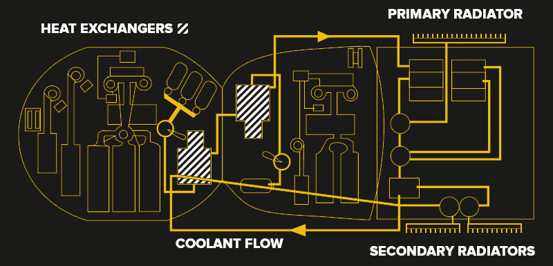
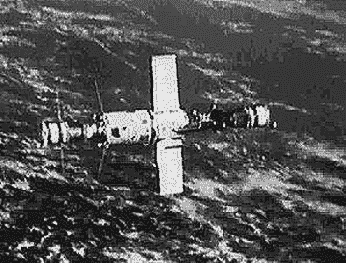

# 受损的联盟号可能会让宇航员无法回家

> 原文：<https://hackaday.com/2022/12/19/damaged-soyuz-may-leave-crew-without-a-ride-home/>

虽然有其独特的美丽，但这是任何宇航员都不想看到的景象:他们的飞船，他们返回地球的唯一途径，向太空喷射无数彩虹般的小水滴。

当阿波罗 13 号的船员们看到他们的飞船在去月球的旅途中大出血时，很明显这次任务，以及最终他们的生命，处于真正的危险之中。幸运的是，目前的情况远没有那么可怕，因为停靠在国际空间站的[号泄漏的联盟 MS-22 飞船不会对轨道实验室上的人员造成任何直接危险。但这仍然是一个前所未有的情况，让船员回家将需要地面上的工程师做出一些非常困难的决定。](https://www.cnn.com/2022/12/15/world/soyuz-spacecraft-leak-iss-scn/index.html)

这种情况仍在发展，无论是美国宇航局还是他们的俄罗斯同行 Roscosmos 都没有公布太多的细节。但是，我们可以从我们看到的受损的联盟号太空舱的视频和图像中做出一些有根据的猜测，从目前向公众展示的情况来看，情况并不乐观。

## 空载运行

14 日星期三，正当俄罗斯宇航员谢尔盖·普罗科普耶夫(Sergey Prokopyev)和德米特里·彼得林(Dmitriy Petelin)准备开始预定的舱外活动(EVA)时，警报响起，显示对接的联盟 MS-22 太空舱中的冷却剂水平正在下降。当将外部摄像机转向飞船时，很明显这不是假警报——因为可以看到液体从飞行器后部喷出。

如上图所示，联盟号通过位于轨道舱(左)和下降舱(中)的一对热交换器泵送冷却剂，最终到达安装在服务舱(右)外部的几个外部散热器。连接这些模块的冷却剂管道实际上沿着飞船的外壳延伸，尽管它们被覆盖了飞船外部大部分的隔热层遮住了。

虽然泄漏的确切原因尚不清楚，但目前的理论是，微流星体或其他小型太空碎片击中了散热器或外部冷却管道之一。人们希望周末更仔细的检查可能有助于确定泄漏的原因，但无论如何，结果是一样的。由于没有办法阻止泄漏，据信在事故发生期间，系统的所有冷却剂都被倾倒到了船外，导致系统无法运行。

该系统不仅负责将下降舱内部保持在人类乘员舒适的温度，还负责冷却飞行计算机和深埋在飞行器内部的其他设备。试图在轨道上修复和重新填充冷却系统将会异常困难，而且几乎肯定会被认为风险太大，甚至不敢尝试。因此，俄罗斯工程师现在必须回答的问题是，在冷却系统离线的情况下，联盟号能否安全地将三名宇航员带回地球。

## 远程救援

在写这篇文章的时候，官方还没有宣布，但是许多太空专家认为最安全的方法是假设联盟 MS-22 不再适合飞行。虽然在发现泄漏后进行的系统测试显示，该飞行器似乎运行正常，其推进器仍在工作，但飞行期间计算机过热和关闭的可能性给机组人员带来了不可接受的风险。如果绝对必要，可以手动执行再入程序，但太空舱很可能会在指定的坐标之外着陆，使回收操作变得复杂。

Salyut 6 with docked Soyuz and Progress spacecraft.

当然，这是假设冷却系统是唯一损坏的。如果飞船被一块太空碎片击中，在没有彻底检查的情况下，很难知道其他系统会受到什么影响——这对于 EVA 来说可能很难做到。

如果 Roscosmos 确定联盟号 MS-22 不再适合使用，他们可能会决定将下一艘联盟号远程飞往国际空间站，以便它可以替换受损的飞行器。如果可能的话，他们甚至可能将目前预定的 2023 年 3 月的发射日期提前。

虽然非常罕见，但这种情况并非没有先例。1979 年 4 月，当他们的联盟号太空舱的可行性受到质疑时，苏联礼炮 6 号空间站的工作人员不得不等待一艘新的宇宙飞船将他们带回家。最终，两个飞行器都安全返回地球，但这并不意味着不值得花费额外的时间和费用来确保机组人员有最好的生存机会。

## 没有足够的救生艇

但是这个计划有个问题。如果确定联盟 MS-22 对人类乘客不再安全，需要更换，这将意味着在其历史上第一次没有足够的航天器停靠在国际空间站，在紧急情况下将所有船员带回家。

万一国际空间站在新联盟号发射前遭遇灾难性故障，谢尔盖·普罗科普耶夫和德米特里·彼得林以及美国宇航员弗朗西斯科·卢比奥将无法安全离开空间站。出于必要，他们可能会被指示登上半功能的联盟 MS-22，并准备在需要撤离时离开，但在这一噩梦般的场景中，之后会发生什么谁也说不准。希望我们不用去发现。