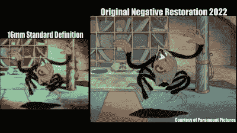

# 35mm 胶片修复流程讲解

> 原文：<https://hackaday.com/2022/12/19/35mm-film-restoration-process-explained/>

在 20 世纪的大部分时间里，电影是在硝酸盐胶片上发行的。虽然对电影公司来说比较便宜，但这部电影非常易燃，容易腐烂。最重要的是，大多数电影拷贝一旦在电影院放映完就被丢弃了，所以很多电影历史都丢失了。

有时，放映的胶卷会由放映员保管，最终会被收藏家发现。如果这部电影被严重损坏而无法再次放映，它仍有可能被丢弃。推动这种衰退和破坏潮流的是一小群专家，他们为数字时代扫描和修复这些电影。

The quality difference between a smaller-format print and the original restored negative can be startling

这一过程相当复杂——从手工检查每一帧胶片开始，修复任何损坏的穿孔或可能在扫描仪中分离的拼接。然后，每一帧都会以高达 10K 的分辨率进行自动扫描，以确保在经过精心的数字清理之前，这一过程不会过时。

真正的专业知识是知道什么是损坏或污垢，什么是原始电影的特征。特别是在定格电影中，帧与帧之间的细微变化确实是原作的一部分，因此需要有选择地控制自动清理工具，以免失去电影制作者的魅力和艺术。

结果相当惊人，我们都有这样的团队来保护我们的文化遗产。

如果您有兴趣观看这个过程，请在休息后查看视频。如果你想尝试自动电影数字化(最好不要在独特的历史版画上！)然后我们展示了[项目来完成过去的](https://hackaday.com/2019/09/04/3d-printed-film-scanner-brings-family-memories-back-to-life/)。

感谢[Cliff Claven]的提示。

 [https://www.youtube.com/embed/rIOgaMnwRrQ?version=3&rel=1&showsearch=0&showinfo=1&iv_load_policy=1&fs=1&hl=en-US&autohide=2&wmode=transparent](https://www.youtube.com/embed/rIOgaMnwRrQ?version=3&rel=1&showsearch=0&showinfo=1&iv_load_policy=1&fs=1&hl=en-US&autohide=2&wmode=transparent)

