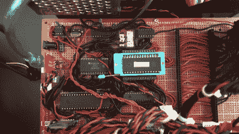

# 科尔曼 Z80 是 20 世纪 70 年代电脑的现代翻版

> 原文：<https://hackaday.com/2022/12/20/the-coleman-z80-is-a-modern-take-on-a-1970s-computer/>

[约书亚·科尔曼]喜欢自己设计电脑。有时，这意味着绘制总线架构、内存映射和 I/O 端口引脚。其他时候，他可以将精力更多地放在一般的美学上，以及建立一套伟大的外围设备上，正如他在最新的 ColemanZ80 项目中所展示的那样。由于[RC 2014 架构](https://hackaday.com/2016/09/08/review-the-rc2014-z80-computer/)定义了经典 Z80 计算平台的大部分基本功能，【约书亚】能够设计出一台现代的逆向计算机，它不仅真正有用，而且看起来就像昨天才从生产线上下来。

外部设计令人赏心悦目:亮红色激光切割丙烯酸片形成一个整洁的半透明外壳，侧面有通风槽，前面有许多闪光灯。受 Altair 8800 等 20 世纪 70 年代经典产品的启发，前面板让用户可以直接看到机器的内部状态，并允许通过一系列翻转开关进行简单的命令输入。CPU、RAM 和其他基本设备都装在一个盒子里，所有的扩展模块都装在另一个盒子里，通过一根 40 线的扁平电缆与主板相连。

Lots of classic chips, but also loads of hand-routed wires grace the ColemanZ80’s mainboard.

虽然主板严格遵循 RC2014 的设计，但[Joshua]花了很大力气来调整系统以满足他的特定需求。他构建的扩展板包括一个 NS16550 UART 以取代默认的 68B50，一个电池供电的实时时钟，一个基于 YM2149 的声卡，甚至还有一个围绕经典 SP0256 芯片构建的语音合成器模块，以*说&拼*闻名。一个更不寻常的特性是 AM9511 的存在，这是有史以来最早的数学协处理器之一，用于加速浮点计算。所有这些模块都是在原型板上完全手工构建的:我们几乎无法想象这要花多少时间。

输出设备包括一个由 Raspberry Pi Pico 提供的 VGA 适配器，以及一个常规的 4 位 7 段 LED 显示屏和一组经典的惠普“气泡”LED。[Joshua]在他的视频(嵌入在下面)中运行了几个演示，从计算 Mandelbrot 集到在 YM2149 上播放 chiptunes。还有很多进一步扩展的空间:[约书亚]计划建造更多的外围设备，包括软驱接口和操作机器人汽车的模块。

这不是第一台科尔曼 Z80 计算机:之前的版本运行在完全由他自己设计的架构上。我们已经看到了其他几款令人印象深刻的 RC2014 衍生产品，如[微型版](https://hackaday.com/2019/10/02/review-the-rc2014-micro-single-board-z80-retrocomputer/)和这个[受牛郎星启发的外壳](https://hackaday.com/2019/11/21/building-a-front-panel-for-the-rc2014-computer/)。

 [https://www.youtube.com/embed/gTTLVIVDOvg?version=3&rel=1&showsearch=0&showinfo=1&iv_load_policy=1&fs=1&hl=en-US&autohide=2&wmode=transparent](https://www.youtube.com/embed/gTTLVIVDOvg?version=3&rel=1&showsearch=0&showinfo=1&iv_load_policy=1&fs=1&hl=en-US&autohide=2&wmode=transparent)

