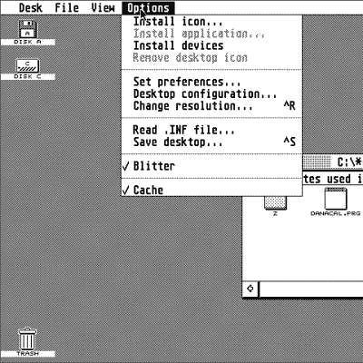

# 看到雅达利宝石桌面运行在便携式文字处理器…的事情

> 原文：<https://hackaday.com/2022/12/20/see-the-atari-gem-desktop-running-on-a-portable-word-processor-thing/>

在[David Given]的项目中将 EmuTOS 移植到 alpha smart Dana 中，为大量的老式计算做好准备。他也把这一切都录下来了。整整 38 小时，13 集！

The GEM desktop, as seen on the Atari ST line of computers.

EmuTOS 的分支是 Atari TOS 的开源版本，Atari TOS 本身是 Atari ST 系列计算机的 68000 操作系统。

至于 AlphaSmart Dana，它是一个大约有 20 年历史的便携式文字处理器*东西*，带有笔输入，运行 PalmOS 的一个版本。这是一个有点古怪的硬件，但在它自己的方式上非常强大。显然是天造地设的一对？如果你有[大卫]的技术和魄力，那就是了！

要让 EmuTOS 在 Dana 上工作，第一步是弄清楚如何找到并使用 Dana 的调试端口，使用它直接访问 CPU，同时绕过引导 ROM。原来，Dana 的 68000 兼容处理器有一个方便的功能:通过操纵正确的引脚，可以通过 UARTs 远程控制 CPU(在一定程度上)。这是大量黑客攻击的切入点，最终导致在 Dana 上启动 GEM 桌面，并能够运行(一些)原始 Atari ST 软件。最大的问题可能是屏幕大小与操作系统的预期不太匹配，但它确实有效。

[大卫]真的知道他的东西，有一个真正的诀窍与老式的硬件，并在其限制范围内。例如，当他向我们展示第一人称视角的 3D 游戏如何在 Commodore PET 上实现时，我们被震惊了，尽管它仅限于字符显示，并且只有 32 kB 的内存。

嵌入在分页符下方，你可以观看将 EmuTOS 移植到 AlphaSmart Dana 的整个过程(一个 13 段视频的系列，从弄清楚如何访问调试端口开始)，或者你可以[直接跳到看到 GEM 桌面愉快地运行](https://youtu.be/K49X3I7X4xg?list=PLuQ2s_IbSWv7Fmr9Ruosm5_OfntEEvqwf&t=1574)。

 [https://www.youtube.com/embed/sgUL5l-W8iE?version=3&rel=1&showsearch=0&showinfo=1&iv_load_policy=1&fs=1&hl=en-US&autohide=2&wmode=transparent&listType=playlist&list=PLuQ2s_IbSWv7Fmr9Ruosm5_OfntEEvqwf](https://www.youtube.com/embed/sgUL5l-W8iE?version=3&rel=1&showsearch=0&showinfo=1&iv_load_policy=1&fs=1&hl=en-US&autohide=2&wmode=transparent&listType=playlist&list=PLuQ2s_IbSWv7Fmr9Ruosm5_OfntEEvqwf)

