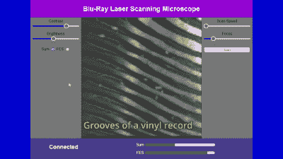

# 使用蓝光部件构建的激光扫描显微镜

> 原文：<https://hackaday.com/2022/12/23/laser-scanning-microscope-built-with-blu-ray-parts/>

激光扫描显微镜对各种微小的研究都很有用。事实证明，你可以用从蓝光播放器中回收的零件来建造一个，正如[医生伏特] 所展示的那样。

诀窍在于重新利用通常用于读取光盘的光学拾取单元。特别是，该构建依赖于光电二极管，这些光电二极管通常用于在跟踪光盘时计算聚焦误差。为了将它变成激光扫描显微镜，光学拾取器被安装到 3D 打印组件上，该组件可以线性旋转它以进行成像。

与此同时，蓝光播放器的硬件被重新利用，以创建一个样品托盘，它可以在正交轴上旋转，实现完全的 X-Y 控制。然后 ESP32 负责运行运动控制和激光。它还从光电二极管捕捉信号，并将它们发送到计算机进行整理和显示。

Volt 博士]通过对一小块织物碎片成像来演示显微镜。扫描区域覆盖小于 1 mm x 1 mm，分辨率为 127 x 127，尽管这可以通过旋转机构上更精细的间距来改善。

虽然这很难说是我们所说的初学者项目，但这项技术看起来仍然比[建造自己的扫描电子显微镜](https://hackaday.com/2022/03/21/home-made-scanning-electron-microscope-show-some-potential/)要容易得多。

 [https://www.youtube.com/embed/liGuhbFh4IQ?version=3&rel=1&showsearch=0&showinfo=1&iv_load_policy=1&fs=1&hl=en-US&autohide=2&wmode=transparent](https://www.youtube.com/embed/liGuhbFh4IQ?version=3&rel=1&showsearch=0&showinfo=1&iv_load_policy=1&fs=1&hl=en-US&autohide=2&wmode=transparent)

 [https://www.youtube.com/embed/Hkialty_8K4?version=3&rel=1&showsearch=0&showinfo=1&iv_load_policy=1&fs=1&hl=en-US&autohide=2&wmode=transparent](https://www.youtube.com/embed/Hkialty_8K4?version=3&rel=1&showsearch=0&showinfo=1&iv_load_policy=1&fs=1&hl=en-US&autohide=2&wmode=transparent)

