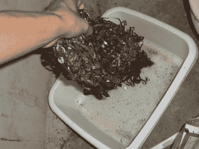

# 你可以用 VHS 录像带廉价制造铁磁流体

> 原文：<https://hackaday.com/2022/12/22/you-can-make-ferrofluid-on-the-cheap-with-vhs-tapes/>

铁磁流体是一种奇妙的物质。这是一种液体粘性物质，对磁场的反应令人兴奋而有趣。自己做其实是可以的，而且也便宜！关键是给自己找一些旧的录像带。

The only fitting end for a copy of *Speed II. *

诀窍是将氧化铁从 VHS 磁带内的塑料带中分离出来。第一步自然是砸开磁带，从里面拉出塑料带。然后胶带可以浸泡在丙酮中溶解塑料，留下氧化铁，它曾经储存了你珍爱的*热量。*磁铁是收集氧化铁的一种简单方法，然后将其晾干。然后可以将粉末状物质以 1 毫升氧化铁比 0.333 毫升烹饪油的比例混合。混合不良可以通过加入一滴混有洗洁精的水来改善。你最终会得到一种褐色的淤泥，作为初级的铁磁流体。

这是一个整洁的家庭科学。与大多数此类活动一样，值得注意的是安全风险。不要让你的丙酮暴露在外，形成令人讨厌的易燃气体，并保持对任何火灾或点火风险的敏锐意识。总的来说，这是一个相当简单的过程。虽然最终的材料不一定是实验室级别的，但是你可以用它来制作你自己的铁磁流体显示器！