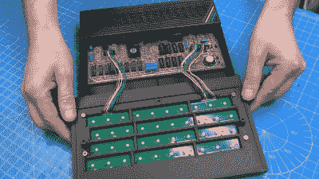

# ZX 频谱终于有了一个合适的键盘

> 原文：<https://hackaday.com/2022/12/27/the-zx-spectrum-finally-gets-a-proper-keyboard/>

辛克莱·ZX 光谱被许多人亲切地记住，因为它是他们对奇妙的计算世界的第一次介绍。它的先进性能加上惊人的低价使它成为 20 世纪 80 年代最棒的家用电脑之一，至少在英国和邻近国家是如此。Spectrum 不太引人注目的地方是它糟糕的键盘:虽然比早期 Sinclair 电脑的平板薄膜键盘有所进步，但 Spectrum 的微型橡胶键使输入超过几个字符的任何东西都有点麻烦。

如果你计划在你的 Spectrum 上做任何严肃的编程，你可能会因此想要看看[李·史密斯]的最新项目，他在其中[重新设计了 Spectrum 的外壳，以包括一个合适的机械键盘](https://www.youtube.com/watch?v=O_FdXpOi2W4)。[Lee]在寻找修复一些破损或丢失的光谱的方法时产生了这个想法，并偶然发现了几个旨在使用现代组件再造经典 Sinclair 机器的项目。他拿了一个为 [ZX Max 128 项目](https://www.pcbway.com/project/shareproject/ZX_Spectrum_Keyboard.html)准备的键盘 PCB，在上面安装了一些高质量的开关，并添加了一套来自 [ManuFerHi N-Go](https://manuferhi.com/c/n-go) 的经过修改的键帽。

The new keyboard plugs into the original connectors and doesn’t require any board-level modifications.

这些部件组合在一起，形成了一个现代、舒适的键盘，所有按键上都有正确的标签。这在频谱上相当重要，因为每个键也用于生成符号和基本关键字:例如，“K”键也用作`LIST`、`+`、`LEN`和`SCREEN$`。

随着键盘设计的确定，[Lee]开始着手剩下的工作:他设计并 3D 打印了一个光滑的外壳，它采用了新的键盘和原始的 Spectrum 主板。由此产生的系统被称为 ZX Mechtrum，其哑光黑色外观和必须的四色彩虹看起来非常棒。可更换的后面板也允许几个板级修改，如复合视频或 VGA 输出，巧妙地融入到设计中。

今年早些时候，在 40 周年纪念日，我们写了一篇详尽的回顾文章。如果，不知何故，你真的喜欢 Spectrum 的原始橡胶键盘，那么你也可以[修改整个东西，使之适用于现代计算机](https://hackaday.com/2014/07/31/zx-spectrum-turned-into-a-usb-keyboard/)。

 [https://www.youtube.com/embed/O_FdXpOi2W4?version=3&rel=1&showsearch=0&showinfo=1&iv_load_policy=1&fs=1&hl=en-US&autohide=2&wmode=transparent](https://www.youtube.com/embed/O_FdXpOi2W4?version=3&rel=1&showsearch=0&showinfo=1&iv_load_policy=1&fs=1&hl=en-US&autohide=2&wmode=transparent)

