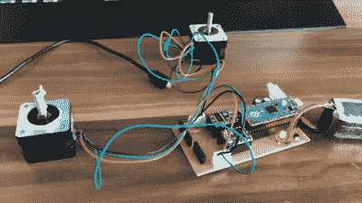

# 3D 打印的自平衡机器人将控制理论带入生活

> 原文：<https://hackaday.com/2022/12/27/3d-printed-self-balancing-robot-brings-control-theory-to-life/>

稳定倒立摆是控制理论中的一个经典问题，如果你上过控制系统课，你可能会记得看到满页的微分方程和伯德图来描述它的基本操作。尽管这可能会使这样一个系统看起来非常复杂，但实际上实现所有这些理论一点也不困难，正如[Limenitis Reducta] [在他的最新项目](https://hackaday.io/project/188801-lotp-two-wheeled-self-balancing-robot)中所展示的那样。你需要的只是一台 3D 打印机，一些基本的电子技能和 Python 知识。

需要的部件是一个车身，两个轮子，驱动这些轮子的马达和一些电子设备。[Limenitis]在下面的视频中演示了设计过程(土耳其语，有英文字幕)，他在 Fusion 360 中绘制了整个系统，然后开始制造。车身和车轮是 3D 打印的，橡胶带为车轮提供了一些牵引力，否则在光滑的表面上会有困难。

The PCB has just a few components, with most of the complexity handled by plug-in modules.

两个步进电机驱动车轮，由 DRV8825 电机驱动器控制，而 MPU-9250 加速度计和陀螺仪单元测量系统的角度和加速度。该回路由一个实现 PID 控制器的 Raspberry Pi Pico 关闭:另一个经典的控制理论，其中调整*比例*、*积分*和*微分*参数，以使控制回路适应所讨论的物理系统。外部输入可以通过蓝牙连接提供，这使得从 PC 或智能手机控制机器人并引导它在你的客厅里走动成为可能。

所有的设计文件和软件都可以在[Limenitis]的 [GitHub 页面](https://github.com/SMDHuman/BalanceWheel)上获得，如果你想将一些控制理论付诸实践，这是一个很好的起点。自平衡机器人是机器人黑客的最爱，所以如果你在制作自己的机器人之前需要更多的灵感，就不会缺少例子:你可以用现成的零件，用[的小木片](https://hackaday.com/2017/06/03/building-a-self-balancing-robot-made-easy/)，甚至用无焊试验板来制作它们[。](https://hackaday.com/2018/10/17/balancing-robots-from-off-the-shelf-parts/)

 [https://www.youtube.com/embed/LykbhLb3tnc?version=3&rel=1&showsearch=0&showinfo=1&iv_load_policy=1&fs=1&hl=en-US&autohide=2&wmode=transparent](https://www.youtube.com/embed/LykbhLb3tnc?version=3&rel=1&showsearch=0&showinfo=1&iv_load_policy=1&fs=1&hl=en-US&autohide=2&wmode=transparent)

