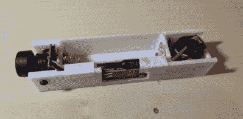

# 2022 年 FPV 竞赛:在你的 N 级铁路上获得火车司机的观点

> 原文：<https://hackaday.com/2022/12/28/2022-fpv-contest-get-the-train-drivers-view-in-your-n-scale-railway/>

模型铁路工人通常从高处观察他们的项目。对你所在小镇的居民来说，看看这个世界是什么样子是很不错的，但是深入了解他们的观点是很困难的，尤其是如果你在一个较小的范围内工作的话。对于那些在 N 型轨道上工作的人来说，现在有一种简单的方法来观察你的项目，就像火车司机会看到的一样:[Vassily98]设法把一个无线摄像头塞进了一辆 N 型轨道车。

这里的主要挑战是可用空间极其有限:N 比例布局中的轨道宽 9 毫米，这意味着整个系统只能容纳 23 x 20 毫米 ² ，这是一辆典型列车车厢的前部区域。少数几个符合这种配置的摄像机之一是 RunCam Nano 4，它[Vassily98]连接到一个超小型团队 BlackSheep 5.8 GHz 视频发射器。

It’s a bit of a sqeueeze, but everything fits perfectly.

一切都是通过 3.6 V 锂电池供电，而不是通过轨道供电——摄像机和射频发射器对电源中断和干扰非常敏感，在直接轨道供电下无法可靠工作。不过，这确实需要增加一个升压转换器，因为视频发射器至少需要 4.5 V 才能工作。[Vassily98]设计了一个整洁的 3D 打印货车车身，可以安全地容纳所有组件，并安装在标准货车底盘的顶部。

如果您迫不及待地想从火车司机的角度了解您的 N-scale 布局，那么您会很高兴地知道，STL 文件和详细的构建说明可在该项目的 Hackaday.io 页面上获得。我们以前在铁路机车模型中见过 FPV 相机，但那是在大规模的场景中。你还可以在稍微小一点的 HO 比例中安装[微型显示器——也许类似的东西会是【瓦西里 98】的摄影系列的一个整洁的配套项目。](https://hackaday.com/2020/08/19/model-railroad-engine-gets-a-tiny-oled-rollsign-while-showing-off-tidy-protoboard-skills/)

 [https://www.youtube.com/embed/rDzGRTFMI04?version=3&rel=1&showsearch=0&showinfo=1&iv_load_policy=1&fs=1&hl=en-US&autohide=2&wmode=transparent](https://www.youtube.com/embed/rDzGRTFMI04?version=3&rel=1&showsearch=0&showinfo=1&iv_load_policy=1&fs=1&hl=en-US&autohide=2&wmode=transparent)

