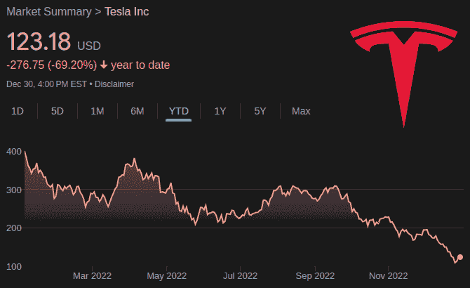
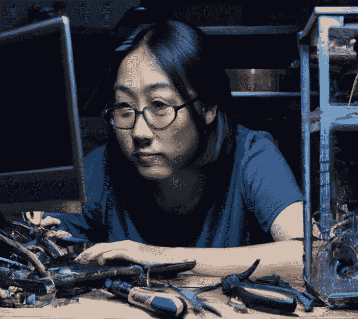
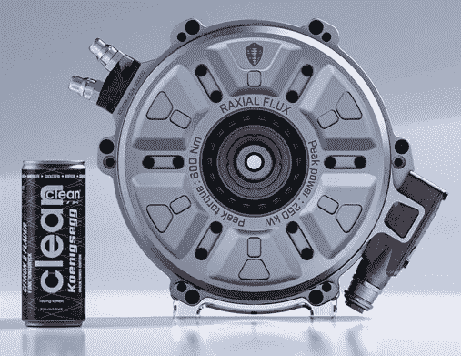
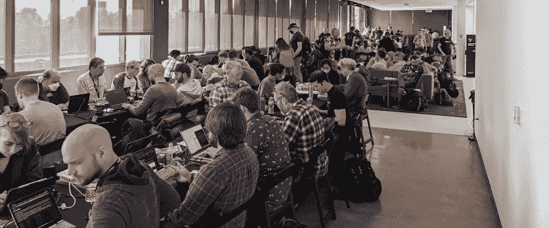
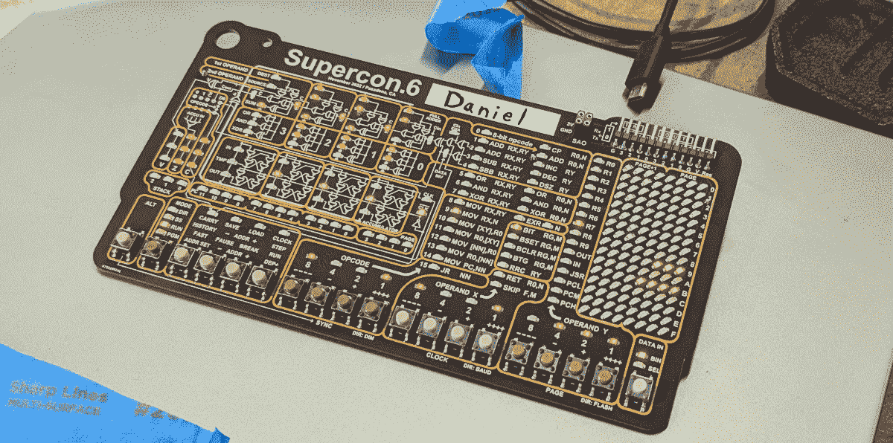

# 2022 年:随着硬件世界的转变

> 原文：<https://hackaday.com/2023/01/03/2022-as-the-hardware-world-turns/>

伙计们，我们又度过了一个难关。虽然对我们这些黑客和制作社区的人来说，将 2022 年称为好年景有些言过其实，但隧道尽头的灯光现在确实比 365 天前的这个时候更加明亮。对未来一年表现出一些合理的乐观可能是安全的，但话说回来，我指望我的特斯拉股票是一项长期投资，所以我知道什么是预测未来。

Eh, my kids probably weren’t going to college anyway.

谢天谢地，事后诸葛亮总能给我们带来一点智慧，不管是应得的还是其他的。现在 2022 年已经正式成为过去，是时候回顾一下过去 12 个月的高点(和低点)了。不管是好是坏，当我们回顾这段生活时，这些故事会在我们的集体脑海中留下深刻的印象。

哦，当然，有些人可能希望他们可以走黑衣人路线，忘记过去几年发生的一切，但事实并非如此。事实上，鉴于我们目前生活在一个动荡的时代，似乎更有可能的是，在某个时候，我们会发现自己不得不向后代解释整个事情，因为他们会睁大眼睛盯着我们周围熊熊燃烧的大火。尽管按照这个时间线来看，所说的火源可能是你刚刚摧毁的一个翻倒的城市攻击机器人的闷烧残骸。

因此，当它仍然在我们的脑海中记忆犹新，并且在 2023 年有机会给我们带来任何新的灾难之前，让我们回顾一下去年一些最大的故事和主题。

## 芯片短缺击中要害

从技术上来说，芯片短缺的起源早在 2022 年之前就开始了，那些对零部件胃口较大的企业，如汽车制造商，早就开始感受到压力。但 2022 年标志着问题变得如此严重，甚至连业余爱好者都受到了影响。

现在，我们敢打赌，很少有人能说这些文字完全没有被触及。举个例子，你最近有没有试过买一个树莓派？除非你愿意在二手市场上以黄牛的价格购买，否则几个月来它们基本上都是买不到的。首先不得不创建像 [rpilocator](https://rpilocator.com/) 这样的服务已经够糟糕了，但即使有了自动股票跟踪，在它们再次售罄之前，你只有几分钟的时间来下单。

An outdated thin client will run circles around the Raspberry Pi.

由于没有稳定的廉价 Linux 单板计算机供应，许多人已经转而购买旧的小型 x86 计算机用于他们的项目。只需在易贝搜索“瘦客户端”并做出选择——即使是你可能看到的最古老的产品也将远远胜过树莓 Pi 中的 ARM 芯片。

这具有一定的讽刺意味，因为除非你正在做的事情实际上利用了 Raspberry Pi 的独特属性(即访问 GPIO、SPI、I2C 等)，否则过时的 x86 机器可能总是更好的选择。

让你感到疑惑——如果有更多的人早点意识到这一点，也许对这些东西的需求一开始就不会这么高……

但是，不仅仅是 Pis 变得难以获得，或者至少变得更加昂贵——大量曾经常见的组件现在几乎无法获得。为了应对这种情况，我们已经开始看到一些开放的硬件项目[在其材料清单](https://hackaday.com/2022/07/25/up-close-and-personal-with-an-8x-floppy-controller/)中包括一个兼容的替代芯片列表，通常按照与理想组件相比的能力降序排列。我们甚至看到一些主板在同一个部件上有[多个足迹，因为不清楚哪一个会在准备组装时最终被使用。](https://hackaday.com/2022/08/13/the-chip-shortage-leads-to-the-strangest-things/)

看到开源硬件世界如何应对这种前所未有的情况是非常令人着迷的，而且有一个论点是，正在学习的经验教训将对社区的未来产生积极的影响。毕竟，假设每个想要使用你的设计的人都足够幸运，生活在一个像 Digikey 和 Mouser 这样的资源只需点击一下鼠标就能得到的地方，这总是一个相当大胆的假设。对于某些人来说，我们所说的零件短缺只是照常营业，能够利用手头的东西凑合是任何优秀黑客都应该努力掌握的技能。

## 人工智能工具成为主流

虽然我们已经听到了关于 2021 年人工智能文本到图像生成器的传言，但直到今年早些时候，闸门才真正打开。这时 DALL-E、Midjourney 和 Stable Diffusion 等软件开始向公众开放。仅仅几个月后，社交媒体上充斥着越来越离奇的文本提示产生的梦幻般的图像。

当然，如果不是因为生成的图像在许多情况下非常令人印象深刻，这些工具就不会如此受欢迎。虽然可以理解的是，在这样一个早期的结合点周围的边缘粗糙，但毫无疑问的是，核心技术将留在这里。从改善你的照片到[用歌词创造虚拟世界](https://hackaday.com/2022/09/14/ai-midjourney-images-stairway-to-heaven/)和[为 3D 环境生成纹理](https://hackaday.com/2022/12/18/image-generating-ai-can-texture-an-entire-3d-scene-in-blender/)，这是一个强大的工具，随着时间的推移只会越来越好。

DALL-E Prompt: Realistic image of a hardware hacker sitting at their workbench and reading their favorite website

但是艺术并不是机器学习模型突然变得非常擅长的唯一事情。6 月，微软宣布，他们的人工智能软件开发工具 GitHub Copilot 已经退出“技术预览”，准备投入商业使用。Copilot 接受了数百万开源 GitHub 库内容的训练，能够通过预测程序员试图完成的内容来生成大量可用的源代码。

这项服务立即引发了争议，因为它偶尔会吐出一个从开源项目中逐字提取的功能——没有注明原作者，也没有解释它发布时的许可条款。上个月初提起的集体诉讼是不可避免的。

11 月还标志着 ChatGPT 的公开发布，尽管它的名字可能意味着什么，但它不仅仅是闲聊。在它向公众开放的几周里，我们已经看到它编写代码，在 OpenSCAD 中生成三维对象，甚至[充当 Linux 虚拟机](https://hackaday.com/2022/12/10/a-vm-in-an-ai/)。但是就像它的图像生成亲戚一样，ChatGPT 也不是完美的。它做出的假设和错误乍看起来可能并不明显，所以你最好对[所说的有所保留](https://hackaday.com/2022/12/07/love-ai-but-dont-love-it-too-much/)。

## 韦伯展示了它的东西

读者可能还记得詹姆斯·韦伯太空望远镜(JWST)于 2021 年圣诞节从法属圭亚那发射升空。但是当它完成了 150 万公里(93 万英里)的旅程，到达日地 L2 拉格朗日点，展开自己，并检查了所有的硬件时，直到 2022 年夏天，我们才有幸获得了来自大型红外天文台的第一张正确的图像。

The Cosmic Cliffs of the Carina Nebula, one of the first images released from the James Webb Space Telescope

增色可能是一种轻描淡写的说法——尽管毫无疑问，耗资 100 亿美元的 JWST 将提供前所未有的宇宙景观——但这并没有减少其壮观程度。红外望远镜的 6.5 米(21 英尺)镀金铍反射镜允许它看到对哈勃太空望远镜来说太暗或太远的物体，哈勃太空望远镜已经是一个非常有能力的仪器。

由于相对于光速的巨大距离，这意味着詹姆斯·韦伯太空望远镜可以让人类看到比以前更遥远的过去。天文台提供的新发现的潜力不能被夸大，我们都有一个前排座位。

## 给所有东西通电

虽然 2022 年可能不是你个人告别内燃机的一年，但它无疑标志着汽车行业的一个转折点。在过去的 12 个月里，人们对电动汽车(ev)做出了很多重大承诺，从加州和欧盟禁止在 2035 年以后销售燃气汽车和卡车，到道奇宣布其标志性的充电器和挑战者肌肉车将于今年退役，因为该品牌正在走向全电动的未来。在 6 月的一次采访中，甚至埃克森美孚公司的首席执行官达伦·伍兹也不得不承认，他相信到 2040 年所有的新型客车都将是电动的。

This 335 HP motor weighs just 28 kg (63 lbs).

从这一切中有两个重要的收获:首先，你停在外面的那辆烧汽油的车时间不多了，其次，如果这个行业要达到这些崇高的时间表，电动汽车技术必须在相对较短的时间内变得更好、更便宜。我们已经开始看到指针的移动，随着[新的轻型发动机](https://hackaday.com/2022/02/09/how-can-335-horses-weigh-63-pounds/)、[令人印象深刻的范围扩展增益](https://hackaday.com/2022/01/19/longer-range-evs-are-on-the-horizon/)，以及对新电池[技术的研究](https://hackaday.com/2022/04/27/the-state-of-play-in-solid-state-batteries/)。

但不仅仅是汽车本身越来越先进。在这个勇敢的新世界中，甚至道路也参与进来，试点项目目前正在探索将感应充电线圈嵌入地表的想法。数百万辆插上充电器的汽车也可以[为能源网](https://hackaday.com/2022/03/08/grid-batteries-on-wheels-the-complicated-logistics-of-vehicle-grid-integration/)提供一个很好的缓冲，所以有一天，车载电网一体化(VGI)可能意味着你的汽车最终会在半夜为邻居的电视供电。

当然，也不全是好消息。制造这些车辆，以及为它们充电所需的基础设施，意味着全球对铜和 T2 钴的需求将会激增。匆忙设计的[电动汽车充电器集体接入电网](https://hackaday.com/2022/11/28/ev-chargers-could-be-a-serious-target-for-hackers/)，也有一些令人担忧的安全隐患。

## 超级警察的回归

当然，如果不提到[我们自己在加州帕萨迪纳的 Hackaday Supercon 的胜利回归](https://hackaday.com/2022/11/12/welcome-back-supercon/)，去年硬件黑客领域的任何亮点都是不完整的。虽然我们对在新冠肺炎封锁期间举行的两次远程会议感到非常自豪，但没有什么可以替代让数百名黑客聚集在一个地方进行 72 小时的焊接、编码和一般的书呆子般的欢乐。直到不和谐可以充分传达霓虹灯变压器烤蛋糕的气味，面对面的活动将永远占上风。

今年 Supercon 的一个特别亮点是由传奇人物 Voja Antonic 设计的令人难以置信的 [4 位徽章。每当我们制作一个活动徽章时，我们都热切希望它不仅仅是一时的好奇。我们希望我们的徽章尽可能长时间地留在你的办公桌上，这意味着要保持谨慎的平衡——它应该*只是*具有足够的挑战性，让你保持参与，但不要太难，以至于令人沮丧。从这个徽章得到的回应来看，很明显我们击中了目标。](https://hackaday.com/2022/10/12/the-2022-supercon-badge-is-a-handheld-trip-through-computing-history/)

Clearly, this badge belonged to Cooler Daniel.

撇开徽章黑客不谈，如果没有天才黑客的精彩演讲，它就不会超超。由于后勤原因，我们只能在活动期间直播其中的一半，但不要担心，每个演讲都被记录下来，我们目前正在编辑它们并上传到 Hackaday YouTube 频道。

事实上，其中一些已经发布，如[山姆·马尔维关于建立自己的调频广播电台的讲话](https://hackaday.com/2022/12/15/supercon-2022-sam-mulvey-shows-you-how-to-fm-radio/)。我们希望从现在开始每周发布几个演讲，所以请继续关注。

## 分享你的回忆

那么，当你回想 2022 年时，什么对你来说最突出？这是个人的胜利吗？最受欢迎的黑客骗局的回归？请在评论中告诉我们。即使你在另一个阵营，今年对你的态度和前两年一样差，你也可以畅所欲言。毕竟，如果我们不从历史中吸取教训，我们注定会重蹈覆辙。

如果你觉得特别大胆，我们很想听听你对 2023 年有什么希望。毕竟，今年不可能比我们刚刚经历的更糟了…对吗？