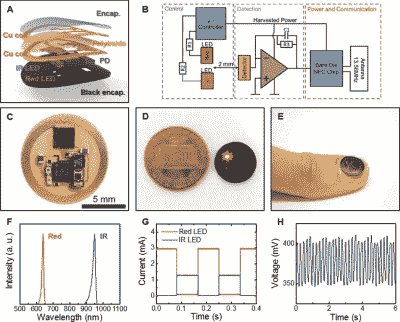

# 这个指甲贴可以检测你何时停止呼吸

> 原文：<https://hackaday.com/2023/01/01/this-fingernail-sticker-can-detect-when-you-stop-breathing/>

有时我们会翻遍档案，看看我们能从万维网的深处找出什么样的疯狂黑客，这一个值得分享。西北大学的研究人员开发了一种贴在指甲上的标签，可以测量心率、运动和血氧，所有这些都不需要电池。

[光电体积描记器(PPG)系统类似于我们在](https://hackaday.com/2021/04/30/an-led-heartbeat-display-you-can-wear-on-your-sleeve/)之前讨论过的系统，运动传感器只是一个加速度计，因此我们不会讨论该设备的这些方面。这款设备吸引我们注意的部分是它的无电池操作和尺寸。它太小了！可以贴合在指甲上，甚至是耳垂上。这里的大小实际上是一个非常有趣的特征，而不仅仅是一个营销插件。因为该设备非常小和轻，所以它非常容易粘附到指甲或皮肤上，而几乎没有感官知觉。基本上，佩戴该设备的人甚至不会注意到它的存在。与我们已经习惯的传统、笨重的医院级仪器相比，这无疑是一个优势。

鉴于其小巧轻便的设计，该设备的粘附性非常好，因此运动伪影显著减少。基于 PPG 的设备中的运动伪像是由于光电极(LED 和光电二极管)和皮肤之间的相对运动造成的。确保设备不会移动的传统方法是让患者在记录过程中保持静止，将设备紧紧地贴在皮肤上(想想你需要将智能手表戴得多紧才能获得一致的读数)，或者使用一些非常坚韧和不舒服的粘合剂，如果你以前曾经获得过心电图读数，你可能会这样做。这个装置消除了这三个问题。

该设备引起我们注意的另一个方面是它使用无线电源而不是电池。从某种意义上说，这可以被视为一种优势，也可以被视为一种劣势。该设备依靠 NFC 进行电力和数据传输，[对于只需要间歇使用的设备来说，这是一种非常常见的方法](https://hackaday.com/2021/12/10/an-nfc-antenna-ring-with-a-chip-as-its-jewel/)。对于每秒或每秒几次提供读数的连续监测设备来说，无线电源可能有点问题。但是谁知道，[无线电源这几天似乎无处不在](https://hackaday.com/2017/02/23/suddenly-wireless-power-transmission-is-everywhere/)。

稍微深入一下细节，双层天线是围绕设备的周围设计的，使用湿法蚀刻在铜聚酰亚胺箔上创建迹线。该团队通过设备的不同层(光电极层、第一天线层、聚酰亚胺、第二天线层、元件层、保护顶涂层)电镀孔，将天线连接到芯片焊盘 NFC 芯片(SL13A、AMS AG)。连接芯片需要一些非常精细的焊接技术，[但是在 Hackaday](https://hackaday.com/2022/01/31/factory-defect-ic-revived-with-sandpaper-and-microsoldering/) 没有什么是我们不习惯的。总的来说，他们似乎相当成功，使用智能手机获得了 16 的 Q 因子和 30 毫米的传输距离，而不是[一些巨大的阅读器天线](https://hackaday.com/2016/09/17/drone-flys-12-cm-on-wireless-power/)。

毫无疑问，一个非常酷的项目，我们建议检查。