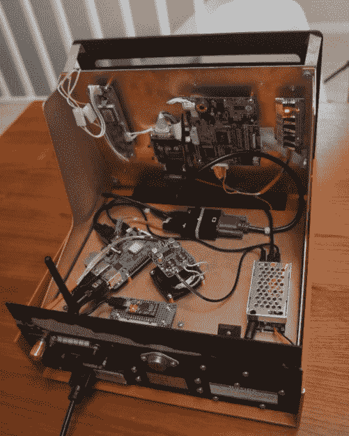

# 20 世纪 70 年代实验室设备改造成复古码头

> 原文：<https://hackaday.com/2018/12/05/1970s-lab-equipment-turned-retro-pi-terminal/>

发布时，贝克曼 421 型 CRT 控制器代表了液相色谱技术的最新和最伟大的成果。其 12 英寸的屏幕将允许操作员查看关键信息，如流速和浓度，其集成键盘简化了系统控制。它使液相色谱更快更容易，使实验室技术人员能够专注于分析，而不是操作设备的复杂性。

 但现在这些都不重要了。重要的是[【伊戈尔·阿法纳西耶夫】在当地的旧货交易会上发现了这些辉煌的老式设备之一，并决定它应该有第二次生命的机会](https://imgur.com/a/EFCIpoI)。凭借一个树莓派和数量惊人的支持硬件，他能够将这个大约有 40 年历史的科学设备变成一个多用途设备，可以做从经典游戏到多媒体播放的一切事情。它有一些怪癖，但总的来说，这是一个任何黑客都喜欢在他们的现代实验室中使用的小工具。

[Igor]解释说，412 型本质上只是一个没有内部逻辑的哑终端，所以理论上应该可以把它挂在串行端口上就可以了。但不幸的是，显示驱动板是死的，所以完全重建是有序的。这意味着除了键盘和外壳本身，原始设备几乎没有留下什么，但由于它不是传统意义上的“老式电脑”，我们认为纯粹主义者会允许它。

对于显示器，[Igor]使用了他从旧数码相框中回收的液晶显示器。它的大小正好适合开口，由于电路板上没有 VGA 接头，用 HDMI 适配器连接到 Pi 并不太困难。他还添加了一个硬件 VGA 扫描线发生器板，这样无论 Pi 显示什么，它都将具有经典的老派外观；这是一个我们通常不会在这样的版本中看到的奇妙细节。

412 型号的键盘更像是一个控制面板，而不是传统的输入设备，所以它不仅有键帽，上面写着“流速”和“写磁带”之类的东西，而且还有一个相当奇怪的布局。在对有点不寻常的按键矩阵进行逆向工程后，他使用 QMK 为 Arduino Pro Micro 开发了一个[定制固件，这将允许他将 Pi 上的电路板用作标准 USB 输入设备。但是[Igor]没有替换按键，而是创建了一个小的小抄覆盖图，他可以把它放在黑板上，看看什么按键转换成什么字母。这肯定很尴尬，但我们真的很欣赏他保留了 412 型的独特性质和外观。](https://hackaday.com/2018/02/15/arduino-keyboard-is-gorgeous-inside-and-out/)

就像通过内置树莓派而重获新生的希斯基特 H19 或者内置 BealeBone 的 T2 DEC vt 100 一样，这些老式终端的视觉美感和严肃的方式继续让它们在 21 世纪引人注目。