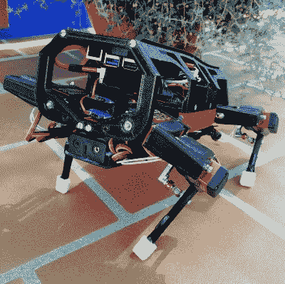

# 2020 年:随着硬件世界的转变

> 原文：<https://hackaday.com/2020/12/29/2020-as-the-hardware-world-turns/>

无论你用什么标准来衡量，2020 年都是令人难忘的一年。通常这是一件积极的事情，但这一次有点复杂。现代史无前例的全球疫情影响了我们工作、学习和聚会的方式。有些人会回顾他们在一级防范禁闭中的时光，尽管有点孤独，但也是富有成效的。其他人的整个生活方式被连根拔起，没有迹象表明事情何时或是否会恢复正常。不管此时的“正常”是什么。

但即使面对这样的逆境，我们的社区也有亮点。随着传统聚会不再可能，许多长期运行的技术会议转向了虚拟形式，这使得演讲者和与会者的数量比过去更多、更多样化。我们还看到全球各地的黑客和制造商将他们的技能和工具投入到个人防护装备(PPE)的生产中。2020 年的新冠肺炎·疫情以一种前所未有的方式帮助证明了超本地化制造的有效性，这是一个很少有人能预测的事件。

不管是好是坏，我们大多数人都会在有生之年将 2020 年与新冠肺炎联系在一起。真的，我们怎么能不呢？但在过去的 12 个月里，我们见证了许多故事，这些故事同样值得在我们的集体记忆中占有一席之地。当我们接近这最沉闷的一年的黄昏时刻时，让我们回顾一下今年触及我们科技世界小角落的一些最有趣的主题。

## RISC-V 开始活跃起来

像你们许多人一样，我们关注 RISC-V 开放标准指令集架构(ISA)已经有一段时间了。这个项目始于 2010 年，旨在为学术目的创建一个易于理解的 ISA，没过多久，硬件领域的主要参与者就开始四处打探。RISC-V 的简化本质使其易于自然教授，也使其易于在现实世界中实现。更好的是，它是免费的。制造商可以使用 RISC-V 构建芯片，而不必支付更传统架构所带来的高昂许可费，随着我们生活中的一切变得“更智能”,对各种芯片的需求越来越大，这是一个非常令人信服的概念。

 但是到目前为止，主要还是有很多传言。当然，我们有一对[RISC-V CPU 在 2019 Hackaday super co Badge](https://hackaday.com/2020/01/27/supercon-keynote-megan-wachs-breaks-down-risc-v/)的 FPGA 内运行，但那是因为由[Sprite_tm]领导的一个令人惊叹的 Badge 团队，他们很酷。传统上，试图找到运行开放 ISA 的商业硬件要困难得多。但在 2020 年，我们终于开始看到一些实质性的运动，将这种令人兴奋的架构纳入主流。

[就在上个月，我们为您带来了 ESP32-C3](https://hackaday.com/2020/11/22/espressif-leaks-esp32-c3-a-wifi-soc-thats-risc-v-and-is-esp8266-pin-compatible/) 的消息，这是非常受欢迎的支持 WiFi 的微控制器家族的新成员，该家族为 RISC-V 放弃了 Tensilica 内核。虽然 Espressif 的官方立场是，新内核的变化不会对最终用户产生太大影响，但这些芯片在消费电子领域(更不用说黑客领域)的广泛采用使这成为一件大事。

大约在同一时间，Bouffalo 实验室推出了 BL602。这个组合 WiFi 和蓝牙芯片组是基于 RISC-V 内核的，PINE64 希望它能为他们未来的设备提供无斑点无线支持铺平道路，并启动了一项社区工作来对其进行逆向工程。如果 Bouffalo 在细节上更主动一点就好了，但黑客社区花了一段时间才能够完全解锁 ESP8266，我们看到了结果如何。

希望像这样的芯片可以成为早期的成功故事，激励其他公司最终将一些 RISC-V 硅投入生产。现在说 2021 年是否会是“RISC-V 年”还为时过早，但看起来它可能最终会近在咫尺。话说回来，[2018 年](https://hackaday.com/2018/12/27/2018-as-the-hardware-world-turns/)我们也是这么想的。

## 很多腿机器人

自制机器人项目是了解爱好电子世界流行什么的好方法，因为它们通常代表了当时普通黑客可以获得的最先进技术。几年前，由于廉价 MEMS 加速度计的发展，似乎每个人都在制造自平衡机器人。那么 2020 年的大事件是什么呢？今年，我们注意到四足行走者的数量大幅上升，许多人显然是受到波士顿动力公司(Boston Dynamics)类似动物的创造的启发。

“Chop” — [one of the finalists in the 2020 Hackaday Prize](https://hackaday.io/project/171456-diy-hobby-servos-quadruped-robot)

那么导致所有这些四足机器人的技术是什么呢？从我们见过的标本中，我们可以找出一些共同的特征。几乎在所有情况下，他们都广泛使用 3D 打印结构，布满伺服系统，点缀着传感器，并配备了一台相对强大的车载计算机来计算所有的运动学。当然，这些都不是特别的*新*。但是所有这些元素的相对成本，以及将它们连接在一起的辅助组件，从来没有这么便宜过。

但不仅仅是硬件。像 OpenDog 这样不可思议的项目真的打开了闸门，重新定义了业余爱好者预算中的可能性。从那时起，知识开始传播，聪明的人想出了如何将核心概念提炼到更便宜的实现中。由于大多数构建都是开源的，每个新的构建都为下一个想要接受挑战的人增加了一点信息。

自然，这些不稳定的黑客创造与波士顿动力公司在 2020 年开始销售的几乎令人恐惧的敏捷机器人相去甚远，但这些仍处于早期阶段。就在几年前，许多人会怀疑你是否能以个人身份建造这样的东西。

## 设计开放式通风机

早在疫情，许多医院发现呼吸机严重短缺。仅在美国，据估计可能需要多达 100 万个救生设备，但即使考虑到联邦政府的紧急储备，该国各种医疗机构中最多只有 20 万个。受到专利的严重阻碍，并且仅由少数几家公司制造，人们严重关切扩大传统生产以满足潜在需求。

JPL’s VITAL ventilator

作为回应，我们看到了一股开发开源呼吸机的巨大推动力，这种呼吸机制造起来又快又便宜。爱好者和专业人士都开始推销他们的想法，从[相对简单的机动化手动操作复苏器的机制](https://hackaday.com/2020/03/23/mit-ventilator-designed-with-common-manual-resuscitator-submitted-for-fda-testing/)到解锁[商业制造的 CPAP 机器的高级功能](https://hackaday.com/2020/04/15/cpap-firmware-hack-enables-bipap-mode-envisions-use-as-temporary-ventilator/)。

随着问题的严重性变得清晰，更大的参与者开始加入这场争斗。虽然它在技术上没有在开源许可下发布，但美国宇航局的喷气推进实验室愿意将 FDA 批准的设计提供给任何有能力建造它们的公司。

最终,《国防生产法案》的实施使得像通用汽车、福特和通用电气这样的公司开始以惊人的速度生产通风机部件或成套设备。此外，还发现了治疗新冠肺炎患者的侵入性更小的方法，从而减少了医院最终需要的呼吸机数量。

谢天谢地，事情从来没有糟糕到黑客空间不得不开始生产通风机的地步。然而，所有这一切的高潮是看到社区围绕着个人防护设备的生产聚集在一起，比如 T2 的面罩和 T4 的口罩，直到工业供应链的运转足以弥补不足。Bravo 黑客！

## 网络平台的兴起

在他 1984 年的小说《神经漫游者》中，威廉·吉布森提供了一些非常模糊的定制“卡片组”的描述，这些卡片组是各种角色在登录网络空间时使用的。他只说它们相对便携，有几个闪烁的灯，并有大量的开关和按键。这一切都让读者的想象力天马行空，随着时间的推移，其他艺术家也采纳了这一想法，并对其进行了独特的诠释。但是花了几十年的时间，才有人尝试建立他们自己的网络平台。

很难说这是什么时候发生的。第一次在 Hackaday 上出现是在 2018 年，虽然我们不会说这是一个权威的日期，但这种项目似乎不太可能逃过我们的注意太久。我们所知道的是，2020 年是这个想法真正开始的时候。事实上，我们写过的大约 70%的网络平台都是在过去的 12 个月内建成的。

这种上升的部分原因肯定是因为今年许多人发现自己有了不寻常的空闲时间。但是至少有一些功劳要归于 Jay Doscher，他的开源设计[产生了几十个已知的变种](https://hackaday.com/2020/03/10/surviving-the-apocalypse-with-a-briefcase-full-of-pi/)。基于他的概念的甲板被构建成一个重型鹈鹕箱，这意味着即使你不太喜欢整个赛博朋克流派，这仍然是一个[组装坚固的移动计算机](https://hackaday.com/2020/09/14/this-ruggedized-raspberry-pi-was-built-to-be-copied/)的好方法。

            

事实上，仍然很难量化是什么造就了网络甲板。纯粹主义者会要求它具有与吉布森甲板相同的虚拟现实能力，但这项技术还不存在。在 2020 年看到这么多著名的例子后，我们可以肯定的一件事是，一个好的网络平台应该是它的创造者的反映。仅仅是一台时髦的便携式电脑是不够的，它应该体现出制造它的人的技能和兴趣。[无论是精心设计和制造的框架](https://hackaday.com/2020/04/20/heavyweight-cyberdeck-is-in-a-class-of-its-own/)，还是使用系统架构的[混合来最大限度地提高机器在不同场景下的性能](https://hackaday.com/2020/12/05/arm-and-x86-team-up-in-no-compromise-cyberdeck/)，这些机器的独特之处使它们与众不同。

## 伸手摘星

2020 年，有如此多有趣的太空故事，以至于我们开始做一篇[循环综述文章，允许我们一次报道其中的几个](https://hackaday.com/tag/spacing-out/)。如果我们停下来给每一个新的任务，飞船，或发现它自己的文章，我们必须改变网站的名称。停滞多年后，太空探索再次成为一项蓬勃发展的事业。自 20 世纪 60 年代的太空竞赛以来，我们还没有见过如此快速的进步，考虑到我们中的许多人都没有亲身经历过那些日子，这是一个非常激动人心的时刻，这是可以理解的。

 NASA [有一个意义深远的让人类重返月球](https://hackaday.com/2020/05/05/nasas-plan-for-sustained-lunar-exploration/)的计划，并且已经正式开始[用商用飞行器](https://hackaday.com/2020/06/01/nasas-long-delayed-return-to-human-spaceflight/)搭载宇航员飞行。国际和商业合作是美国宇航局月球雄心的主要部分，蓝色起源和 SpaceX [等公司已经获得了建造各种航天器](https://hackaday.com/2020/04/15/spacex-offers-nasa-a-custom-moon-freighter/)和火箭的合同，这些将构成整个 Artemis 计划。

那么，为什么太空突然又变得如此受欢迎呢？简单来说就是比以前更便宜了。SpaceX 已经将可重复使用性作为他们运营的基石，几乎所有的 2020 年任务都使用了以前飞行过的助推器。其他商业发射提供商也在类似地投资可重复使用性，最近[火箭实验室首次回收了他们的电子助推器](https://hackaday.com/2020/12/01/spacing-out-rocks-from-the-moon-rocks-from-mars-a-near-miss-and-some-interesting-launches/)。本月早些时候，SpaceX 还对他们的下一代星际飞船进行了一次引人注目的试飞，该公司声称，这种飞船最终将比猎鹰 9 号更便宜。

这一年也是样品返回任务的丰收之年。10 月，OSIRIS-REx 成为第一个从小行星 T1 收集表面样本的美国宇航局航天器。12 月 6 日，日本*隼鸟 2 号*运载了自己的土壤和岩石样本，这些样本是 2018 年从小行星 Ryugu 收集的。就在几天后，中国创造了历史，成为第三个成功将月球物质样本送回地球的国家；[朝着他们在 21 世纪 30 年代让人类探险者登陆月球的长期目标迈出的重要一步。](https://hackaday.com/2020/12/14/chinas-moon-mission-was-about-more-than-rocks/)

不幸的是，2020 年并不是所有的太空新闻都是积极的。阿雷西博天文台令人心碎的倒塌震惊了科学界。这台独特的射电望远镜的丢失不仅[阻碍了我们进行雷达天文学的能力](https://hackaday.com/2020/08/24/damage-to-arecibo-leaves-gaping-hole-in-astronomy/)，而且进一步限制了人类探测潜在危险近地天体的能力。虽然失去阿雷西博是灾难性的，但事实上[无法保证它会被取代，这甚至更糟糕。](https://hackaday.com/2020/11/24/eulogy-to-arecibo-with-demise-of-a-unique-scientific-facility-who-will-carry-the-torch/)

## 迈向 2021 年

去年的这个时候，我们对 2020 年做了一些预测，虽然我们没有预料到几个月后全球疫情将袭击我们，但其余的都如预期的那样。对电动汽车的需求使得像[特斯拉这样的公司开始投资新的电池技术](https://hackaday.com/2020/10/05/teslas-new-tabless-batteries-unlock-new-levels-of-performance/)，尽管今年确实看到了 [Raspberry Pi 4 采取了一些新的形式](https://hackaday.com/2020/11/02/new-raspberry-pi-400-is-a-computer-in-a-keyboard-for-70/)，但 ARM SBCs 总体上似乎有点停滞不前。

那么，我们认为 2021 年的事情会如何发展呢？除了我们已经讨论过的新 RISC-V 硬件之外，预计会看到更多的二手 FPGAs 以低廉的价格进入市场。如果你能找到一个使用 FPGA 的过时设备，你很有可能把它变成一个预算开发套件。

得益于谷歌和英伟达等主要厂商越来越便宜的硬件，机器学习可能会得到推动。很难想象 2021 年会看到比 59 美元的 Jetson Nano 2 GB 更便宜的东西，但这种负担得起的硬件现在正在成为主流的事实应该会在黑客和制造商领域得到更高的采用。

## 特别感谢

年底总是反思什么是真正重要的好时机，但在 2020 年，它似乎比以往任何时候都更重要。Hackaday 的每个人都非常感谢我们的读者和这个社区，即使世界上有如此多的不确定性，他们仍然团结在一起。我们知道这对很多人来说都很艰难，而现实是事情在变好之前很可能会变得更糟。我们真诚地希望，通过这些困难时期和未来，我们能够激励你继续前进。