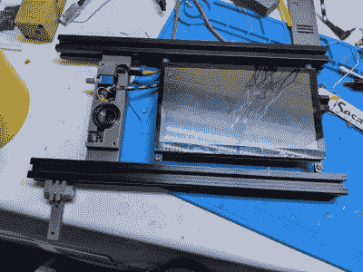

# 2022 年赛博甲板竞赛:挤压钻机散发着凉爽

> 原文：<https://hackaday.com/2022/08/20/2022-cyberdeck-contest-extruded-rig-exudes-coolness/>

当我们想出网络平台竞赛的时候，我们想我们会看到各种各样的构建，到目前为止，你们没有让我们失望。以【无面者】建造的这个整洁但却是后世界末日风格的建筑为例。它有“我用了我能在废墟中找到的东西”的吸引力，但它看起来如此干净。这是为什么呢？

 这一定部分是因为车架，也就是 2020 铝型材挤压而成。现在你可以看到，这个 cyberdeck 基于 Raspberry Pi 400，它结合了 Pi 4 的功能和 chiclet 键盘以及昔日一体式计算机的复古感觉。

但这个 cyberdeck 的建设真正开始是因为[无脸失败者]有一个 7 英寸的 HDMI 屏幕考虑了一段时间，最终决定采用这种设计。屏幕通过一对[定制印刷的支架](https://www.printables.com/model/205859-cyberdeck-2020-edition)连接到挤压导轨，并通过更多的塑料防止来回滑动，包括一个漂亮的外壳，用于容纳扬声器、放大器板、耳机插孔和 USB-C 端口。

由于屏幕本身没有声音，[无脸失败者]增加了一个 3 W 的放大器板和一个扬声器，用于播放芯片音乐和其他类型的电子噪音，提供恰到好处的氛围。我们非常喜欢背面由六边形制成的印花网布，它不仅看起来很漂亮，而且是一种实用、简约、透气的解决方案，既能收纳线缆，又能展示内部结构。你可以在博客文章上找到[更多的细节和一些额外的构建图片，请务必在休息后查看视频，看看【无脸失败者】如何将这个网络平台应用到他们的工作台上，并留下来参观构建。](https://facelesstech.wordpress.com/2021/11/20/cyber-deck-2020-extruder-edition/)

 [https://www.youtube.com/embed/Bwmbo6YYKE4?version=3&rel=1&showsearch=0&showinfo=1&iv_load_policy=1&fs=1&hl=en-US&autohide=2&wmode=transparent](https://www.youtube.com/embed/Bwmbo6YYKE4?version=3&rel=1&showsearch=0&showinfo=1&iv_load_policy=1&fs=1&hl=en-US&autohide=2&wmode=transparent)

