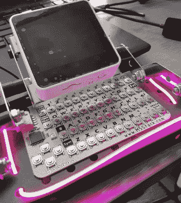

# 2022 年网络甲板大赛:RPG 角色追踪器

> 原文：<https://hackaday.com/2022/09/14/2022-cyberdeck-contest-rpg-character-tracker/>

虽然认为网络平台的构成有任何固定的规则是错误的，但我们至少可以确定一些共同的特征，这些特征似乎可以给我们一个基线描述。例如，我们看到的大多数 deck 构建都是全功能的 Linux 计算机，通常由一些 Raspberry Pi 变种提供支持。但这并不意味着社区中没有空间容纳计算能力较弱的平台，或者定制得只能执行少数选定任务的构建。

 作为一个完美的例子，看看【梅丽莎·马托斯】的 [RPG 角色追踪器。你在这里找不到一个树莓派，也找不到一个完整的操作系统。相反，我们有一个 M5Stack Core2 和一个 I2C CardKB 迷你键盘，包裹在由 Erector 套件制成的可折叠框架中。加入一点 LED 灯光，营造出赛博朋克的感觉，舞台就搭建好了。](https://hackaday.io/project/187288-cyberdeck-rpg-character-tracker)

那么这个小小的建筑是做什么的呢？显然现在什么都没有。[Melissa]刚刚组装好硬件，最近才开始整理所有的 1 和 0 来执行她的命令。但是它应该做的事情已经很清楚了:它旨在成为复杂的 RPG 桌面游戏的电子伴侣，以帮助诸如角色创造之类的事情。听起来它还会有一个“掷骰子”模式，当你的一个 d20 坏掉时，这将省去你不得不爬到桌子底下的麻烦。

虽然这种设备可以用于许多不同的游戏，但听说[梅丽莎]目前正在瞄准赛博朋克*shadow run 也就不足为奇了。*

虽然我们特别喜欢让你为所有桌面游戏需求生成 3D 打印组织者的[在线工具](https://hackaday.com/2022/02/19/make-your-own-tabletop-game-organizers-with-online-tool/)，但我们肯定更喜欢像这样的数字伴侣，这将使那些装满零件的塑料袋过时。

