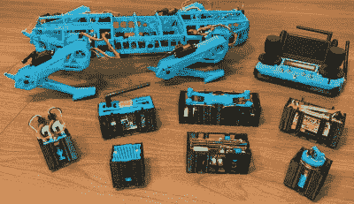

# 2022 年 FPV 竞赛:LOTP 机器狗

> 原文：<https://hackaday.com/2022/12/21/2022-fpv-contest-the-lotp-robot-dog/>

当你想到第一人称视角(FPV)车辆时，飞机可能是你首先想到的。然而，[【limen itis Reducta】已经将一只机器狗](https://hackaday.io/project/188660-lotp-robot-dog-v2)带到了这个世界，并计划为它装备一些 FPV 冒险。

LOTP pictured with various equippable modules.

机器狗本身被命名为 LOTP，原因不明，是在 Fusion 360 中从头设计的。Teensy 3.5 负责运行表演，管理控制输入，并向电机控制器输出必要的指令，以管理行走周期。运动是通过定制 RC 控制器发出的。由于机载 IMU，机器人平台能够有效地行走，即使在倾斜或移动的平台上也能保持平衡。

[Limenitis]制造了一个模块化平台的机器人，以支持不同的任务。公平模块包括一个用于检测危险气体的传感器，一个无人机发射平台和一个激光雷达模块。还有一个摄像头可以将实时视频发送到遥控器。[Limenitis]已经用一个似乎是普通的无人机 FPV 相机实现了这一点，这是一种完成工作的简单方法。

这是一个有趣的建筑，看起来准备好在外面冒险。用 FPV 相机这样做看起来肯定很有趣，我们也在其他机器狗上看到过类似的装备[。](https://hackaday.com/2021/09/27/robot-dogs-hack-chat/)

 [https://www.youtube.com/embed/w09KS9C38RI?version=3&rel=1&showsearch=0&showinfo=1&iv_load_policy=1&fs=1&hl=en-US&autohide=2&wmode=transparent](https://www.youtube.com/embed/w09KS9C38RI?version=3&rel=1&showsearch=0&showinfo=1&iv_load_policy=1&fs=1&hl=en-US&autohide=2&wmode=transparent)

 [https://www.youtube.com/embed/0Uxo6_Tk0NY?version=3&rel=1&showsearch=0&showinfo=1&iv_load_policy=1&fs=1&hl=en-US&autohide=2&wmode=transparent](https://www.youtube.com/embed/0Uxo6_Tk0NY?version=3&rel=1&showsearch=0&showinfo=1&iv_load_policy=1&fs=1&hl=en-US&autohide=2&wmode=transparent)

