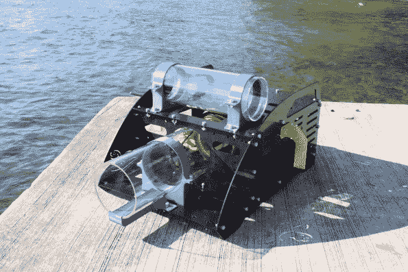
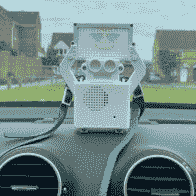
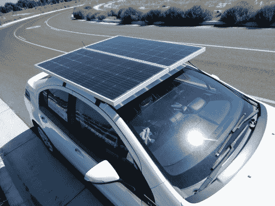
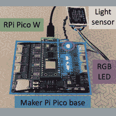
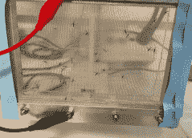
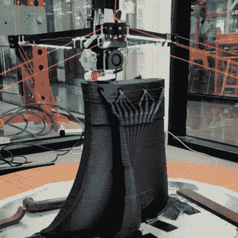

# 2022 年 Hackaday 奖:祝贺你们，外卡赢家！

> 原文：<https://hackaday.com/2022/10/19/2022-hackaday-prize-congratulations-wildcard-winners/>

通配符回合是最疯狂的回合，2022 年 Hackaday 奖有许多优秀的参赛作品。我们已经筛选出少数通配符，我们很高兴宣布最终候选人。每位获奖者将获得 500 美元的奖励，并自动进入最后一轮的 Hackaday 大奖。大奖获得者将在 11 月 5 日的 Supercon 期间公布，我们将进行直播，因此无论您是否在帕萨迪纳与我们一起，您都可以为您的最爱加油。

话不多说，决赛选手。

## 狂野的海洋和观察空气

我们的两位外卡决赛选手将他们的努力转向了海洋。Otter Force One 本质上是一个水下人工智能驱动的真空紫海胆收集器。什么？入侵的海胆破坏了海藻森林，扰乱了海洋生态系统。虽然潜水员可以捕获海胆以帮助它们远离海湾，但这可能是机器人更好的工作。原型一是静止的，但新版本旨在移动，用推进器驱动它在海底周围移动。

面向所有人的海洋感知:OpenCTD 是一个邀请，以公民科学的方式进行海洋学研究。这是一种低成本的 CTD:一种测量盐度、温度和水深的设备。这是一个 DIY 的设备，可以让学校、个人或任何有预算的人开始了解他们当地的海洋。

        

即使你不住在海边，你也可能呼吸空气。如果你担心当地的空气质量，那么[minded Droid](https://hackaday.io/project/187165-mindful-droid-take-action-against-air-pollution)和[互动空气质量地图](https://hackaday.io/project/187662-the-interactive-air-quality-map)将帮助你量化空气质量。前者是一个可爱的像素艺术装饰的机器人，既便携又有信息——显示传感器读数供所有人观看，甚至讨论。该地图更像是一个家用设备，但它可以向其他地图报告数据，并共同帮助绘制出一个城市当前的空气质量状况。

## 欢迎野性

然后是不典型的项目——这就是为什么你有一个通配符回合。领先的是 [Bloft Mk2 3D 打印机](https://hackaday.io/project/187059-bloft-mk2-3d-printer-for-plastic-waste)，这是一种悬挂式打印机，带有一个吃颗粒的喷嘴，允许它使用回收塑料，并以足够大的规模挤压来制造家具。[自动建筑](https://hackaday.io/project/187663-automatic-construction-inflatable-building)使用充气模型和一种独特的肥皂泡泡沫混凝土，这种混凝土实际上可能有助于隔离二氧化碳，抵消一些混凝土的排放。

[自主研究实验室](https://hackaday.io/project/186289-autonomous-research-laboratories)是一个闭环科学自动化演示项目，它基本上由一台分光光度计和一些发光二极管组成，但它旨在展示你*如何能够*自动化简单的实验。同样疯狂的是， [DC-DC 太阳能电动汽车充电器项目](https://hackaday.io/project/187634-dc-dc-solar-ev-charger)将一块太阳能电池板和特制的 MPPT 充电装置安装在电动汽车的车顶上。我们不知道它是否会联网，但至少它在收集数据。

          

另一个有希望的项目是[Tica-Lab——电气化蚊帐](https://hackaday.io/project/187659-tica-lab-electrified-mosquito-net)。基本的创新是一种负担得起的导电蚊帐，可以在白天通过太阳能电池板充电，在晚上电死蚊子，而不使用杀虫剂。他们仍在生产方面工作，但这个项目看起来真的很有进展。

最后， [JoyToJoy](https://hackaday.io/project/186678-joytojoy) 是一个可爱而简单的项目，它将视频游戏操纵杆功能添加到轮椅驱动的操纵杆控制器中。它基本上由一堆可配置的操纵杆头组成，这些操纵杆头都嵌入了一个 IMU，可以检测它们的位置。添加一些按钮，设计 3D 打印来满足用户的需求，你就有了一个轮椅兼容的指点设备。这是一个开箱即用的解决方案，既聪明又尊重用户。在我们的书中，这是一个通配符胜利。

## 最后的日子

随着我们的 50 名决赛选手在本周末的截止日期前对他们的项目进行最后的润色，我们的评委拿出他们精致的梳子仔细检查，我们可以[回顾一下所有 327 个(！)进入](https://hackaday.io/submissions/prize2022/list)的项目。我们期待着 11 月 5 日的决赛。

再次感谢 Supplyframe 和 Digikey 是 Hackaday 奖的忠实支持者！

## 拯救世界通配符决赛选手

*   [獭力一号](https://hackaday.io/project/186901-otter-force-one)
*   [Bloft Mk2](https://hackaday.io/project/187059)
*   [为每个人感知海洋](https://hackaday.io/project/187637)
*   [Joytojoy](https://hackaday.io/project/186678)
*   [DC-DC 太阳能电动车充电器](https://hackaday.io/project/187634)
*   [互动空气质量地图](https://hackaday.io/project/187662)
*   [自动建筑:充气建筑](https://hackaday.io/project/187663)
*   [自主研究实验室](https://hackaday.io/project/186289)
*   [正念机器人——采取行动对抗空气污染](https://hackaday.io/project/187165)
*   [Tica-Lab-带电蚊帐](https://hackaday.io/project/187659)

The [HackadayPrize2022](https://prize.supplyframe.com) is Sponsored by: