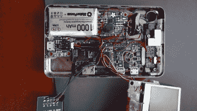
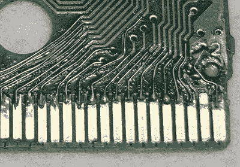

# 2022 年黑客日大奖:黑回去，让它成为你的

> 原文：<https://hackaday.com/2022/06/13/2022-hackaday-prize-hack-it-back-and-make-it-yours/>

2022 Hackaday 奖继续飞速前进，五个挑战中的两个已经成为过去。虽然我们自然对今年比赛的每个阶段都感到兴奋，但我们对社区在第三次挑战中的表现寄予厚望: *Hack it Back* 。

这是一个简单的公式:找到一些过时和废弃的设备，把它打扮一下，不要扔进垃圾填埋场。但延长消费类硬件的寿命只是硬币的一面，通过升级和修改某些东西，而不是购买现成的替代品，你也可以将平凡变为独特和个性化的东西。但是当然，我们几乎不需要向你们解释这些好处——这就是我们在 Hackaday 几乎每天都会看到的那种[定制工程。现在的区别是有现金奖励。](https://hackaday.com/2022/06/12/modernizing-an-outdated-electric-vehicle-charging-station/)

Custom iPod, some Assembly Required

因此，如果你的桌子上有一个旧的 iPod 正在积灰，也许现在是时候用一些现代硅来取代它的内脏，并教它一些新技巧了。当然，一个全新的机器人吸尘器可能会很好，但你可以通过[买一个二手 Roomba](https://hackaday.com/2021/03/09/roomba-gets-alexa-support-with-an-esp8266-stowaway/) 并在车上塞一个 ESP8266 来为自己节省一些钱。在我们现在认为理所当然的方便的数据导出功能出现之前，有没有一件很好的测试设备？你可能需要使用核选项和[从单元的 LCD 控制器](https://hackaday.com/2022/05/05/exporting-data-from-old-gear-through-lcd-sniffing/)上抓取想要的数据。我们可以花一整天的时间从档案里找例子，但你会明白的。

你说什么？你不是那种会被闪亮的新功能诱惑的人？乐于把东西放在本地，而其他人把所有东西都运到云上？我们不会向您投诉，这也是为什么 Hack it Back 挑战赛也认可简单地将一件设备重新投入使用的维修。但是不要被愚弄了，因为修复一个东西往往比从头开始重建更难。

 当你不得不[撬开 x 光机，在一个有几十年历史的印刷电路板上找到所有损坏的痕迹](https://hackaday.com/2022/03/06/vintage-mmu-repair-its-easier-with-x-rays/)，然后又单调乏味地[用微小的金属丝代替它们](https://hackaday.com/2021/09/15/bringing-a-ruined-game-boy-cart-back-to-life-with-tons-of-soldering/)时，你可能会发现自己做了什么激怒了魔烟的守护者。另一方面，由于[没有比一个不良焊点](https://hackaday.com/2022/01/12/rohde-schwarz-fsiq-signal-analyzer-if-filter-module-repair/)更奇特的东西，许多小配件已经被禁用。无论是哪种情况，当你能够[将一段真实的历史恢复到工作状态](https://hackaday.com/2021/09/13/cisco-router-repair-revives-piece-of-internet-history/)时，都会有某种满足感。

准备好展示你的硬件恢复技能了吗？只需前往 [Hackaday.io](https://hackaday.io/) ，创建一个新的项目页面，然后开始黑客活动。但是不要等太久，你只需要在 7 月 24 日之前参加 Hack it Back 挑战赛，并在 10 个 500 美元的奖励中赢得一个。

The [HackadayPrize2022](https://prize.supplyframe.com) is Sponsored by: