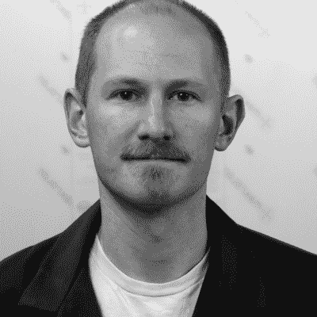
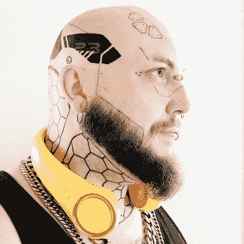
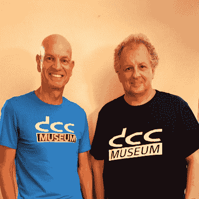
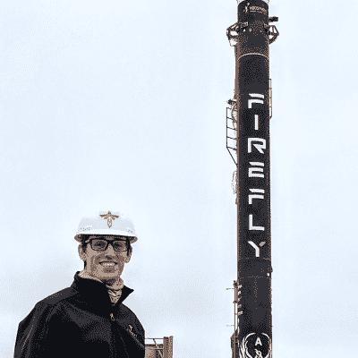

# 2022 Hackaday Supercon 扬声器将激发您的灵感

> 原文：<https://hackaday.com/2022/10/04/2022-hackaday-supercon-speakers-will-inspire-you/>

超级大陆的回归将在一个月后举行。我们为为期三天的周末计划了 45 场精彩的讲座和研讨会，它们就像 Hackaday 社区本身一样丰富多彩，令人振奋。从分子到军用连接器，这里有十几个讲座可以吊起你的胃口。

Supercon 是终极硬件会议，您必须出席！在接下来的几周里，我们将继续宣布演讲者和研讨会。super co*将*卖光，所以[现在就去买票](https://www.eventbrite.com/e/2022-hackaday-superconference-tickets-402410268947)，否则就太晚了。敬请期待下周的下一轮访谈节目！

Ben Krasnow
Counting molecules: chemical identification at parts-per-trillion levels

可以测量超低浓度的实验室技术概述。本讲座还将涵盖饮用水(或葡萄酒)中的铅等重要应用。)以及如何搭建自己的探测器。

Michael Whiteley
There’s No Rev 2: When Badgelife Goes Wrong

当你做了几千个徽章，然后发现一个问题，会发生什么？没有时间或预算来重新制作它们，你会怎么做？来听听来自#badgelife 战壕的故事，从我的错误中吸取教训。

Liz McFarland
Fandom and Fabrication: How I Made Electronically Actuated Cosplay Wings

在这个演讲中，我将解释我是如何为我的金鹰神奇女侠角色扮演设计和制作电子关节翅膀的。我将讲述我所面临的限制:预算、重量和电池消耗。我还将谈到创造真实生活版本的虚构服装和道具的挑战。

Nick Poole
DIY Vacuum Tubes: How Hard Could It Be?

我们都以不同的方式对待疫情。尼克非常…非常喜欢真空管。事实上，到目前为止，他正在组装工具来制作他自己的。有没有想过如何在你的家庭实验室中复兴一项百年老技术？希望这次演讲能给你一些启发。

Dr. Irak V. Mayer
Building Self-Sustainable Outdoor IoT Devices

可操作的户外 IOT 设备受到电池寿命的限制。我们提出了一种自供能的灌溉监控系统，该系统通过风力、水力或太阳能为 LiPo 电池充电。结果显示了利用自然资源作为能源的潜力。

Stephen Hawes
It Takes a Village: Lessons Learned Starting an Open Source Hardware Company

在这次演讲中，我将分享我在创办开源硬件公司时所面临的一些固有挑战，以及为什么这些挑战绝对值得解决。保持您的源代码开放不仅有极大的好处，还能让用户更好地完成他们的目标。这才是问题的关键，不是吗？

Jac Goudsmit and Ralf “Dr. DCC” Porankiewicz
Reverse-Engineering the Digital Compact Cassette

DCC 是一种短命的数字音频磁带格式，具有许多从未问世的功能。该演示揭示了 DCC 的秘密，并将表明 DCC 过去和现在都不仅仅是一个听起来更好但不太用户友好的 MiniDisc 的竞争对手。

Sherry Chen
To (un)muddy the water: how we built S.S.MAPR, an autonomous boat for water quality monitoring

构建一个自主的硬件系统很难，如果是为浑水设计的话就更难了。我们在 5 个月内从头开始建造了一艘自主船，帮助水务部门收集多深度水质数据，并赢得了康奈尔杯大奖。这是我们学到的。

Sam Mulvey
Trash on the Radio: Post-Consumer Broadcast Engineering

在 KTQA，我们已经用自由软件、实际垃圾、捐赠的设备、唾液、汗水和善意建立了一个正常运转的电台。我将讨论建设和运营广播电台的过程，作为进入社区广播电台的邀请——一个比你想象的更活跃的地方。

Mooneer Salem
Miniaturizing HF Digital Voice Using the ESP32 Microcontroller

FreeDV 是一种新兴的数字语音模式，专为传统上需要电脑的业余无线电爱好者设计。本次演讲将介绍我如何使用 ESP32 微控制器设计一个电路板，对该模式进行调制和解调，并在此过程中了解一些硬件设计。

Joshua Wright
Going Battery Free – Applications Guide For Indoor Photovoltaics

你会用一微瓦做什么？我们正处于一个高功率密度光伏、高效能源采集和极低功率电子设备的时代。本次讲座将涵盖典型的住宅照明、室内光伏、能量采集、能量存储，并为您的应用提供免电池指南。

Joseph Marlin
Let’s Connect – A Maker’s Introduction to the Wide Overwhelming World of Military and Industrial Connectors

除了我们日常使用的 USB 和电插头之外，还有一个广阔的连接器世界，可以想象出各种形状和尺寸。在这里，我们将了解这些不起眼的设备如何导致世界上一些最复杂系统的崩溃，讨论可用的选项，并讨论为您的项目选择连接器时的注意事项。

如果你读到这里，你可能想要票。只是说说而已。]