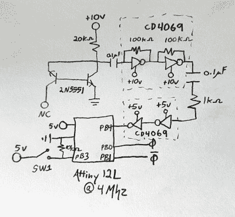

# 2022 年科幻竞赛:薛定谔的触发器被训练在电子上，而不是猫上

> 原文：<https://hackaday.com/2022/04/18/2022-sci-fi-contest-schrodingers-trigger-is-trained-on-electrons-not-cats/>

虽然 Hackaday 的抄写员和他们的家人很遗憾地无法在我们的比赛中竞争，但 Hackaday 的明矾非常欢迎他们参加比赛。[军团实验室]甚至制作了一个游戏——他们只使用废料堆中的零件，甚至玩“打败时钟”游戏，在八个小时或更少的时间内建造一个真正的、科幻的、可工作的东西。

好吧，酷，但是它有什么用？简单地说，输入的上升沿驱动两个输出之一，点亮两个值得流口水的法兰 led 之一。哪一个输出会[发光]在观测之前是不可知的，这就是薛定谔的观点。实际上，输出是通过采样确定的。在这种情况下，采样是三个电子隧穿事件之间的时间差。

 薛定谔触发器的阶段一是一对输入——一个变量 10-15 VDC 输入和 5 VDC 输入。然后是电子隧道事件发生器。[军团实验室]正在对一个半导体结(2N551 晶体管)进行反向偏置。那是什么意思？如果我们将结视为二极管，并在错误的方向上施加电压，会发生什么情况？充其量，什么都没有；最坏的情况是，烟雾怪似乎在告诫我们。

但是由于半导体充当二极管，一些电子必然会跳过结。这被称为*隧道*，这是一个有用的现象，因为它是完全随机的。

第三阶段包括通过 hex 反相器放大这些反叛电子的信号。为什么不是运算放大器？CD4069s 更便宜，而且触手可及。最后，用 ATtiny12 对放大的信号进行采样，一些组装逻辑计算出哪个导致发光。

很高兴看到参赛作品更倾向于科学的一面，同时赢得美学上的胜利。我们喜欢漂亮的 ABS 外壳，非常羡慕[军团实验室]能够接触到凸缘 led 和角落里的玻璃桌面安装点光盘。

