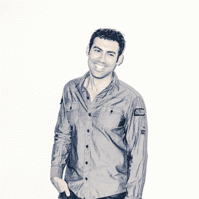
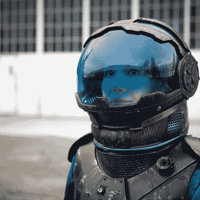
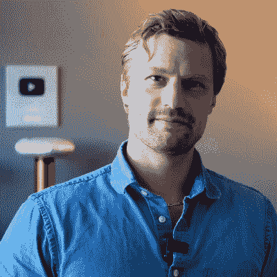
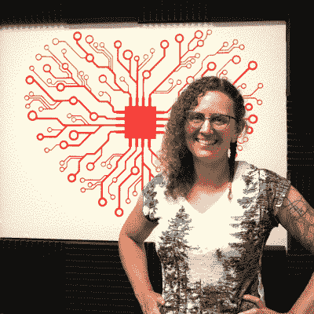
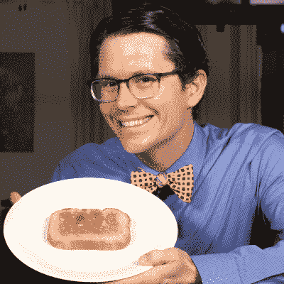
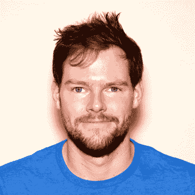
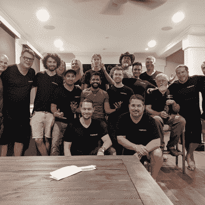
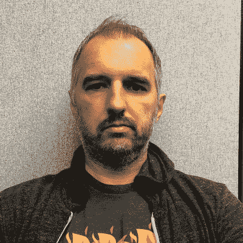
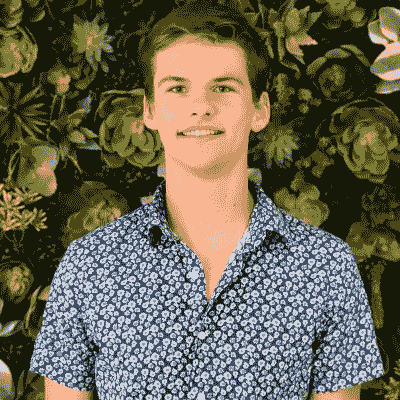

# 2022 Supercon:更多的演讲，更多的演讲者！

> 原文：<https://hackaday.com/2022/10/11/2022-supercon-more-talks-more-speakers/>

2022 年 Supercon 会谈的第二轮已经结束，这是另一个出色的阵容。这一轮都是高压电，艺术，科学。如果你曾经梦想开一家自己的黑客公司，制作自己的冰箱，教你的烤面包机思考，或者只是让你的呼吸发光，那么 11 月 4 日至 6 日，Supercon 是你想去的地方！

super co*将*卖光，所以[现在就去](https://www.eventbrite.com/e/2022-hackaday-superconference-tickets-402410268947)买票，否则就太晚了。请继续关注下周的下一轮也是最后一轮谈话！加上主讲人透露。加上工作坊。我的天啊。

Samy Kamkar
How to Make Your Breath Glow in a Wearable Glass Pendant 

轻！物理！捏造！让我们开始制作包含我们发光呼吸的玻璃吊坠，无需 led:柔性 PCB 设计、灯工作、生产真空管、可佩戴的特斯拉线圈、氧气提取和电离气体，以查看它们美丽的颜色(发射光谱)！所有这些都是在家里穿着我们最喜欢的睡衣，使用低成本/DIY 设备。

Sophy Wong
Beyond Technique: Artistic Wearable Technology

Sophy Wong 是一名设计师和艺术家，他设计的服装和时装融入了科技元素。为了让她的设计栩栩如生，她将亲自动手的服装设计与数字制作和实验技术相结合。Sophy 将分享最近完成的作品，她创作这些作品的过程，以及她超越技术创造艺术可穿戴技术的追求。

Jay Bowles
Beyond engineering, and a dip into the Plasmaverse

通过舞台上的演示和预先录制的视频，我计划激励尽可能多的人去建造、创造和设计。会有高压电，火花，一如既往的科学。

Carrie Sundra
Manufacturing on a Shoestring Budget

这个演讲是为任何考虑自己制造硬件产品的人准备的。我将介绍从第一个概念验证到成功构建第一个 100 个单元所需的所有步骤。

Shawn Hymel
Hacking a Toaster with Machine Learning to Produce the Perfect Toast

烤面包机通常依靠计时器或双金属片来控制烘烤过程。然而，我决定利用气体传感器和机器学习将这个问题提升到下一个(过度工程化的)水平。有趣的是，估计“燃烧前时间”被证明是预测性维护的一个很好的例子。

Alex Whittemore
Making sense of sensors: Grafana for Makers (and other assorted strategies)

Adafruit 和 Sparkfun 让硬件开发变得如此简单，以至于我经常遇到的问题是如何理解您的定制设备生成的数据。在这次演讲中，我将为创客们介绍数据收集和可视化，从简单到精彩。

Chris Combs
Art-World Compatibility Layer: How to Hang and Sell Your Blinky Goodness as Art

你做了很棒的东西！但是它能存在于你的已完成项目大厅之外吗？这个讲座涵盖了将一个很酷的 blinky 转化为可销售的艺术品的必要步骤:艺术品买家的期望，如何找到展览，以及你的光辉作品如何能在别人的墙上存活多年。

Nat Galin
Galin Engine: Software is Eating the Internal Combustion Engine

我们将解释我们的解决方案如何实现旋转叶片发动机，以及发动机的结构如何使其非常适合从碳氢化合物中产生电能(而不是机械轴输出)。

Haddington Dynamics
Getting Bought Without Selling your Soul

与哈丁顿动力公司(Haddington Dynamics)团队的这次小组讨论将强调在被收购的同时保持黑客文化的策略，哈丁顿动力公司是 2018 年黑客日奖得主德克斯特的创造者。

Amitabh Shrivastava
Refrigediro- OpenSource Refrigeration Systems

将铜管焊接到压缩机上，并添加制冷剂来制作一个在几分钟内产生霜的制冷回路，这是令人惊讶的简单！在这次演讲中，我不仅会解释制冷系统背后的工作原理，还会展示如何以及为什么你可能想自己做一个。

Kuba Tyszko
Cracking encrypted software like it’s 1988

以各种创造性的方式破解加密软件的图解方法。额外的收获是，演讲中提到了旧电脑

Alec Vercruysse
A Low-Cost, Underwater, Ultrasonic Phased Array Research Platform

这项工作提出了一个声学相控阵是开源的，易于修改。大部分的成本节约来自于修改水下使用的现成传感器。九元素阵列用于海洋生物研究。

如果你读到这里，你可能想要票。只是说说而已。]