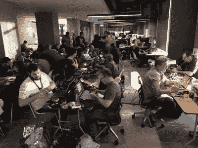

# 2022 Supercon:时间表发布，和[奇数 Jayy]

> 原文：<https://hackaday.com/2022/10/26/2022-supercon-schedule-released-and-odd-jayy/>

终于到时间了！我们已经整理了 2022 年超级会议日程安排，你可以在一个地方查看所有的会谈、研讨会和活动——现在。

Badge hacking heating up (photo by [@hackerwarehouse](https://twitter.com/hackerwarehouse/status/929848129465106433))

这一切都从周五早上的早餐开始，让你在周五晚上的派对之前有一整天的时间进行徽章破解、研讨会和一般的混合和交往。星期五明显不太正式，但任何时候都可以来 Supplyframe 总部注册，领取徽章，并在 Supercon 上有一个良好的开端。

周六早上，会谈开始！在简短的介绍和欢迎之后，主题演讲人 Joe Grand 上台开始。从那时起，这是两个阶段的两个轨道的谈话，直到你的大脑爆炸。或者至少等到晚上 7 点的 Hackaday 奖颁奖典礼，然后是颁奖晚会。

周日早上把自己从床上拉起来，开始另一整天的精彩谈话。以某种方式挤出一些最后一分钟的徽章黑客时间，因为我们在周日晚上结束了总是有趣的徽章黑客比赛和奖项。

## 约尔冯[奇杰伊]莫斯说话了

另外，我们还有最后一个好消息:乔冯·莫斯正在做一个关于他制造伙伴机器人的冒险的演讲，以及他最近为他的电子动画和艺术作品增加更多智能的尝试。

所以，如果你还没有买票，那就去买吧。努夫说。超级广场见！

如果你不能现场直播，LACM 舞台上的所有演讲都将在我们的 YouTube 频道上直播，你可以在 [Hackaday Discord 服务器](https://discord.gg/NkbHrAW7NG)或 [Hackaday.io 的 Supercon 聊天频道](https://hackaday.io/messages/room/306977)加入讨论。所有我们不能播放的演讲，我们都在录制，以便以后发布，所以你可以随时了解。