# 35C3:最大的交流大会，但几乎没有混乱

> 原文：<https://hackaday.com/2019/01/10/35c3-biggest-communication-congress-yet-little-chaos/>

在过去的 35 年里，德国混沌计算机俱乐部每年都会在圣诞节后举行为期几天的“spaam Gert”聚会，与机器一起玩耍。从试图让旧的 PDP-8 恢复运行状态，到打造新的软件来取代渗透到我们生活中的旧的和崩溃的社交媒体平台，这一切都是如此。总共约有 17，000 人做着他们喜欢的无聊事情，并一起分享，这既令人惊讶又鼓舞人心。四天的小睡和社交之后，我敢打赌还有四天的东西值得看。

 今年的官方主题是“刷新记忆”,老实说，这听起来有点像可乐的口号，但这是一个很好的机会来回顾过去的黑客，正是它们让我们走到了今天。集会者为他们过去的黑客英雄竖起了神龛。复古电脑无处不在，在会谈中，在地板上。今年的大会是回顾和回忆的好时机，也是为未来创造新的回忆的好时机。在那方面，它是完全成功的。

但今年非官方的主题是“平稳运行”。[一切都很顺利](https://media.ccc.de/v/35c3-9576-35c3_infrastructure_review)，考虑到基础设施、装饰、安全，甚至医疗响应团队都来自混沌社区，这可不是一个小壮举。正是参与的深度使这项工作得以进行:在 17000 名参与者中，只有 4000 多人自愿参加“天使”轮班——这意味着他们帮助看门，为咨询台工作人员，或者建设或拆除。这是有史以来最大的 CCC，你可以感觉到，但他们成功了，然后更多。

天使和你我一样都是极客，因为一切都进行得如此顺利，他们有时间玩。例如，电话操作人员提供 [DECT 电话](https://en.wikipedia.org/wiki/Digital_Enhanced_Cordless_Telecommunications)服务，这样与会者可以把他们的家庭电话带进来，在大会上使用。在过去的几年里，注册和登记电话的队伍长得令人痛苦。今年，这一切都发生在网上，结果是电话操作人员感到无聊。这解释了为什么他们有时间在一些正常的莱比锡市电车上建立漫游家庭电话无线服务。等等，什么？

## 展示和讲述？没有。过来做！

黑客伦理渗透到 CCC 中:它不仅仅是参与者参加的，它*是*参与者。两个巨大的大厅专门用于“集会”——黑客空间或兴趣小组，或者只是聚在一起的人群。这些集会可能仍然是大会的核心和灵魂——毕竟，CCC 中的“C”代表“交流”,在这些集会上，你可以结识朋友，结识新朋友。今年我花了大部分时间在集会上。

虽然毫无疑问，一些大会带来了令人敬畏的完成工作，但我喜欢看到所有带着尚未完成的项目出现的大会，并在大会期间至少花一些时间一起工作。想知道黑客有几天空闲都干嘛？黑。

 [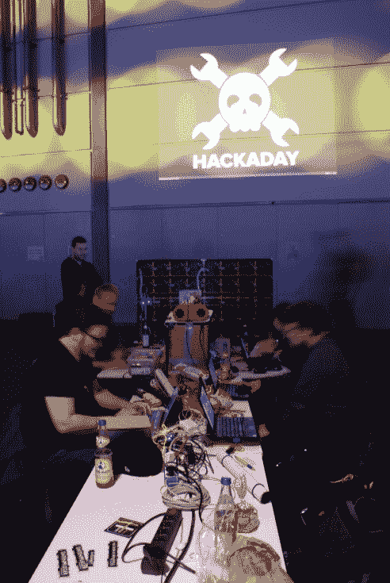](https://hackaday.com/2019/01/10/35c3-biggest-communication-congress-yet-little-chaos/sony-dsc-102/) Hackaday, Assemble! [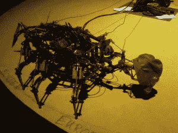](https://hackaday.com/img_20181227_203504/) Upload your own firmware into post-apocalypitc pneumatic robot  Hector 9000! [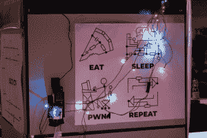](https://hackaday.com/dsc00910_bright/) Yup [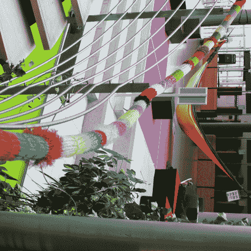](https://hackaday.com/dsc00923_thumbnail/) Knitted during the congress [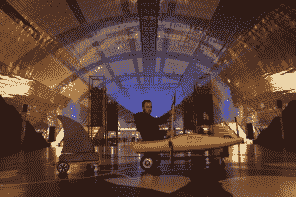](https://hackaday.com/a07a5848/) Paddling with accelerometers [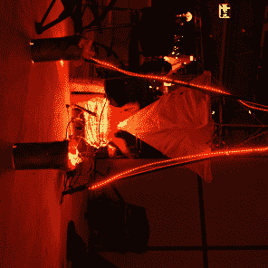](https://hackaday.com/dsc00915_thumbnail/) Hacking around the virtual campfire [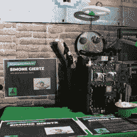](https://hackaday.com/dsc00912_thumbnail/) Shrine to Simone Giertz, for inspiring kid hackers [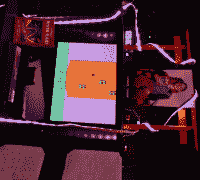](https://hackaday.com/dsc00925_bright_thumbnail/) Playable shrine to Carol Shaw, Game Programmer  PDP-8 lab edition, brought back to working at 35C3 [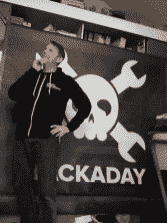](https://hackaday.com/dscf1160_thumbnail-2/) Our banner: stolen on night one. Theft is the sincerest form of flattery? Next time, please wait until the last night. 

【托比亚斯】【FPGA 驱动的 LED 怪物

hack aday 社区组装了[第一个组件](https://hackaday.io/project/162413-hackaday-35c3)，我们玩得很开心！在展示和讲述方面，[Tobias]带来了一个由定制 FPGA 帧缓冲器驱动的巨型 LED 显示屏和一个运行复古游戏的 Beaglebone。[乔]和[托拜厄斯]也带来了他们 flipdot 展示项目的一些片段，这将是一个直径为 1 米的 flippy goodness 圆形，当所有的都说和做了。虽然他们实际上在项目上完成了一些工作，但他们也一直忙于向每个路过的人解释他们正在做什么。

[戴夫·达科]手头有许多他定制的徽章，包括他为会议制作的一个。在真正的混沌精神中，它还没有编写任何固件——它只是一个空白的多无线电石板。所以他给[SpaceHuhn]和 Innsecure 的其他成员发了一堆让他们黑进去。让我们看看他们有什么发现。[Alex]正在为[甚至更小的 LED 矩阵](https://hackaday.io/tinyledmatrix)进行布局和零件采购！[法特斯巴克教授](https://hackaday.io/professor)正在制作一个共鸣板，为他的摩托车增加噪音。

我带来了一个项目——一个由 16 个光敏电阻组成的蜂巢状蜂眼和一个匹配的显示器——这是我在离家前一天晚上匆匆做好的。不用说，固件还没有写出来，我在火车上花了几个小时研究它，结果碰了壁。有一次，我去找写了第四个系统的 Mattias，我用第一个系统来做这样的项目。他很快就解决了我的问题，然后我们开始谈论一切，从作为波长依赖型光传感器的 led 到他最近完成的生物物理学博士学位。

另一个附近的组件正在用激光切割的木块组装一个奇妙的可寻址像素阵列。一切都是在现场完成的，据我所知，很多图片是在大会的最后一天设计的。(您在这里看不到它，但这堵墙完全是模块化的，每个模块都使用圆头螺母和垫圈连接到下一个模块，以实现物理支撑和电气接触。非常聪明！)其他组件带来了 3D 打印机农场、整个厨房或老式电脑，让它们重获新生。工作正在进行中。

我们在硬件黑客元装配附近，在那里[Mitch Altmann]正在举行一系列似乎永无止境的面向初学者的研讨会，[Piotr Esden-Tempski]正在根据他在 Supercon 上的破冰板举办他的 FPGA 研讨会，[Kliment]正在讲授基于 skillet 的回流焊的福音，[Helen Leigh]正在向一群人讲授如何制作柔性织物传感器。焊料在融化，代码被输入或调试，每天 24 小时。这只是在一个大厅里。另一个有自制的赛车跑道！

简而言之，国会的集会就像一个运行良好的元黑客空间，每个人都带着他们的项目，聚集在一起，一起集思广益，一起调试，只是享受黑客的乐趣。一年只能有四天，太可惜了。

 [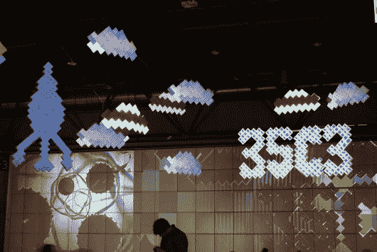](https://hackaday.com/sony-dsc-92/) Projection-mapping everywhere [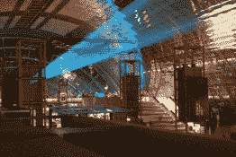](https://hackaday.com/sony-dsc-90/) The main hall at night [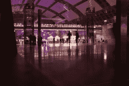](https://hackaday.com/sony-dsc-89/) Everything is prettier with colors [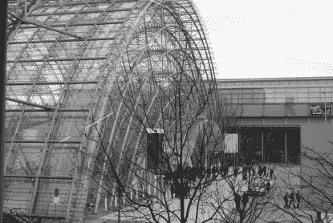](https://hackaday.com/sony-dsc-100/) Looks normal on the outside [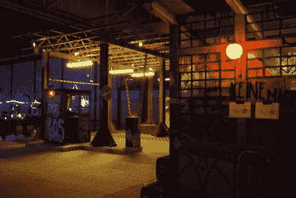](https://hackaday.com/sony-dsc-93/) One awesome bar of many [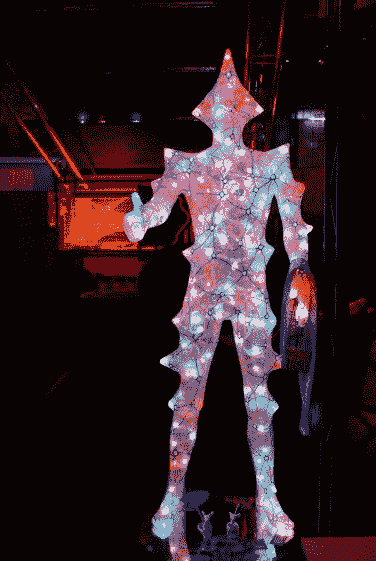](https://hackaday.com/sony-dsc-94/) C-base’s alien friend [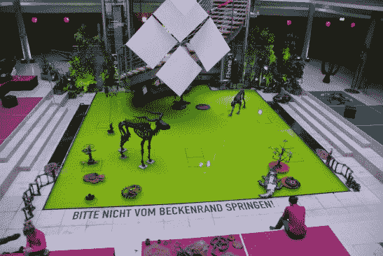](https://hackaday.com/sony-dsc-98/) Don’t jump from the edge of the pool! [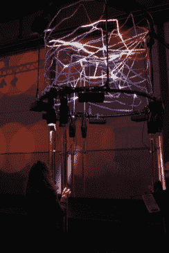](https://hackaday.com/dsc00918_bright/) Interactive light/sound sculpture [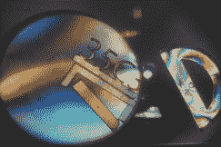](https://hackaday.com/sony-dsc-97/) Art + Science [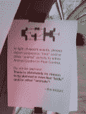](https://hackaday.com/img_20181230_111622/) This meme [got out of hand](https://ctrlcreep.github.io/35c3/) pretty quickly. [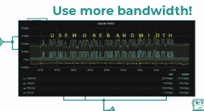](https://hackaday.com/usemorebandwidth/) Someone had to do it  See you at camp!

## 会谈？项目？

哦，是的，也有会谈。在 Hackaday 大会上，我们在墙上投影了五个同步对话轨道中的一个，但仍然没有办法完全理解。幸运的是，[所有的东西都可以在网上找到](https://media.ccc.de/c/35c3)，如果你喜欢的话，还有翻译版本。到目前为止，我们已经介绍了一些，但是我们将在接下来的几周内再写一些，所以请继续关注。

(附赠音轨！想听听[气动机器人](https://hackaday.com/wp-content/uploads/2019/01/robot_march.mp3)或者[风铃/光雕](https://hackaday.com/wp-content/uploads/2019/01/bells.mp3)的动作吗？)

我们还偶然发现了一些需要以黑客风格进行覆盖的项目，其中一些可以在图片库中看到。如果你在 35C3，你看到了一些你认为我们应该写下来的惊人的东西，[让我们知道](https://hackaday.com/submit-a-tip/)！