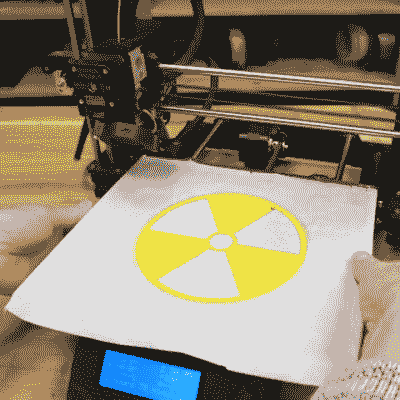
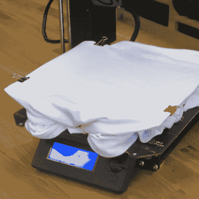

# 一步一步 3D 打印定制 t 恤设计

> 原文：<https://hackaday.com/2021/10/15/3d-print-a-custom-t-shirt-design-step-by-step/>

想做一件印有自定义设计的 t 恤？使用 3D 打印机是可能的，Prusa Research 有一篇证据充分的博客文章和视频，详细介绍了使用 3D 打印创建彩色 t 恤设计的两种不同方法。一种方法使用薄的 3D 打印作为熨烫，另一种方法直接在织物上打印。事实证明，非常薄的 PLA 印花可以在剥离前经受住几次洗涤，但直接在织物上印刷柔性长丝——尽管更复杂——会产生更持久的效果。不确定如何首先将图形转换为 3D 可打印模型？没问题，他们也包括那个。

制作熨斗相当简单，这种方法可以适用于任何类型的打印机。人们只需用一些装订夹将一张烘焙纸(在北美称为羊皮纸)固定在印刷床上，然后涂上胶棒，这样印刷品就可以粘在一起了。一层或两层厚的 3D 打印将粘在纸上，然后可以将打印面朝下放在 t 恤上，并通过在最高温度下熨烫转移到织物上。PLA 似乎最适合熨烫，因为它能更好地保留细节。结果看起来不错，方法也相当简单。

用柔性长丝直接打印到织物上可以产生更好(和更持久)的结果，但这个过程更复杂，需要 3D 打印 Prusa 打印机的凸起底座适配器，并修改相当多的打印设置。但结果不言自明:印刷设计看起来很清晰，即使多次洗涤也不会松散。所以一定要准备几件旧衬衫在身边练习，因为错误是无法挽回的。

A very thin 3D print makes a decent iron-on that survives a few washes.

A 3D-printed bed adapter enables direct printing onto fabric for better results.

[3D 打印机可以用来将设计直接嵌入到织物上](https://hackaday.com/2017/08/27/3d-printing-t-shirt-designs/)这是许多人多年前就知道的事情，但看到一个过程不仅仅是作为概念进行演示，而是作为一步一步的工作流程进行记录总是很好的。从将图形转换为 3D 模型到用这两种方法在 t 恤上打印，所有内容的视频演示都在下面嵌入的短视频中，所以观看一下吧。

 [https://www.youtube.com/embed/9IHftw8cmd8?version=3&rel=1&showsearch=0&showinfo=1&iv_load_policy=1&fs=1&hl=en-US&autohide=2&wmode=transparent](https://www.youtube.com/embed/9IHftw8cmd8?version=3&rel=1&showsearch=0&showinfo=1&iv_load_policy=1&fs=1&hl=en-US&autohide=2&wmode=transparent)

随着万圣节的到来，这里有一个提醒:3D 打印到织物上可以与服装设计一起进入有趣的地方。2020 年的【Remoticon 展示进入了如何使这种方法工作的所有细节。