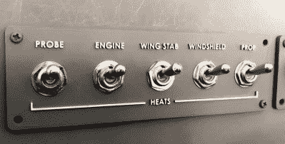

# 3D 打印玻璃驾驶舱模拟器

> 原文：<https://hackaday.com/2019/12/14/3d-print-your-way-to-a-glass-cockpit-simulator/>

今天的商用飞机挤满了装有传感器、计算机和数英里长的电线的电梯。在驾驶舱内，你更可能看到成排的液晶显示器和按钮，而不是模拟仪表。那么这对无畏的家庭模拟器建造者来说意味着什么呢？现代的问题需要现代的解决方案，这个 3D 打印的模拟器是最现代的。

这个项目由名副其实的[FlightSimMaker]发布给 Thingiverse，它由令人眼花缭乱的 3D 打印组件组成，这些组件组合成了 Garmin G1000 航空电子系统的全功能桌面模拟器。从驻车制动杆到显示屏挡板上的按钮，所有东西都经过了设计和印刷:总共超过 200 个单独的零件。这个 X-Plane 11 兼容模拟器中的一切都由 Arduino Mega 2560 和 SimVim 固件控制。

 为了帮助将几十个按钮、拨动开关和旋转编码器连接到 Arduino，[FlightSimMaker]使用了五个 CD74HC4067 16 通道多路复用器。显示器是一个 12.1 英寸的 1024 x 768 LCD 面板，集成了驱动程序，是旋转编码器之后第二昂贵的部件。总的来说，每台显示器的估计成本约为 250 美元。

即使你不打算为自己建造一个高科技的飞行模拟器，这里也有很多对建造前面板有用的想法和技巧。我们特别喜欢 3D 打印字母的技术:部分被打印成白色，喷上较深的颜色，然后将字母表面的油漆打磨掉，露出塑料。即使使用标准的 0.4 毫米喷嘴，这也可以在面板上产生清晰的高对比度标签，而不会造成任何混乱。

当然，虽然令人印象深刻，这些面板只是一个开始。如果你想建立一个身临其境的模拟体验，还有很多工作要做。包括，在最极端的情况下，[购买波音 737 驾驶舱](https://hackaday.com/2012/04/20/a-flight-simulator-made-out-of-a-real-737-cockpit/)。