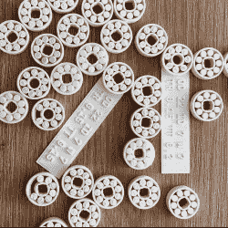

# 实际工作的 3D 可打印轴承，不需要 CAD 调整

> 原文：<https://hackaday.com/2022/09/17/3d-printable-bearings-that-actually-work-no-cad-tweaking-required/>

用 FDM 打印机 3D 打印轴承可能是一个不确定的努力，但它不必如此。[Matvey Kukuy]的[带有校准套件的 Ultimate 608 轴承](https://www.printables.com/model/276409-ultimate-608-bearing-with-calibration-kit)是您在 3D 打印机上拨入和打印功能性 608 型就地打印轴承所需的一切。

Calibration pieces have a handy label attached for identification.

[Matvey]发现有两个关键的公差是正确的。他所说的“正确”是指“凭经验确定哪一种最适合你的灯丝和打印机”。但是不要担心，没有必要进入 CAD 工作来实现这一点。[Matvey]已经出口了惊人的 **64 个略有不同的校准模型**(以及它们匹配的生产版本)以及一个可打印的测试工具。在类似于二分搜索法的一步一步的过程的帮助下，人们可以采取[的金发女孩方法](https://hackaday.com/2020/06/09/finding-perfect-part-fits-with-the-goldilocks-approach-and-openscad/)在最少的步骤中为自己的灯丝和打印机找到合适的型号。

还有一个提示:[Matvey]说，一旦你确定了要使用的最佳模型，不要用副本填满打印床，除非你想要一个装满可能无法工作的轴承的床！这是为什么呢？3D 打印机打印一床物品*与打印一个物品略有不同，因为完美选择的轴承误差很小，这足以让它停止工作。为了一次打印多个轴承，将它们放置在远离彼此的位置，并使用类似于 [PrusaSlicer 的顺序打印](https://help.prusa3d.com/article/sequential-printing_124589)的东西，这是在开始下一个对象之前完全打印每个对象的一个选项。*

[Matvey]自己的最佳结果来自于用 PLA 打印 0.16 毫米的层高度。他还在轴承中使用润滑脂来提高性能和延长寿命。他没有具体说明他使用哪种润滑脂，但我们推荐一种塑料安全的润滑脂，如聚四氟乙烯基超级润滑油。

你在项目中使用过 3D 打印轴承吗？[Matvey]的设计对你有帮助吗？请在评论中让我们了解这一切。