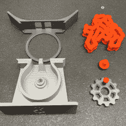

# 3D 打印雕塑展示了不可预测的链条顺序

> 原文：<https://hackaday.com/2022/09/25/3d-printable-sculpture-shows-off-unpredictable-order-of-chains/>

【davemoneysign】设计了这个[引人入胜的滚子链动能雕塑](https://www.printables.com/model/273818-desktop-machine-with-roller-chain)，只要转动手柄，就能创造出翻滚变幻莫测的图案和形状；考虑到零件的简单性和刚性，这是一个令人惊讶的有机行为。

3D-printed, with a satisfying assembly process.

这个的灵感来自于【亚瑟·甘森】的 [*带滚子链的机器*](https://www.youtube.com/watch?v=Tcw7IvGJG9s) 雕塑(视频，嵌入下方)。最初的版本使用金属链条，由电机驱动，但[davemoneysign]受到启发，创建了一个桌面和手摇手动版本。这个新版本完全是 3D 打印的，每件作品都没有支架。

根据[davemoneysign]的说法，该模型适用于 36 个链接的链，但人们可以很容易地试验更多或更少的链接，并看看这如何改变结果。也许加上一个马达，这种设计可以被改造成类似于链条链轮时钟的东西？

你可以在下面的视频中看到[Arthur Ganson]的原创作品。它很好地展示了这件作品的混乱和不可预测的——然而奇怪的有序——运动和形状。难怪[davemoneysign]从中找到了灵感。

 [https://www.youtube.com/embed/Tcw7IvGJG9s?version=3&rel=1&showsearch=0&showinfo=1&iv_load_policy=1&fs=1&hl=en-US&autohide=2&wmode=transparent](https://www.youtube.com/embed/Tcw7IvGJG9s?version=3&rel=1&showsearch=0&showinfo=1&iv_load_policy=1&fs=1&hl=en-US&autohide=2&wmode=transparent)

