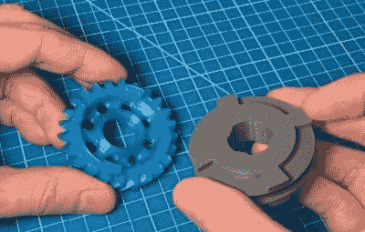

# 3D 打印狗盒传输踢你的桌子进入高速档

> 原文：<https://hackaday.com/2020/03/20/3d-printed-dogbox-transmission-kicks-your-desk-into-high-gear/>

根据我们的经验，一些最令人印象深刻的项目是激情建造，那些建造者真的投入了他们的全部，并且痴迷于每一个细节的项目。即使他们并不总是有实际应用，但看着最终产品而不尊重成就也是不可能的。

 举个例子，这个绝对不可思议的 [3D 打印模型是由【不确定设计】创造的一个连续的“狗窝”传动](https://github.com/indeterminatedesign/SequentialDogbox/tree/Release-1)。所有的 STL 文件和一份完整的材料清单可供任何有足够勇气接受挑战的人使用。它可能永远不会被安装到车辆上，并在赛道上行驶，但你仍然可以快速通过齿轮，看着复杂的齿轮做它的事情。

即使你不一定想要建立模型本身，[不定设计]带你了解这种独特的变速器背后的概念，以及它与我们这些普通通勤司机熟悉的变速箱有什么不同。他甚至很友好地解释了狗窝是什么。

简而言之，这种类型的变速器允许驾驶员像在电子游戏中一样简单地向前和向后移动换档来逐步换档。这可以防止你在应对比赛驾驶的所有其他压力时不得不驾驶 H 型换挡。观看它的运行，你当然可以看到它的吸引力。

如果你喜欢你的印刷变速箱是实用的品种，我们当然也看到了很多。下次你需要在车间里移动铁砧时，它们是完美的选择。

 [https://www.youtube.com/embed/uicrRgTfQ24?version=3&rel=1&showsearch=0&showinfo=1&iv_load_policy=1&fs=1&hl=en-US&autohide=2&wmode=transparent](https://www.youtube.com/embed/uicrRgTfQ24?version=3&rel=1&showsearch=0&showinfo=1&iv_load_policy=1&fs=1&hl=en-US&autohide=2&wmode=transparent)

