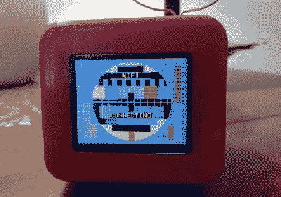

# 3D 打印的 ESP8266 电视是过去的一次爆炸

> 原文：<https://hackaday.com/2020/07/23/3d-printed-esp8266-tv-is-a-blast-from-the-past/>

我们常说，桌面 3D 打印的最佳应用之一是定制外壳的生产，但你肯定不局限于经典 Radio Shack 项目盒的挤压版本。正如[Marcello Milone]用这个为 Wemos D1 迷你设计的非常聪明的复古电视外壳展示的那样，3D 打印意味着当你想如何包装你的最新创作时，你的想象力是唯一的限制。

 尽管印刷的部分很漂亮，但小细节才是真正的卖点。[Marcello]将一根铜线弯曲成一个圆圈，制作了一个具有复古风格的人造天线，当 ESP 连接到 WiFi 网络时，它甚至在其 1.8 英寸的 TFT 显示屏上显示了一个旧的学校电视测试模式。

在休息后的视频中，你可以看到设备经历了它的启动程序，虽然在启动时显示 Hackaday 扳手可能不是严格的主题…我们将允许它。

虽然你肯定可以将这个小外壳用于你心目中的任何 ESP 项目，[Marcello]说他正在使用 HTU21D 温度和湿度传感器构建一个分布式环境监测网络。虽然听起来他仍然在做软件方面的工作，所以希望当功能完全实现时他会发布一个更新。

 [https://www.youtube.com/embed/3oFBmPer3iY?version=3&rel=1&showsearch=0&showinfo=1&iv_load_policy=1&fs=1&hl=en-US&autohide=2&wmode=transparent](https://www.youtube.com/embed/3oFBmPer3iY?version=3&rel=1&showsearch=0&showinfo=1&iv_load_policy=1&fs=1&hl=en-US&autohide=2&wmode=transparent)

