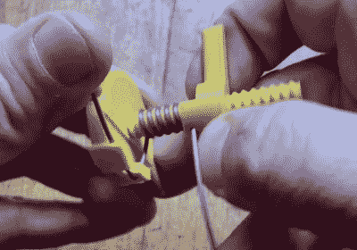

# 3D 打印夹具使定制弹簧轻而易举

> 原文：<https://hackaday.com/2022/01/28/3d-printed-jig-makes-custom-springs-a-snap/>

我们经常听人说，弹簧有各种形状和大小……除了你需要的那种。有鉴于此，硬件黑客在构建移动的东西时，最好将定制弹簧所需的工具和知识放在手边。幸运是，真正需要的只是一些硬金属丝、一根杆子和耐心。

除非你有 3D 打印机。在这种情况下，我们建议你[打印出这个由【Vincent Baillet】](https://www.thingiverse.com/thing:5171637)设计的非常聪明的“弹簧工厂”。这个简单的工具由两部分组成，与传统方法相比，可以更容易、更快地制作出一致的 DIY 弹簧。当你将电线缠绕在心轴上时，不要试图盯着线圈的间距，这种设计为你做到了。

 从视频中可以看到，用这个工具制作的弹簧看起来非常专业。螺纹心轴不仅能保持线圈之间的间距均匀，还能确保您生产的所有弹簧都是相同的。这对于需要使用多个匹配弹簧的项目尤其重要。[Vincent]说，他的便捷工具可以处理 0.8 到 1.2 毫米的钢琴丝，如果是普通钢，还会稍微厚一点。

当然，像这样的工具的明显缺陷是，它只能用来制造特定直径的弹簧。改变长度很容易，只需使用或多或少的电线。但是要制造更薄或更厚的弹簧，你需要不同尺寸的心轴。似乎[文森特]到目前为止只发布了这个大约 9 毫米直径的小工具，但这里希望在不久的将来会有更多的尺寸加入进来。

在寻找更高级的东西吗？这款由 Arduino 驱动的弯丝机能够制作一些令人印象深刻的定制弹簧，还有其他功能。

 [https://www.youtube.com/embed/QOz2l867N_4?version=3&rel=1&showsearch=0&showinfo=1&iv_load_policy=1&fs=1&hl=en-US&autohide=2&wmode=transparent](https://www.youtube.com/embed/QOz2l867N_4?version=3&rel=1&showsearch=0&showinfo=1&iv_load_policy=1&fs=1&hl=en-US&autohide=2&wmode=transparent)

感谢[马里奥]的提示。