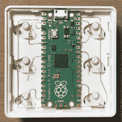
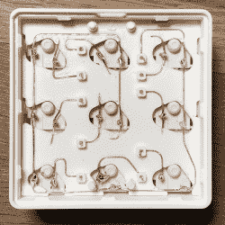

# 3D 打印的宏焊盘通过光滑的布线导管去除了 PCB

> 原文：<https://hackaday.com/2021/03/02/3d-printed-macro-pad-ditches-the-pcb-with-slick-wiring-guides/>

Reddit 用户[duzitbetter]展示了他们的一款 [3D 打印可编程宏键盘](https://www.reddit.com/r/3Dprinting/comments/ls5gvv/keypad_with_3d_printed_pcb/)的设计，它提供了一种不同的 3D 打印 PCB。这个设计被称为 *Bloko 9* ，使用了[树莓 Pi PICO](https://hackaday.com/2021/01/20/raspberry-pi-enters-microcontroller-game-with-4-pico/) 和一些樱桃 MX 风格的开关，这在 DIY 键盘中很受欢迎。

外壳和键帽都是 3D 打印的，有趣的是外壳既能固定组件，又能为所有电气连接提供一种导线。结果是裸铜线可以在引线之间布线和焊接，其布局非常类似于 PCB 的布线方式。图片说明了一切，所以看看吧。

[*【Bloko 9】*可作为付费模式](https://cults3d.com/en/3d-model/gadget/bloko-9-pico)获得，虽然[由于 3D 打印而摆脱 PCB 是其他人与](https://hackaday.com/2020/11/16/3d-print-your-way-to-a-modular-midi-playset/)一起玩的一种技术，但它在这里得到了很好的展示，表明在概念上仍有很大的创新空间。DIY 键盘和宏 pad 设计也是黑客的沃土；我们甚至看到[有可能 3D 打印一个开关本身](https://hackaday.com/2020/07/09/3d-printing-a-macro-pad-switches-and-all/)。