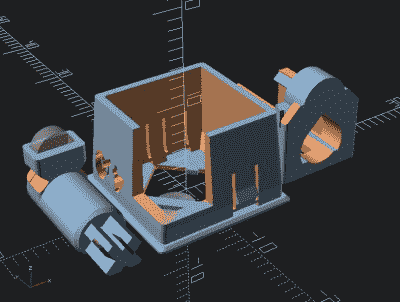

# 3D 打印磁性开关承诺真正的定制键盘

> 原文：<https://hackaday.com/2022/01/17/3d-printed-magnetic-switches-promise-truly-custom-keyboards/>

虽然大多数人都很乐意在他们的机器自带的任何键盘上打字，但对于键盘爱好者来说，在寻求完美的按键开关机制方面没有什么可挖的。进入【Riskable】，带着[一个 3D 打印机制的创新设计](https://github.com/riskable/void_switch)，它在不使用弹簧或金属触点的情况下提供近乎无限的调整。

开关本身由霍尔效应传感器执行，其细节在第二个储存库中[详述。主要项目只是代表组成开关机构的印刷组件和磁铁。每个开关使用三个 4 x 2 mm 的磁铁，一个固定磁铁安装在开关外壳上，两个安装在开关的移动滑块上。一个安装在静态磁铁下方，用于吸引它，而另一个安装在静态磁铁上方，用于排斥它。](https://github.com/riskable/void_switch_kicad)

 通过这种布置，下部磁铁提供所需的触感，而上部磁铁的排斥力取代了传统机械装置中使用的弹簧。[Riskable]称之为磁分离非接触式按键开关，但我们认为“革命性”有一个更好的名字。

它的特别之处在于，它是一个完全参数化的 OpenSCAD 模型，其中磁铁的分离是可定制的，因此构建者可以完全控制按键的触感和回复力。我们在下面发布了一个视频评论，用一个显示一系列触感设置的测试键盘演示了这一点。

我们在 Hackaday 有一位常驻键盘专家，他就是我们的同事[克里斯蒂娜·帕诺斯]，他的*[kee bin ' With Kristina](https://hackaday.com/2021/07/27/keebin-with-kristina-the-one-with-the-mad-model-m/)*系列向我们介绍了文本输入世界中所有有趣的东西。她计划带着由这些智能开关组成的[键盘进行试驾](https://github.com/riskable/void_switch_65_pct)，一旦她挤出了必要数量的小细节。

 [https://www.youtube.com/embed/H_Ym9528awM?version=3&rel=1&showsearch=0&showinfo=1&iv_load_policy=1&fs=1&hl=en-US&autohide=2&wmode=transparent](https://www.youtube.com/embed/H_Ym9528awM?version=3&rel=1&showsearch=0&showinfo=1&iv_load_policy=1&fs=1&hl=en-US&autohide=2&wmode=transparent)

感谢[达伦·施文克]的提示。