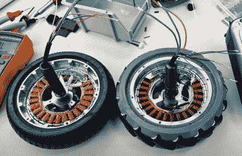

# 用于悬浮滑板电机的 3D 打印麦克纳姆轮

> 原文：<https://hackaday.com/2021/06/25/3d-printed-mecanum-wheels-for-hoverboard-motors/>

在这一点上，有人从廉价的“悬浮滑板”中取出马达，用它们来驱动踏板车或遥控车辆，这并不是一个新的想法。但是在 FPV·罗孚[Proto G]的例子中，他对发动机的选择只是故事的一部分。真正有趣的一点是他设计的用于安装马达的 [3D 打印全方位麦克纳姆轮，他认为这可能会有超出他自己项目的深远应用。](https://www.thingiverse.com/thing:4887372)

 现在，这并不是说火星车本身不令人印象深刻。所有的激光切割和金属板弯曲都是由[Proto G]亲自完成的，我们喜欢前面的高架 GoPro“炮塔”,让他可以在远程驾驶车辆时环顾四周。该漫游者由一对 Makita 无绳工具电池供电，并利用业余爱好级别的 RC 部件，看起来它将成为一个出色的机器人平台，可以在此基础上进一步开发。

麦克纳姆车轮本身是两件式的，并利用了从市场上可买到的小得多的车轮上拉下来的滚轮。这可能不是最具成本效益的方法，但与尝试印刷所有滚筒的替代方案相比，我们看到了使用现成产品的优势。如果你不确定如何让这些奇怪的轮子为你工作，[Proto G]还发布了一个视频，解释了[他如何混合 RC 通道，以获得车辆所需的全向运动](https://www.youtube.com/watch?v=4sH-XZ_LRMo)。

如果你满足于更传统的轮式移动，我们之前已经看到了几个二手悬浮滑板可以多么迅速地[变成一个令人印象深刻的强大移动平台](https://hackaday.com/2019/08/24/hacked-hoverboards-become-potent-rc-tank/)，无论你有什么邪恶的计划。

 [https://www.youtube.com/embed/abPLaRr66IM?version=3&rel=1&showsearch=0&showinfo=1&iv_load_policy=1&fs=1&hl=en-US&autohide=2&wmode=transparent](https://www.youtube.com/embed/abPLaRr66IM?version=3&rel=1&showsearch=0&showinfo=1&iv_load_policy=1&fs=1&hl=en-US&autohide=2&wmode=transparent)

