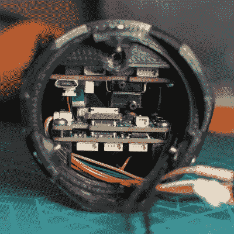

# 3D 打印火箭的特征是世界上最棒的

> 原文：<https://hackaday.com/2021/09/22/3d-printed-rockets-features-are-out-of-this-world/>

我们很高兴看到[Foaly]的 3D 打印 Cortex 2 火箭的进展，最新的建造日志充满了美丽的图片和设计细节。这枚火箭不仅搭载了高效的电子设备和智能设计，而且似乎单枪匹马地证明了 3D 打印远非一些人认为的新奇。

Cable management and component layout is far from a trivial task in a rocket like this.

Cortex 2 中发生了如此多的事情，如果不能完全按照规格制造自己的部件，它根本不可能完成它所做的一切。事实上，正在发生的事情太多了，电缆管理本身就是一个挑战。

建造日志中的一切都很有趣，但降落伞系统的设计尤其值得注意。[Foaly]最初的 Cortex 火箭在降落伞未能展开时遇到了它的末日，Cortex 2 决心尽可能避免这种命运。对于降落伞和任何绳索和锚，精心的布局最大限度地增加了成功部署的机会，没有任何缠结，但也有一些额外的功能。覆盖降落伞的面板是在四个磁铁的帮助下安装的，这四个磁铁以相反的极性安装。当门被伺服系统解锁时，这提供了初始排斥力，这应该有助于风立即冲进开口将面板吹走。回收系统甚至有自己专用的微控制器，可以自主运行；即使其他所有软件都崩溃了，降落伞仍然会打开。锁定所有电缆的连接器还可以确保加速力不会移动任何触点。

火箭的一切看起来都很棒，软件的工作量尤其明显。主控制器甚至有一个交互式的飞行前清单，这是一个了不起的功能。

上一次我们看到 Cortex 2 的时候，它还只完成了一半，我们迫不及待地想看看它的表现。火箭学是一个从 3D 打印、高度集成电子产品的可用性，甚至是像 FreeCAD 的火箭设计工作台[这样的东西中受益匪浅的领域。毕竟，更好的工具能带来更好的工作。](https://hackaday.com/2021/04/02/freecad-takes-off-with-a-rocket-design-workbench/)