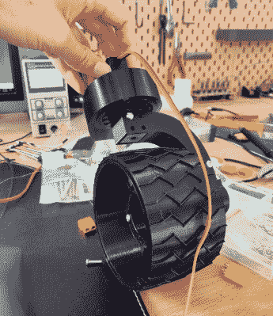

# 3D 打印的漫游者喜欢在沙滩上漫步

> 原文：<https://hackaday.com/2019/08/27/3d-printed-rover-enjoys-long-walks-on-the-beach/>

不少黑客投入了相当多的时间和精力来建造一辆受美国宇航局机器人火星探测器启发的漫游车，但不幸的是，即使是资金最充足的家庭修理工也负担不起将他们的创作送往世界各地的机票。因此，这些构建中的大多数不会经历比后院沙盒更令人兴奋的事情。我们不能责怪它们的创造者，我们认为自制漫游者在你的客厅里看起来就像在采石场漫步一样酷。

 但是 DIY 漫游车的现状显然不足以满足【雅各布·将军】，他决定[测试他的新漫游车的最好方式是让它在沙滩上嬉戏一下午](https://imgur.com/a/1xtFIQ8)。但从休息后的视频来看，他的结实的 3D 打印机器人证明了他能胜任这项任务；轻而易举地穿越崎岖不平的地形。

除了一些“真实”的轴承，漫游者的所有关键部件都是 3D 打印的。[Jakob]确实借用了一些现有的设计，比如他在 Thingiverse 上找到的一个可打印的轴承，但大部分时间他都在 Fusion 360 中辛苦地设计，并使用真正的好奇号火星车的图像作为他的指南。

现在，他用一个标准的 6 通道遥控接收器控制漫游者。四个通道映射到转向伺服系统，第五个映射到控制六个车轮电机的单电子速度控制。但他最近给漫游者添加了一个 Arduino，最终将负责解释 RC 命令。这将允许用更少的通道进行更复杂的机动，例如原地旋转的能力。

在全球漫游者争锋相对的黑客中，我们自豪地拥有自己的[郑健国]。围绕着他的六轮锯木车出现了一个完整的社区，在设计和建造[过程中获得的知识可以应用到任何其他项目](https://hackaday.com/2018/05/08/how-to-build-anything-out-of-aluminum-extrusion-and-3d-printed-brackets/)。

 <https://hackaday.com/wp-content/uploads/2019/08/3dprover_video.mp4?_=1>

[https://hackaday.com/wp-content/uploads/2019/08/3dprover_video.mp4](https://hackaday.com/wp-content/uploads/2019/08/3dprover_video.mp4)

[通过[/r/3d 打印](https://www.reddit.com/r/3Dprinting/comments/crua5b/finished_my_curiosity_inspired_rover_it_really/)