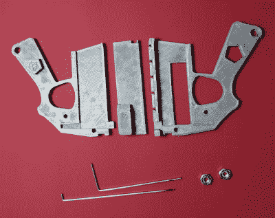
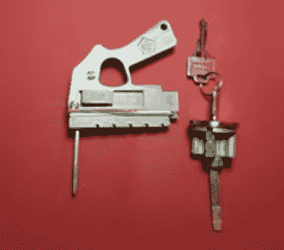

# 用于自动开锁的 3D 打印弹簧枪

> 原文：<https://hackaday.com/2019/07/17/3d-printed-snap-gun-for-automatic-lock-picking/>

在一个遥远的、风吹过的 Hackaday 前哨，我们正在看一部间谍电影  和一瓶适当便宜的俄罗斯伏特加，突然一个金发的三重代理人把一个看起来很迷人的小玩意交给一把锁，然后开始自动打开它。我们都很清楚，我们不应该相信我们在电视上看到的一切，但这一条。

现在，至少对我们来说，幻想变成了现实，因为【彼得·辛克斯】公开了他的 [3D 打印开锁工具](https://www.youtube.com/watch?v=o_lXz6A6MSQ&feature=youtu.be)——非常适合崭露头角的中情局特工。当然，俄罗斯人可能已经使用这种设备很长时间了，他们的 [YouTube 视频](https://www.youtube.com/watch?v=0ap4ZgujNpQ)要好得多，但是建造自己的机器需要向中间偏左一步。

该装置的工作原理是手动轻弹弹簧(橡皮筋)加载侧开关，然后上下拨动拾取柄脚，同时使用另一个柄脚轻轻启动开启旋转器。

该设备的尺寸非常适合放在后口袋里，等待在当地超市停车场成为英雄的机会，因为有人不可避免地会把钥匙锁在车里，甚至在你作为特工的日常工作中使用它。只要确保你有中情局、军情六处或克格勃的证件，以防你被警察搜查，否则他们会认为你只是一个普通的窃贼。外交豁免权，或者“挑选许可证”也会有用，如果你能得到的话。

如前所述，[彼得的]视频不是解释开锁的最佳视频，但他肯定会因隐身而获奖。他的视频低于休息时间。

与此同时，我们现在需要的只是一些 3D 打印的柄脚。

 [https://www.youtube.com/embed/o_lXz6A6MSQ?version=3&rel=1&showsearch=0&showinfo=1&iv_load_policy=1&fs=1&hl=en-US&autohide=2&wmode=transparent](https://www.youtube.com/embed/o_lXz6A6MSQ?version=3&rel=1&showsearch=0&showinfo=1&iv_load_policy=1&fs=1&hl=en-US&autohide=2&wmode=transparent)

 [https://www.youtube.com/embed/33sH6wU_SRc?version=3&rel=1&showsearch=0&showinfo=1&iv_load_policy=1&fs=1&hl=en-US&autohide=2&wmode=transparent](https://www.youtube.com/embed/33sH6wU_SRc?version=3&rel=1&showsearch=0&showinfo=1&iv_load_policy=1&fs=1&hl=en-US&autohide=2&wmode=transparent)

