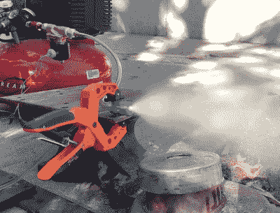

# 3D 打印漩涡火箭注射器升温

> 原文：<https://hackaday.com/2020/03/11/3d-printed-swirl-rocket-injector-turns-up-the-heat/>

从概念上讲，液体推进剂火箭发动机实际上是一个非常简单的硬件。你所需要做的就是将你的燃料和氧化剂以适当的比例喷入燃烧室，加上火花，通过精心设计的喷嘴，你就可以开始比赛了。或者月亮，视情况而定。只是在现实世界中这样做，并保持整个事情不爆炸足够长的时间来做一些有用的工作，完全是另一回事。

一步一步来，Luke Walters 一直致力于 3D 打印注射器，解决问题的前半部分。经过近 12 种不同的原型，他提出了一种可打印的注射器设计，将燃料雾化，并以合适的比例与压缩空气混合进行燃烧。正如你在休息时的视频中看到的，它肯定能够产生一些令人印象深刻的火球。

A cloud of highly atomized alcohol from the injector.

喷油器内部通道的设计使得燃油(91%异丙醇)和空气相遇时旋转方向相反。这促进了更完全的混合，进而导致更有效的燃烧。最初开发于 20 世纪 30 年代，这种所谓的“涡流喷射器”是德国 V-2 火箭计划取得的关键技术进步之一。有些想法永远不会过时。

由于喷油器在点火前只接触燃油和空气，因此不需要特别耐热。为了安全起见，[卢克]已经在 PETG 打印了 100%填充的部分，但实际上火焰前锋离得足够远，温度不是一个大问题。也就是说，他确实希望最终将这些注射器安装到某种燃烧室中，这是事情开始变得温暖的地方。

需要说明的是，这是*不是*火箭发动机，它不会产生明显的推力。将巨大的火焰转化为一种有用的推进方式是事情变得棘手的地方，[这几乎就像是火箭科学什么的](https://hackaday.com/2019/02/13/the-impossible-tech-behind-spacexs-new-engine/)。但是[并不意味着雄心勃勃的黑客们不能做到这一点。](https://hackaday.com/2015/03/10/open-source-3d-printed-rocket-engines/)

 [https://www.youtube.com/embed/NNECW4OpH4U?version=3&rel=1&showsearch=0&showinfo=1&iv_load_policy=1&fs=1&hl=en-US&autohide=2&wmode=transparent](https://www.youtube.com/embed/NNECW4OpH4U?version=3&rel=1&showsearch=0&showinfo=1&iv_load_policy=1&fs=1&hl=en-US&autohide=2&wmode=transparent)

