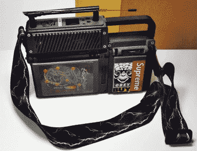

# 3D 打印虚拟示波器是一个有目的的 Raspberry Pi 4 网络平台

> 原文：<https://hackaday.com/2019/09/20/3d-printed-virtuscope-is-a-raspberry-pi-4-cyberdeck-with-a-purpose/>

威廉·吉布森可能在 1984 年就提出了 cyberdeck 的想法，但直到最近，桌面 3D 打印和强大的单板计算机等技术才使黑客和制造商能够组装这些经典 cyberpunk 设备的功能版本。最终产品通常只不过是一个角色扮演道具，但当[Joe D](在 tubes 上更为人所知的名字是[bootdsc])开始设计他的虚拟示波器时，他想[创造一些实际上足够实用的东西来使用](https://cyberdeck.cafe/mix/virtuscope)。到目前为止，看起来他已经成功了。

我们看到的许多 cyberdeck 构建都是基于一台与时代相适应的老式计算机的框架，它看起来很棒，真的有助于销售整个复古未来的氛围。不幸的是，这会使项目难以复制并且成本高昂。此外，有很多人会因为在 DEF CON 上把一个 30 多年前的硬件拿出来挂在脖子上而生气。

【boot DSC】通过 3D 打印虚拟示波器的*整个*外壳，巧妙地避免了这个常见的陷阱，由于他共享了所有的 STL，他甚至让任何人都可以运行自己的副本。大多数零件可以在任何具有 20 x 20 x 10cm 构建区域的 FDM 打印机上完成，尽管有一些细节部分需要 SLA 机器的分辨率。

在引擎盖下，VirtuScope 使用的是 Raspberry Pi 4，[bootdsc]称这是该版本可用性的关键，因为最新版本的小型 Linux SBC [最终拥有足够的计算能力，使其能够用于日常计算](https://hackaday.com/2019/09/09/can-you-really-use-the-raspberry-pi-4-as-a-desktop-machine/)。诚然，对于马拉松式的黑客会议来说，7 英寸的液晶显示器可能有点小，但当你不需要移动时，你可以随时插入外部显示器。为了满足您的无线黑客需求，VirtuScope 配备了内部 NooElec SDR(带 HF 上变频器)和 AWUS036AC 远程 WiFi 适配器；尽管有足够的空间给它装上你在旅途中会发现有用的任何类型的有效载荷。

这个项目的文档仍然处于早期阶段，但是[bootdsc]已经为您提供了足够的帮助。他告诉我们，至少还会有两篇帖子，不仅会详细介绍他是如何构建 VirtuScope 的，还会解释为什么它现在成为了他的便携式 SDR 钻机的选择。我们很高兴看到更多关于这个版本的细节，并希望有人愿意接受构建他们自己的版本的挑战。

过去[我们已经看到了部分 3D 打印的电脑平台](https://hackaday.com/2019/07/16/raspberry-pi-cyberdeck-inspired-by-rare-msx/)，[至少有一个也走了全打印路线](https://hackaday.com/2018/07/28/a-mobile-computer-to-make-william-gibson-jealous/)，但是没有一个像虚拟示波器一样容易接近。通过保持打印部件的几何形状简单并利用常见的组件，[bootdsc]很可能为 hackerdom 的第一个“大规模生产”网络平台奠定了基础。

 [https://www.youtube.com/embed/DYS0D73awXU?version=3&rel=1&showsearch=0&showinfo=1&iv_load_policy=1&fs=1&hl=en-US&autohide=2&wmode=transparent](https://www.youtube.com/embed/DYS0D73awXU?version=3&rel=1&showsearch=0&showinfo=1&iv_load_policy=1&fs=1&hl=en-US&autohide=2&wmode=transparent)

