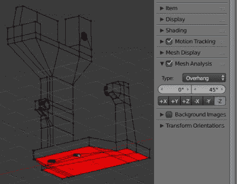
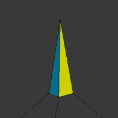
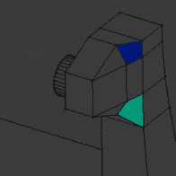
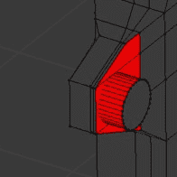
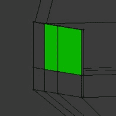
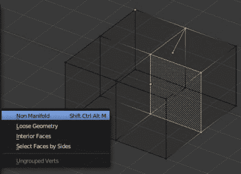
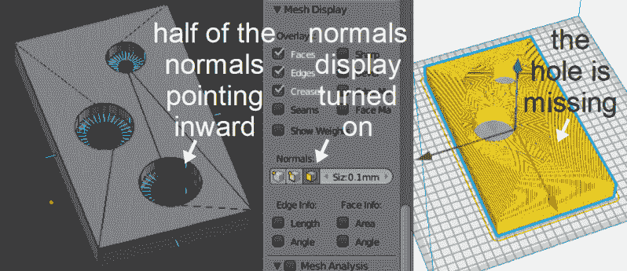
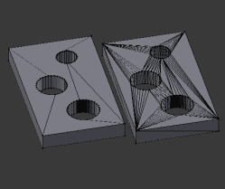
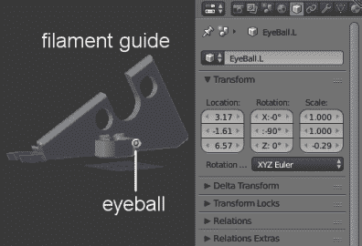
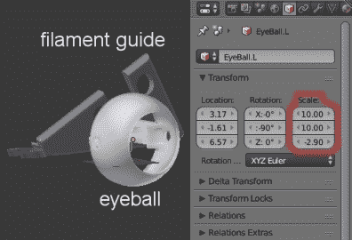

# 3D 打印:可打印对象的搅拌机技巧

> 原文：<https://hackaday.com/2018/11/14/3d-printering-blender-tips-for-printable-objects/>

在 Blender 中绘制的 3D 模型在计算机动画虚拟世界中工作得很好，但在用于 3D 打印时并不总是如此。切片师需要在现实世界中有意义的东西。现实世界远没有这么宽容，正如我在自己使用 3D 打印零件的项目中发现的那样。

我们的[布莱恩·本考夫]已经谈论过用他的两部分系列([这里](https://hackaday.com/2014/01/03/3d-printering-making-a-thing-in-blender-part-i/)和[这里](https://hackaday.com/2014/01/08/3d-printering-making-a-thing-with-blender-part-ii/))在搅拌机中制作零件，所以考虑这是下一步。这些是我想出的技术，用于在将零件交给切片程序之前，为 3D 打印做准备。请注意，这同样适用于其他网格类型的建模程序，但由于 Blender 是我唯一使用过的程序，请在下面的评论中分享您与其他程序的经验。

此时我将使用 Blender 的最新版本，2.79b 版。我的打印机是 Crealty CR-10，切片机是 Cura 3.1.0。根据您的切片器或您使用的是打印服务，这些步骤可能会有所不同。例如， [Shapeways 为从 Blender 创建 STL 的人提供了上传的指令](https://www.shapeways.com/tutorials/prepping_blender_files_for_3d_printing)。

## 修复形状问题

 切片师通常会突出你的零件的一些问题，比如它的一部分悬在半空中，下面没有支撑。但是 Blender 也可以向您展示这些东西，允许您在到达切片器之前修复它们，从而避免在两个程序之间来回切换。

其中一部分是通过属性区域中的网格分析面板完成的(在 3D 视图中的右侧区域，您可以通过按 N 键调出该区域)。

这里我们突出显示了突出部分，0 到 45 之间的任何部分。红色区域是零件的底部，将位于打印床上，因此不会有问题。然而，蓝色区域可以通过增加从水平方向测量的角度来固定。

        

通过单击类型下拉菜单可以看到的其他问题有:

*   锐利–这些是面相交处的边缘或点，可能太锐利而打印不好。
*   扭曲–一个三边的多边形总是有一个平面，但是 Blender 支持任意边数的多边形，称为 n 边形。这些可以是平的，但是它们也可以是扭曲的，使得它们面部的不同部分指向不同的方向。这可能会混淆一些切片器。
*   相交-这是零件的一部分在另一部分内的地方。在所示的例子中，我通过简单地将一个圆柱体部分插入垂直面的一侧来制作一个旋钮，这样一端在网格内部，但不连接到网格。
*   厚度-这是一个可能太薄而无法打印的部分，可能是一个薄壁。

## 修复网格中的问题

可能使切片器困惑的其他事情通常是网格的更多问题，这些问题不可见或在零件内部。幸运的是 Blender 也有工具来帮助解决这个问题。

 这些问题很多都归在非流形几何或者现实世界中不可能存在的几何这个标题下。例如:

*   没有连接到任何面的顶点或边，可能是在删除顶点时留下的，但丢失了一些
*   重复的几何图形，可能是在按 E 键挤出一个面时留下的，从而创建了一个新的面，但后来决定不把它拉走，然后只删除它的一部分或根本不删除
*   物体侧面的洞，也许一条边实际上是两条不相连的边，但看起来像一条边
*   几何学完全封闭在一个物体内部。

在为 3D 打印导出任何内容之前，您应该进入编辑模式，将视口着色设置为线框，并确保没有选择任何几何体。然后选择>按特征全选，得到一个工具菜单，可以选择上面列出的任何几何问题的类型。

最有可能的罪魁祸首是里面不必要的几何图形，所以简单地删除它，同时小心不要删除你仍然需要的东西。例如，当删除某些边仍连接到外表面的内部面时，请使用“删除”菜单中的“仅面”和“仅边和面”。

另一个常见的罪魁祸首是不正确的法线。法线由垂直于多边形的线表示。这些线显示为从多边形的一边发出，而另一边有一个点。你希望物体外部的所有法线都指向同一个方向，否则切片器可能会混淆。插图的右边是 Cura 中的对象，您可以看到这个洞不见了。导出前的一个好习惯是在编辑模式下选择所有内容，然后转到工具架,“着色/uv”选项卡，并选择“重新计算”以使所有法线指向同一方向。

## N-Gons 对切片工不好

我发现检查并修复上述问题是可行的，但如果在为切片器导出对象之前将 n 边形转换为三角形，您可能会有点健忘。在 Blender 中，你可以在编辑模式下选择所有东西，然后执行网格->面->三角化面(Ctrl-T)。

## 缩放和导出

您绘制零件的比例很可能与切片器使用的比例不同。一旦您准备好将零件导出为 STL、OBJ 或任何适用于切片器的文件格式，您可以选择在 Blender 中缩放零件，然后导出，或者按原样导出，然后在切片器中缩放。我最常做的是前者。

  Scaling in Blender: before  Scaling in Blender: after

我在我的 CR-10 上打印的第一个部分是我从 Thingiverse 下载的 STL 文件。当在 Cura 打开时，它不需要缩放。因此，当我准备打印自己设计的第一部分时，我从头开始创建了一个新的 Blender 文件，并导入了细丝指南。然后我添加了我的部分，[一个可以连接 Pi 相机的眼球](https://hackaday.com/2018/08/04/feast-your-eyeballs-on-this-mechanical-eyeball/)(文件- >添加，深入到文件中的眼球对象)。细丝导向器大约 5 厘米长，相比之下眼球显得很小，所以很明显眼球需要重新调整。将所有标度值乘以 10 就可以了。然后，我删除了细丝导向，并将我的眼球导出为 OBJ(在 Cura 中打开时，Blender 的 STLs 中似乎缺少圆形的平滑度)。

然后，我保存了那个带有适当比例眼球的搅拌机文件。现在，每当我准备切片一个部分时，我就打开该文件，添加新的部分，进行任何需要的缩放，删除眼球，然后导出该部分。

这看起来比直接从我首先创建零件的 Blender 文件中导出零件，然后在 Cura 中重新缩放它要笨拙得多。你可能是对的。然而，我几乎总是创建多个互锁的部分，似乎没有任何方法告诉 Blender 只导出其中的一个。

## 一些最后的提示

根据修改器的不同，您可能希望在上面提到的一些步骤之前应用它们。镜像修改器就是一个很好的例子。

也有 Blender 插件将上述许多步骤整合到一个地方。通过“文件”->“用户首选项”进入附加组件列表，搜索“3D 打印”找到任何附加组件。

上述许多问题源于 Blender 是一个网格类型的建模程序，而不是像 SolidWorks 和 FreeCAD 那样基于实体的程序。但对于自由形式或雕刻的 3D 对象，Blender 大放异彩。在制作模型时谨记以上提示，并在导出之前使用 Blender 的工具进行检查，打印应该会顺利进行。