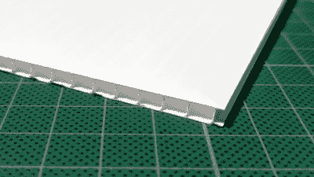
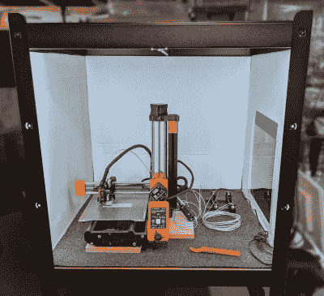
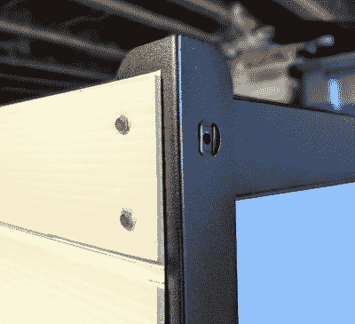
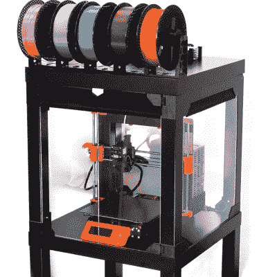
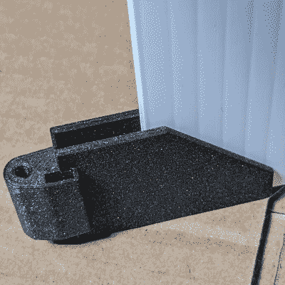

# 3D 打印:更便宜、更简单外壳的波纹塑料

> 原文：<https://hackaday.com/2021/10/06/3d-printering-corrugated-plastic-for-cheaper-easier-enclosures/>

透明丙烯酸面板长期以来一直是 3D 打印机外壳设计的主流，但它们也会在资金、运输、重量和麻烦方面增加大量成本。一种值得关注的替代材料是波纹塑料(也称为其商标名 *coroplast* )，它便宜、重量轻、是一种极好的绝缘体，并且易于加工。许多外壳设计可以改装使用它来代替丙烯酸，所以让我们仔细看看它有什么提供。

## 亚克力怎么了？

不仅仅是购买价格使丙烯酸树脂成为一个昂贵的选择。丙烯酸树脂相当重，外壳面板大小的运输件可能很贵。此外，在没有特殊工具的情况下切割亚克力也是一个挑战，因为如果处理不当，它很容易破裂。丙烯酸在激光切割机中切割得很漂亮，但大多数业余爱好者可以使用的激光切割机都不够大，无法制作外壳大小的面板。如果你坚持需要手工切割丙烯酸树脂，[这里有一些关于如何使用现有工具的提示](https://hackaday.com/2021/07/26/how-to-build-with-acrylic-using-the-tools-you-have/)。

最好从当地商店购买丙烯酸树脂，也可以用合适的工具以合理的价格将其切割成合适的尺寸，但它仍然远远不是一种便宜的材料。还有另一个选择:波纹塑料有很多值得考虑的特性，尤其是对业余爱好者来说。

## 瓦楞塑料有什么好？

我们大多数人都知道波纹塑料是制作草坪标志的材料。在外壳设计中使用它并不是一个新的想法(这里的[是一个完全由它制成的打印机外壳](https://www.reddit.com/r/3Dprinting/comments/75793v/printer_enclosure_using_corrugated_plastic_sheet/)，这里的[是一个也使用它的数控轧机外壳](http://www.built-to-spec.com/blog/2010/12/25/quick-projects-building-a-cnc-mill-stand-and-enclosure/))但是与其用它来制作一个完整的外壳，不如只把它用作面板材料更有意义。没有必要从头开始设计新的外壳。人们可以使用现有的设计，将丙烯酸面板换成波纹塑料面板。

Corrugated plastic, also known as *Coroplast*.

波纹塑料有很多优点:

*   这是丙烯酸成本的一小部分。
*   它是一种极好的绝缘体。
*   它很轻。
*   用锋利的刀片很容易切割。
*   如有需要，可提供阻燃型。
*   可以沿着波纹弯曲或折叠，可以先划线也可以不划线。

它比丙烯酸板更容易获得，也更容易使用。任何标志店或塑料供应商可能都有各种颜色的。

然而，也有一些缺点。

*   标准厚度为 4 毫米。然而，丙烯酸树脂通常用于 3 毫米(或 1/8 英寸)的厚度。
*   它是不透明的(但是窗户可以很容易地被切开。)
*   它不是防火的。像丙烯酸树脂一样，如果温度足够高，它会燃烧。但是与其他塑料相比，燃烧[不会喷出有毒物质，并且容易熄灭](https://www.coroplast.com/resources/health-and-safety-aspects/)。

波纹塑料材料的厚度为 4 毫米而不是 3 毫米，这意味着它不一定是现有设计中丙烯酸树脂的替代物。但并不是每个外壳都受到面板厚度的限制。

## 在外壳中使用波纹塑料

使用这种材料的两个最简单的方法是:通过在现有结构上添加面板来创建一个外壳，或者使用现有的设计，但用波纹塑料代替丙烯酸。以下是两者的例子。

#### 用现有结构建造围墙

这是我在金属宜家 BROR 搁架单元中搭建的一个外壳，它可以轻松容纳一台 Prusa Mini 3D 打印机。钻孔器由有角度的金属片制成，金属片上有规则间隔的孔。这使得只需安装几块侧板就可以非常方便地将搁板部分变成封闭空间；规则的搁板表面提供了顶部和底部。

波纹塑料板不仅可以轻松地安装在倾斜的金属柱后面，而且只需穿过方便的孔的几个短螺钉就可以完全固定它们。窗户可以通过切割一个洞，并在一侧或两侧粘贴或胶带粘贴一个透明的塑料片来制作。CA 胶和大多数其他粘合剂在波纹塑料上工作良好。

我遇到的唯一的不便是当它来到形成一个大门的前面。我没有制作带铰链的橱柜式门，而是利用材料的轻质特性制作了一个简单的可拆卸盖子。架子是钢制的，所以我把几块强磁铁粘在一块单独的板上，制成一个磁性附着的可拆卸前盖。我可以完全封闭前面，或者根据需要留一个缝隙让空气流通。结果很简单，很吸引人，而且除了架子本身，花费很少。

Corrugated plastic panels fit easily into the angled steel of an IKEA BROR shelf

Embedded magnets make a simple front cover instead of a door.

#### 替换现有外壳设计中的丙烯酸树脂

改装为 3 毫米丙烯酸板设计的现有外壳的唯一问题是，4 毫米波纹塑料可能不适合，因为它们稍厚。虽然总是可以简单地切割和剥离材料，直到它适合，但为了获得最佳效果，面板固定部件应该重新设计，以适应更厚的材料。

例如，我喜欢 [Prusa V2 拉克外壳设计](https://blog.prusaprinters.org/mmu2s-printer-enclosure_30215/)及其 3D 打印部件，但下次我建造一个时，我将使用波纹塑料板，而不是丙烯酸。为了做好准备，[我已经重新设计了必要的部件来接受 4 毫米厚的材料](https://github.com/DPHAD/PRUSA-Enclosure-4mm-Panels-Mod)。

Prusa’s original LACK enclosure design, intended for 3 mm thick acrylic panels. (Photo: Prusa Research)

Parts modified to accept 4 mm thick corrugated plastic instead of 3 mm acrylic.

幸运的是，Prusa 不仅为他们的设计提供了 STL 文件，还提供了 CAD 文件。虽然可以[修改仅作为 STL 文件](https://hackaday.com/2018/05/16/3d-printering-when-an-stl-file-is-not-quite-right/)存在的零件，但一般来说，访问 CAD 格式文件会使这类任务变得容易得多。

## 未被充分展示的材料

对于 3D 打印机来说，[外壳设计仍然是一个没有完全解决的问题](https://hackaday.com/2021/02/02/3d-printering-why-arent-enclosures-easier/)。“软”外壳选项，如照片帐篷或用于植物的织物种植箱，是注重成本的选择，但也有一些方法可以降低更传统设计的成本。波纹塑料在这方面有很多优点。

在外壳中使用波纹塑料的想法并不新鲜，但它似乎没有得到充分的代表。你知道有效或特别聪明地利用它的附件吗，或者你自己有什么建议吗？我们当然想听听，所以请在评论中分享你的想法。