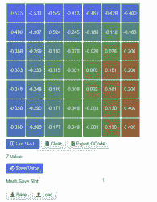

# 3D 打印:通用底座调平入门

> 原文：<https://hackaday.com/2022/01/14/3d-printering-getting-started-with-universal-bed-leveling/>

上次我们谈到了 [Marlin 如何拥有多种基床调平机制](https://hackaday.com/2022/01/05/3d-printering-one-bed-level-to-rule-them-all/)，包括统一基床调平或 UBL。UBL 试图成为所有人的一切，并提供创建密集网格来模拟你的床，并为你提供调整和编辑这些网格的方法。

上次我们讨论了如何为 UBL 准备好打印机，但没有讨论如何在打印时使用它。为此，您需要创建至少一个网格，并在启动代码中激活它。您还需要正确设置您的 Z 高度，以使一切正常工作。

## 阶段

几乎所有的 UBL 机制都在 29 国集团的指挥下。除非你完全从零开始，否则你会想从 EEPROM 中的一个“槽”中加载一个网格:

```
G29 L2
```

这意味着插槽 2 的网格现在在内存中，您将使用它。如果不保存，您所做的任何更改都将丢失。顺便说一下，这并不一定会激活调平。它只是加载网格。如果你是从零开始，你不需要加载任何东西。

设置网格需要使用 G29 的相位命令，这些命令使用字母 P 和一个数字:

*   P0–将网格调零，并关闭调平系统。
*   P1——尽可能自动探测。通常，这将清除现有网格，除非您使用 C 选项。如果你意识到你不想探测几十或几百个点，你可以通过按住控制器按钮几秒钟来停止。
*   P2-手动探测任何未填写的点。打印机将在显示屏上提示您继续。您可以用喷嘴手动触摸床，或者第一次使用 B 参数像测量一张纸一样测量垫片，然后使用该高度手动测量所有点。您也可以通过按住控制器按钮来中止。
*   P3-填充网格中未填充的区域。您可以用 C 指定一个值，或者省略它，打印机将尝试从周围的数据中猜测正确的值。它在这方面出奇的好。但是，如果您有多行或多列未指定的点，此命令将只处理“第一”组点，因此您可以优化它们，并更好地猜测其余的点。这意味着，如果你只是想填充网格，你可能需要多次发出 P3。
*   P4-微调网格点。这使得打印机在屏幕上提示您测量特定的点。通常，您将提供一个 X 和 Y 坐标以及一个重复计数(通常为 1)。
*   P5–给出网格的统计数据，包括平均值和标准偏差。如果要移动网格以使平均值为零，请包含 C。
*   P6——移动网格。提供一个 C 值来上下移动整个网格。这可能是有用的，如果你说，打印计划，并希望打印移动了几百微米，以防止过度粘附。

这看起来令人困惑，但总体思路是你将从 P1 开始，然后使用 P2 或 P3(或两者)，直到所有的点都设置好。其余的用于特殊用途或微调的东西。只是不要忘记存放网格，并记住你把它放在哪里:

```
G29 S1
```

我建议你把你的第一个 P1 结果保存在一个永远不会改变的槽里，然后在 P2 和 P3 之后把结果保存在别的地方。这样，如果你把事情搞砸了，你可以回到基线，重新开始，而不必重新做许多调查。

## 想象你的床的高度

你怎么知道 UBL 在做什么？你可以要求一份地形报告(T)并得到一些数据:

```
G29 T
```

您可以添加 V1 来获得更多的细节，T1 将输出适合电子表格或其他软件读取的数据。

下面是一个示例报告:

```
 Bed Topography Report:

     (  0,210)                                      (210,210)
         0       1       2       3       4       5       6
  6 | -0.533  -0.533  -0.522  -0.483  -0.461  -0.429  -0.400
    |
  5 | -0.400  -0.367  -0.324  -0.245  -0.183  -0.112  -0.183
    |
  4 | -0.359  -0.259  -0.183  -0.075  -0.026  +0.076  +0.200
    |
  3 | -0.333  -0.233  -0.115  -0.001  +0.070  +0.181  +0.200
    |
  2 | -0.348  -0.248  -0.140  -0.009  +0.062  +0.161  +0.200
    |
  1 | -0.350  -0.290  -0.177  -0.049  -0.003  +0.130  +0.400
    |
  0 | -0.350 [-0.290] -0.177  -0.049  -0.003  +0.130  +0.400
         0       1       2       3       4       5       6
     (  0,  0)                                      (210,  0)

```

顺便说一下，P5 命令报告这个集合的标准偏差大约为 0.24。这意味着大约 68%的数据是平均值的正负 0.24 毫米。那么 95%的读数都在 0.48 mm 以内(同样是正负)。正如你所看到的，我有一个角落需要一点点工作——从最高点到最低点的总变化约为 1 毫米。

[](https://hackaday.com/wp-content/uploads/2021/12/newplot.png)

The bed data plotted

## z 高度

即使我们知道床的形状，还有其他因素在起作用。特别是，喷嘴的实际高度至关重要。您必须设置 Z 偏移，以便探头和喷嘴之间的差异恰到好处。

每个人都有自己的方式来设置 UBL，但我的建议是从关闭开始。然后在床的中央印一个小环或圆盘。它不必很厚，应该足够小，这样床就可以平放在它下面。例如，直径为 20 毫米的 5 毫米高的圆柱体。你可以很快看出塑料是否粘在床上。如果太粘或者没有粘住，调整 Z 偏移直到粘好。然后进行网格测量。

但是，偏移不会改变床的形状，所以您可以最后设置偏移，也可以调整网格的高度。所有合法的解决方案，但我更喜欢先设定高度。

## 开始

您的启动代码有一些事情要做。您需要加载所需的网格并启用调平。默认情况下，home 命令会将其关闭，但是如果您重新构建 Marlin，您可以更改这一点。你的床可能不会改变形状，但它可能会有点移动。您可以使用 G29 J 进行 3 点测量，并基于该测量倾斜网格。如果 G29 A 没有始终启用，您还需要使用它来激活调平。

你也应该设置一个渐变高度，如果你愿意，你可以在 EEPROM 中设置一次。这通常是 10 毫米，由于网格应用的校正在每一层变得越来越少，直到你达到那个高度。之后，不会应用 Z 校正。通常，到那个时候，你的打印是好的，它节省时间和磨损你的 Z 轴。

## 一个计划

如果你想在 UBL 身上做实验，这里有个计划:

*   重新编译马林，使 UBL 和抵制冲动，开始与太多的点。你可能想先熟悉一下，然后再扩大点数。7×7 网格适用于许多打印机。您可能还想设置它，以便自动调平在回家后恢复到以前的状态。
*   尽你所能，用通常的方式把床放平。需要纠正的越少，UBL 就会运行得越好。
*   暂时不要打开自动调平。通过调整 Z 偏移，首先在床的中心获得一个漂亮的滚筒进行打印。
*   把床加热到你的正常温度，做一次 G29 P1。将结果保存在插槽 2 (G29 S2)中。
*   做个 G29 T，看看有没有点没测到。你应该明白为什么他们没有被测量。例如，如果 Z 探针位于打印喷嘴的左侧，则底座的左侧不应有未打印的点。如果你这样做，你在 Marlin 中的设置是错误的，你需要重新编译。
*   你可以做一个 G29 P2 来填充剩下的点，但是第一次尝试，试试 G29 P3。
*   再次做一个 G29 T，重复 P2 或 P3 命令，直到你有一个完整的网格。
*   将网格保存在插槽 1 中(G29 S1)
*   设置您的启动代码加载插槽 1 (G29 L1)并激活(G29 A)。你可能想在负荷后做 G29 J，最好是在你的床热了之后。
*   打印测试对象。你可能想从一个小的居中的物体开始，只是为了确认你没有搞砸任何事情。床的平坦模式是有用的。Marlin 有一个“网格验证”命令，可以画出这样的图案(G26)，你也可以使用它。然而，任何床平整度测试打印都可以开始。
*   如果您注意到有些点太高或太低，您可以尝试编辑它们。如果离得太远，您可以随时恢复到槽 2 中保存的副本并重新开始。例如，当电感式传感器部分离开金属床时，有时会在边缘附近给出奇怪的结果。

## 技巧

[](https://hackaday.com/wp-content/uploads/2021/12/plugin1.png)

Octoprint can edit meshes with a little help,

请注意，我总是试图用热床做任何探测。热量使物体膨胀，所以探测床的温度可能不像你想的那样准确。

如果你需要一个快速的床验证打印，在像 Thingiverse 这样的网站上有很多，包括我的。您可以缩放 X 和 Y 尺寸以适合您的床，而不是重新创建它。只是不要按比例缩放 Z 轴。

如果你使用 Octoprint，你可以用[插件](https://plugins.octoprint.org/plugins/ublmeshedit/)查看和编辑网格。还有一个插件来可视化网格，或者你可以像我上面做的那样，使用一个[网站](https://i.chillrain.com/index.php/3d-printer-auto-bed-leveling-mesh-visualizer/)来实现这个目的。

## 这是一个总结！

你在用 UBL 吗？如果没有，为什么没有？当然，如果你有一张很棒的床，你可以让它平行于 X 轴就可以了。但是，如果你使用的床不是完全平的，你就不能只移动角落来让一切都完美。

UBL 系统是一种“虚拟床面”，这意味着你可以很容易地调整它，没有机械问题。如果你想让 PETG 不要粘得太紧，你可以把网格上移一点。如果模型的一部分非常小，需要额外挤到床上，你也可以这样做。

当然，整平床并不是什么新鲜事。但是如果你不使用 UBL，你可能要考虑升级。仅仅调整网格和存储多个床水平设置的能力是值得努力的。