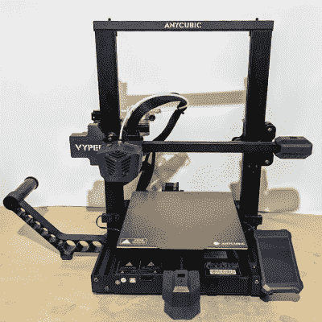
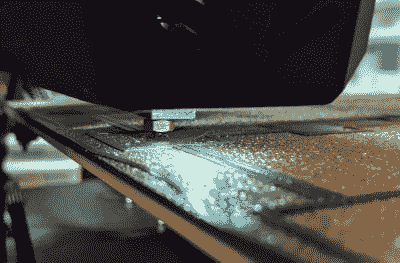
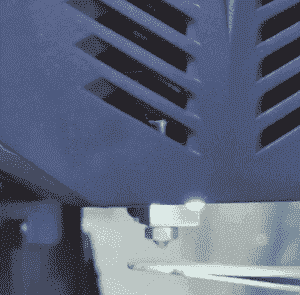
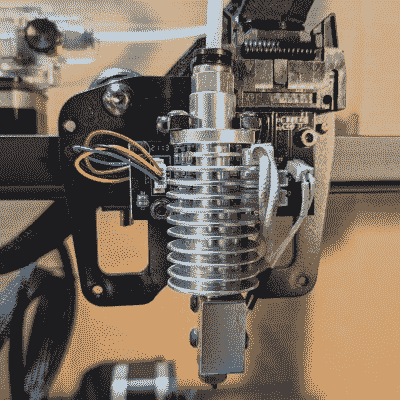
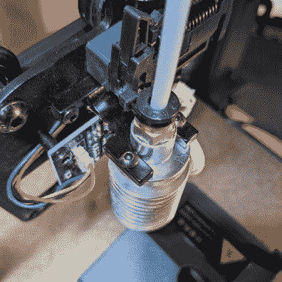
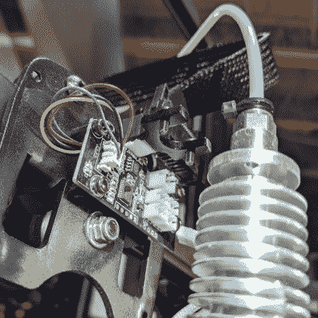
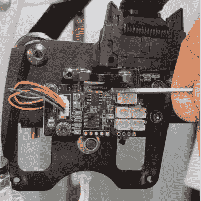
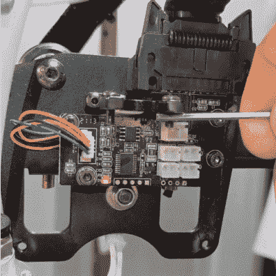
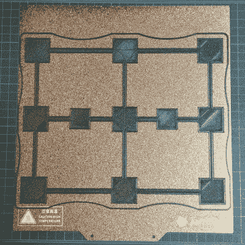

# 3D 打印:无障碍床调平终于来了吗？

> 原文：<https://hackaday.com/2021/08/30/3d-printering-is-hassle-free-bed-leveling-finally-here/>

在过去的几年里，3D 打印机已经取得了很大的进步，但是床的调平过程仍然是一个痛点。让我们看看解决这个问题的不同方法，以及最近的发展是否成功地自动化了这个麻烦。

Anycubic Vyper, with an auto-leveling feature we decided to take a closer look at.

基床找平和第一层校准往往会绊倒新手，因为做对需要经验和判断，做错就意味着印刷失败。随着时间的推移和经验的积累，3D 打印机操作员学会了处理这些事情，但它们在很大程度上仍然是手动过程，经常以听起来更像艺术的方式进行讨论。难怪有很多简化整个过程的尝试。

一些消费 3D 打印机正在采用一种新的方法来进行床调平和第一层校准，其中一种打印机是 [Anycubic Vyper](https://www.anycubic.com/products/anycubic-vyper) ，它为新手和有经验的用户提供一键解决方案。我们接受了 Anycubic 提供的样品打印机，专门用于检查这种新的调平方法，所以让我们来看看试图自动化 3D 打印机底座调平这一有时很棘手的任务的最新进展。

## 为什么床的水平是一个问题？

在 3D 打印机术语中，平台调平(或简称为“调平”)是一个宽泛的术语，指最终结果是将打印的第一层以最佳方式沉积在构建平台上的过程。良好的第一层是成功印刷的基础。

为了实现这一点，喷嘴需要在其整个运动范围内与构建平台保持恒定的距离。如果喷嘴在某些地方离床太近，而在另一些地方离床太远，就会导致质量差和故障。调整打印机的床，直到它平行于喷嘴的运动范围被称为水平。(机械师们会正确地称这个过程为 tramming，因为实际上没有什么东西必须垂直于地球的重力场。)

The extruder in the process of laying down a first layer.

下一步是第一层校准。这将调整 Z 轴偏移，或喷嘴尖端与构建平台表面之间的距离。需要有足够的空间让关键的第一层塑料以均匀的厚度均匀沉积，并压入构建表面，足以在印刷过程中保持粘附。

让事情变得复杂的是，没有一个构建平台是完全平坦的。当几分之一毫米被计算在内时，即使是很小的瑕疵也会引起问题。构建平台中的高点或低点都是问题，因为无论印刷床倾斜多少都不会将它们调整走。这是调配问题长期存在的原因之一。

没有一个单独的部分是特别复杂的，但许多相互关联的因素可以使它成为一个复杂的，精细的任务。毫不奇怪，人们尝试了不同的方法来使整个过程尽可能简单和可重复。

## 一些尝试的解决方案

Rafts(一种牺牲建造平台)是处理河床缺陷的早期方法，但现在大多数解决方案都围绕着*网格调平*。

网格调平是一种在软件中补偿不完美印刷床的方法，但它需要一种测量构建平台的方法。通过用传感器进行测量，可以创建表示构建表面及其缺陷的软件模型。该模型在打印头放下关键的第一层时修改打印头的路径，通过试图跟随这些缺陷来调整有缺陷的表面，而不是像它们不存在一样移动。

实现网格调平的一种方法是使用感应传感器来感应构建平台，而不接触它。每次打印前，打印机使用这种方法在 3 x 3 或可选的 7 x 7 网格中进行测量。手动确定特定构建页面的适当 Z 轴偏移仍然取决于用户。

另一种选择是物理探针。例如， [BLTouch](https://www.antclabs.com/bltouch) 是一种与构建平台进行物理接触的流行传感器。它作为售后附加产品的成功，以及它被复制的频率，是一个很好的指标，表明床调平仍然是 3D 打印机所有者的一个痛点。

## 最新的方法:集成应变仪

The printer’s nozzle acting as a touch sensor.

这种方法使用喷嘴本身的尖端作为传感器。不仅从实际发生挤出的点进行测量更容易，而且这样做也为自动设置适当的 Z 偏移打开了大门。

一种方法是将应变仪集成到挤出机中，将热端变成一种测压元件。我们在一个 DIY 项目中看到了这种方法[，该项目使用 SMD 电阻作为应变计](https://hackaday.com/2019/01/27/quartet-of-smd-resistors-used-to-sense-z-axis-height/)，该方法也用于 delta 打印机的[智能效应器](https://www.duet3d.com/DeltaSmartEffector)。

最近的两款消费 3D 打印机 Anycubic Vyper 和 Creality CR-6 SE 实现了他们自己的工厂制造版本。我们从 Anycubic 接受了一个 Vyper 打印机样本，专门用来检查这个特性，所以让我们仔细看看。

## 它是如何工作的

Vyper’s extruder, cover removed. Colored wires to the left go to the strain gauge built into the hot end mount.

Anycubic Vyper 的挤出机组件包含一个用于热端的叉形金属支架，该支架内置一个应变仪。这就把它变成了一个[称重传感器](https://en.wikipedia.org/wiki/Load_cell)，类似于电子秤中的称重传感器。

施加在热端的任何力都会使底座轻微变形，应变仪将这种变形转化为可以测量和量化的电信号。以这种方式甚至可以检测到热端上非常轻的压力。

由于这一功能，喷嘴本身成为一个触摸传感器。当机器被引导自动调平时，挤出机反复向构建平台下降，直到喷嘴接触到它。即使是轻轻的触摸也可以被可靠地检测到，所以这个过程不需要太多的力量。

通过在网格模式中进行多次测量，可以实现网格调平。此外，由于可以感知喷嘴尖端和构建表面之间的物理距离，因此可以自动实现合理的 Z 轴偏移，让操作者只需担心微调。

  The fork-shaped mount has a strain gauge built into it.  Strain gauge visible as a white patch under the mount.  Hot end removed from fork-shaped mount.  A light touch on the mount triggers the touch sensing.

这是一个巧妙的想法，挤出机显然是围绕这一特点设计的。

## 结果？非常耐用

A perfectly serviceable first layer. Fine tuning can be done in +/- 0.05 mm increments.

效果如何？我很高兴地说，该功能似乎像宣传的那样工作，包括自动设置有效的初始 Z 偏移。

人们只需安装构建板，确保喷嘴和构建表面清洁，然后指示打印机执行自动调平过程。机器将预热，确保校准在打印条件下完成，而不是在冷的情况下，然后喷嘴以 4 x 4 网格模式接触构建平台，之后它会自动应用网格调平和初始 Z 偏移，如果需要，可以进行微调。理论上，除非构建平台发生变化，否则这个过程不需要重复，但是用户可以随时触发这个过程。

## 有限制

自动调平正如广告宣传的那样有效，但是它的功能是有限的。首先，与灯丝的质量或类型有关的问题，或者构建平台的材料，都是可能让新手犯错的独立问题。自动调平功能无法解决这些问题。

为了获得最佳效果，打印表面和喷嘴尖端都必须干净，因此最好在自动调平前从热端卸下灯丝。因为机器预热并接触每个网格点两次，所以装载的喷嘴会在每个点留下少量熔融塑料，喷嘴和构建表面之间的这些额外材料会影响测量的准确性。事实上，这可能是所有基于喷嘴的传感器的致命弱点。

用 4×4 的触摸点网格可以感测和模拟的内容是有限的。具有严重缺陷的构建表面可能无法精确建模。在运行自动调平过程之前，我通过使用垫片来模拟构建表中高达 0.8 mm 的混合高点和低点，对此进行了简单测试。不出所料，一个 4 x 4 的触摸点网格不足以准确模拟这些缺陷开始和停止的确切位置，但我很高兴地看到，最终的第一层至少仍然是可用的，如果在一些高区域有点薄和过度挤压的话。如果有一个增加测量点数量的选项，或者手动细化网格，作为更好地处理特殊情况的一种方式，那就太好了。

最后，机器的固件对自动调平过程的细节不是很详细。似乎没有办法修改灵敏度，没有办法看到实际测量，也没有办法手动微调除了 Z 偏移以外的任何东西，Z 偏移可以以 0.05 mm 的增量向上或向下改变。

## 是这条路吗？

Vyper 的自动调平和初始 Z 偏移功能正如广告所说的那样工作，并给出了可维护的结果，即使固件对引擎盖下到底发生了什么有点沉默。它非常方便，应变仪集成看起来很可靠，总体而言，这是一个很好的工厂产品智能系统。

你认为这种自动化去除底层调平和第一层调整的枯燥乏味的方法怎么样？将热端变成称重传感器是正确的方法吗？我们想知道你的想法，所以请在评论中告诉我们。