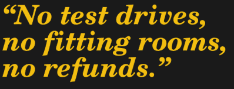
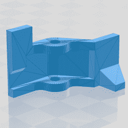
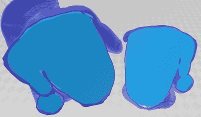
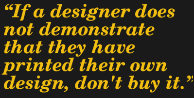

# 3D 打印:非免费 3D 模型的世界是买家当心

> 原文：<https://hackaday.com/2020/08/26/3d-printering-the-world-of-non-free-3d-models-is-buyer-beware/>

网上免费的 3D 模型多得让人目不暇接，但付费模型呢？在某个地方托管模型，并在下载前放置一个购买按钮，这当然是一个已解决的问题，但在花了一些时间在网上购买和打印各种非免费的 3D 模型后，很明显，当前的系统存在缺点。

问题是什么以及如何解决这些问题在一定程度上取决于模型销售的不同方式，但有一点是明确的:设计糟糕的 3D 模型对消费者不利，总体上对付费下载的未来也不利。

## 销售模型的不同方式

网上出售 3D 模型的方式有很多种。网上销售对数字模型非常有利，因为模型不是实物商品，服务一千个买家和服务十个买家没什么区别。从技术上来说，用户需要为使用该模型的许可付费，而不是直接购买，条款因创建者和提供商而异。

####  直销(按型号付费)

直销就像免费的 3D 模型一样，只是在下载前贴了一个价格标签。像 [Cults3D](https://cults3d.com/) 和 [MyMiniFactory](https://www.myminifactory.com/) 这样的网站允许创作者为非免费模型定价。销售数字有点难以确定，但受欢迎的型号有数百或数千次下载。

一个突出的成功是像 Hero Forge 这样的网站，它允许用户用基于网络的界面创建定制的桌面游戏模型。用户可以付费下载他们创作的 STL，或者付费购买印刷版本。英雄锻造是一个专有系统，但从他们最近的 Kickstarter 活动来看[是一个非常成功的系统。](https://www.kickstarter.com/projects/heroforge/full-color-custom-miniatures-with-hero-forge-20)

#### 间接销售(购买模型)

间接销售是指客户付费购买产品，而不是单独购买型号。成功的创作者在感兴趣的利基领域制作模型，人们为持续访问创作者的作品库付费。

Patreon 是 3D 模型创建者管理月订阅用户和提供文件访问的常用方式。桌面游戏是一个常见的利基市场，一些较大的玩家每月有数千用户。

间接销售的另一种方式是通过众筹活动。筹集资金来创建一组特定的模型，支持者可以访问生成的文件。同样，桌面游戏模型和地形在这一领域被过度渲染了。

#### 客户打印自己零件的套件

这种方法将 3D 模型作为产品的一部分出售。购买者购买一套工具并打印他们自己的塑料部件，不管有没有额外的硬件，如电子部件或紧固件。因此，该套件的零件更少，更容易生产，运输成本更低，并且通常比卖方必须提供所有东西的成本更低。

这种商业模式的例子包括(NERF 兼容) [Bulwark Blaster](https://www.etsy.com/listing/785112876/bulwark-nerf-blaster-full-auto-bullpup) 和 [OpenScan](https://en.openscan.eu/openscan-mini) (开源 3D 扫描仪。)在这两种情况下，该项目都是围绕 3D 打印零件和可靠的材料清单构建的。通常，买方购买的是打印部件的一次性使用许可。

## 问题出在哪里？

在理想世界中，3D 打印机可以可靠地创建任何任意形状，而不会有悬突、桥接、扭曲或支撑等问题。人们可以购买一个 3D 模型，并得到完全符合预期的东西。遗憾的是，我们还没到那一步。

高质量的 3D 模型必须是专门为 3D 打印设计的，如果涉及到金钱，这一点尤其正确，因为在当前的系统中，买家接受所有的风险。

#### 没有试驾，没有试衣间，没有退款

非免费 3D 模型的世界很像没有试衣间的服装店，或者没有试驾的展厅。“不退款”是服务和销售中的一个常见术语，如果没有能力在购买前试用，如果模型质量不好，结果可能是不幸的。

#### 存在 DFM(为制造而设计)差的模型

3D 打印机像任何工具一样，在某些方面很好，在其他方面还过得去，而在其他方面则很糟糕。这意味着设计 3D 打印模型时应该考虑 3D 打印机的优缺点。以这种方式设计的模型可以说具有良好的可制造性设计(DFM)。

As designed, this model will require supports and post-processing no matter what orientation is chosen.

如果一个模型在设计时没有考虑到 3D 打印，那么对于试图打印它的人来说会很困难。麻烦的是，仅凭截图并不总是能识别出有问题的型号。这里有两个例子。

第一个是一个简单的闩锁，来自一个更大的组件，用于 FDM(基于灯丝)打印，如图所示。问题很微妙:它的设计方式使得它几乎不可能在不需要支撑的情况下可靠地打印，无论方向如何。(它也有其他问题，但稍后会详细说明。)

增加支撑意味着额外的后处理和支撑连接处较差的表面光洁度。如果支架放在插销的展示侧，零件会很难看。如果支架位于非展示侧(铰链所在的位置)，则会带来装配问题。

这些问题可以用后期处理来解决，但这不是重点。关键是，最好首先以避免此类问题的方式设计器件。

Model sliced in two, with colors added for contrast between inner and outer layers. The model is not solid. Gaps where the outside layer (jacket) and inner layer (light blue) do not touch are a problem.

这里显示了另一个例子。这种模型被宣传为与 SLA(树脂基)打印兼容。 [FDM 和 SLA 打印机擅长于非常不同的事情](https://hackaday.com/2020/04/30/3d-printering-will-a-resin-printer-retire-your-filament-based-one/)，所以看到一款专为 SLA 设计的型号令人鼓舞。

不幸的是，事实证明并非如此。这个模型不是一个实体。外层(人物的外套)和内层(身体)之间有间隙，因为它们是单独建模的，并保持原样。

这些间隙不仅会截留未固化的树脂，而且间隙周围的区域非常薄，这导致印刷失败。简而言之，这个模型的设计选择确保了外层——表现表面——最有可能失败。这些问题直到模型被支付之后才被发现。

这些问题和其他类似的问题表明了不良的 DFM，这从截图和渲染中看不出来，正如前面提到的，付费下载目前是不退款的，买家要小心。

## 为什么质量差的模型是一个大问题

坏模型造成的问题是这样的:当一个模型被证明打印起来很麻烦(或不可能，或浪费)时，买家已经投入了比购买价格多得多的钱。一个糟糕的模式只会疏远一个愿意点击购买按钮的人。

让买家承担所有风险，却让他们的金钱和努力变得毫无价值，这对于任何试图发展的平台来说都是最糟糕的情况。

## 改进的方法

试图用一个可以控制对下载文件的访问的系统来解决无退货或退款的问题可能很诱人，但这个方向上的任何东西都开始看起来很像 DRM，这是一种值得怀疑的前进方式。

有可能增加对模型质量和购买的信心，而不改变当前存在的基础平台。这里有一些可以做的事情。

#### 通过照片和文档展示模型质量

文档和照片(打印结果的，不仅仅是模型的渲染)是让买家更多了解模型的有效方式。文档不必很长，但它应该谈论设计元素、装配或特别注意的领域。Christophe Laimer 制作的 3D 打印虎钳模型就是一个例子。这是一个免费的模型，但在某种程度上是建立对模型质量信心的优秀文档。

需要额外硬件的型号应该有明确的材料清单以及规格和来源。我用作不良 DFM 示例的闩锁型号？它需要一个没有具体尺寸和来源的神秘弹簧；另一个问题发现得太晚了。

如果一个设计师没有清楚地证明他们已经成功地打印了自己的设计，就不要购买。

#### 提供“试驾”产品

出售的套件或其他组件的设计者可以免费提供少量零件，以此来表达“如果你能打印出这些模型并组装起来，你就可以走了，因为我的产品是用同样的原理设计的。”如果顾客不能退货，这至少可以提供一种形式的试驾。

#### 对模型执行自动质量检查

像 [3D Hubs](https://www.3dhubs.com/) 这样的专业印刷场所对上传的对象进行分析，作为其报价流程的一部分，并警告模型特征，如薄壁、可能丢失的复杂细节或难以移除的支撑。负责托管和销售模型的服务可以通过对销售的模型执行类似的检查，并显示模型和价格的分析来增加购买者的信心。

## 你对付费模特有什么体验？

你在网上买过模型吗，还是你自己卖设计？你有什么经验，你会如何改变这一切的运作方式？请在评论中告诉我们你的感受。