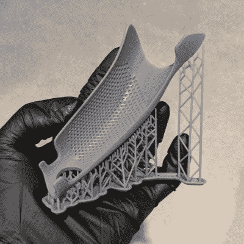
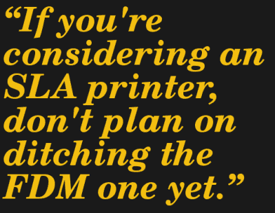

# 3D 打印:树脂打印机会淘汰基于细丝的打印机吗？

> 原文：<https://hackaday.com/2020/04/30/3d-printering-will-a-resin-printer-retire-your-filament-based-one/>

在工作台上安装一台树脂打印机从未如此吸引人，也从未如此实惠。复杂的形状，毫不费力的细节和表面处理？是的，请！不管怎样，照片让结果看起来毫不费力。由于使用熔融沉积成型(FDM)的灯丝打印机在表面光洁度和小细节分辨率方面获得了可靠的“可能更好”评级，如果人们购买树脂打印机，值得信赖的 FDM 打印机最终会退休吗？

简短的回答是:对于已经使用 FDM 的用户来说，基于树脂的立体平版印刷(SLA)打印机不太可能取而代之。更有可能发生的是，细丝打印机继续做它擅长的相同工作，而树脂打印机打开了一些美妙的新大门。这部分是因为这些伟大的 SLA 打印将会付出代价，而这些额外的工作并不总是值得的。

让我们来看看是什么让 SLA 变得好，它需要什么回报，以及它如何适应和不适应 FDM。

## 当 SLA 好的时候，就是真的好

Objects with organic curves and no real “up” or “down” are much better suited to SLA than FDM.

树脂印刷的最佳点是:具有光滑表面、有机曲线和表面细节的小物体。有了 SLA，这些对象的打印更加可靠，质量始终高于 FDM——只要操作员在布局和支持位置方面做得好。

一个很大的原因是 SLA 不像 FDM 那样产生层线。FDM 版画因可见的层线而臭名昭著，这些线在曲面上传播时效果最差。SLA 仍然是一次一层地创建对象，但是这个过程没有留下明显的线条。

用树脂印刷时，零件方向也更自由。与 FDM 不同，树脂版画是各向同性的。在 3D 打印的背景下，这意味着打印对象的物理属性相对于物理方向不会改变。只要一个零件得到足够的支撑，能够正常打印，树脂打印机就不会太在意它以什么方向或什么角度来构建一个物体；结果会是一样的。这使得 SLA 打印机在零件定位方面更加灵活，有助于保持展示表面和细节不受支撑。

## SLA 优势的利基应用

树脂印刷擅长的领域的一个例子是游戏模型和人物。桌面爱好者正在购买打印机和树脂，游戏相关模型的设计者也取得了成功。更成功的人在像 Patreon 这样的网站上茁壮成长，拥有成千上万每月支持者的 T2。

只要对象足够小，工程应用就可以在 SLA 中占有一席之地。与 FDM 相比，大多数 SLA 打印机的构建量非常小，但他们能够处理 FDM 有问题的形状和细节，从而弥补了这一点。

## 当心 SLA 的额外成本

SLA 打印以增加成本的形式到处带来一些讨厌的伙伴。这些不是机器本身的成本；业余爱好者 SLA 打印机非常实惠。这些持续成本包括耗材、增加的维护和零件加工时间以及存储空间。

SLA 比 FDM 需要更多的设置和清理。印刷后，印刷部件需要清洗(通常在酒精浴中),并可能通过额外的紫外线曝光进行后固化。因为树脂很脏，所以需要一次性手套和防溅工作区。另一件需要考虑的事情是，树脂不应该长时间留在打印机中，所以当打印在可预见的未来完成时，是时候清空打印机并清洁部件了。

所有这些都需要时间，但也会占用工作区的宝贵空间。树脂瓶、酒精容器、洗涤箱、手套、防滴漏工作空间，所有这些都占据了储物空间和桌子空间。SLA 打印作为一个整体将比打印机本身占据更多的空间。

另一个要考虑的是需要手动后期处理。树脂打印往往需要大量的支撑，这些支撑需要用手移除。这些留下的小痕迹可能需要用砂纸打磨掉。对于 FDM，支持是仅在需要时使用的最后手段，但是对于 SLA，它们是规则而不是例外。

## FDM 仍然擅长的事情

维护良好的 FDM 打印机是制作原型、迭代设计和创建功能部件的绝佳工具。与树脂印刷相比，FDM 还有其他突出的优势。

FDM 非常乐意耐心等待，直到需要的时候，在这一点上，可以开始打印最少的大惊小怪。耗材少，价格合理。灯丝最好存放在干燥的环境下，除此之外，要求不高。更换灯丝类型或颜色简单、干净、容易。即使是一次失败的打印，通常也只是扫掉一堆塑料，再试一次。

 最大的缺点是与层线的可视性、表面细节的分辨率以及处理弯曲的有机形状有关。这些都是挥不去的，但都可以在一定程度上缓解。[可变图层高度](https://hackaday.com/2017/02/16/hands-on-with-variable-layer-height/)试图解决图层线的可见性，这是一个已经融入大多数切片软件的功能。在某种程度上，通过将打印机的标准 0.4 毫米喷嘴更换为更小的喷嘴，可以提高渲染非常小的细节和特征的能力。

FDM 打印机最大的挑战是被要求打印弯曲的对象，没有平面区域，也没有真正的“上”或“下”。一种选择是将这些对象分割成更小、更容易打印的对象，但这并不总是可行的。印刷复杂的模型需要支撑物，而 FDM 支撑物总是会降低表面质量。水溶性支撑结构可以帮助减轻这一点，但这样做需要多材料印刷。另一方面，SLA 更适合这样的对象。

## 两者都有空间吗？

树脂印花看起来很棒，人们可能会认为 SLA 比 FDM 更好，但这并不是全部。他们是不同的工具，擅长不同的事情。除非您的需求非常具体，否则您可能会受益于这两者。

如果您需要打印具有良好表面光洁度和细节分辨率的小对象，并且可以处理使用树脂带来的额外麻烦，那么 SLA 绝对适合您。但是，即使你只打印小对象，一个工作的 FDM 打印机也可以轻松地在你的工作台上赢得一席之地，它能够创建功能部件，而无需任何重大的设置和清理。如果你正在考虑一个 SLA 打印机，现在还不要计划放弃 FDM。

我经常使用这两种打印机，但就个人而言，如果可能的话，我总是选择灯丝打印机；即使最终的模型将最终用树脂打印出来，它也只是更便宜、更快、更容易用 FDM 制作原型和迭代。

如果你两者都有，这也是你的经历吗？你知道一个树脂印刷的利基市场吗，它以一种其他任何东西都无法做到的方式击中要害，就像 SLA 对桌面爱好者所做的那样？我们想知道所有的事情，所以请在评论中告诉我们。