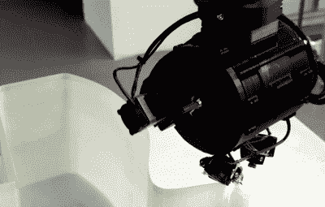

# 3D 打印全尺寸玻璃纤维快艇

> 原文：<https://hackaday.com/2021/01/30/3d-printing-a-full-scale-fiberglass-speedboat/>

这是一个古老的问题。你画了一艘漂亮的 6.5 米长的摩托艇，然后发现它的形状不适合玻璃纤维模具。你是做什么的？如果你是(Moi)，你会拿几个 Kuka 机器人，用嵌有玻璃纤维的热塑性塑料 3D 打印出来。紫外光固化塑料，你就完成了印刷玻璃纤维。这就是 3D 打印机动船 [MAMBO 背后的故事。](https://www.3dnatives.com/en/3d-printed-fiberglass-boat-mambo-300920205/#!)

 除了颜色，玻璃纤维在门外并不是蓝色的——这艘船是涂漆的。不过，它看起来很不错，线条灵感来自 1973 年[Sonny Levi]的 Arcidiavolo 设计。MAMBO 代表汽车添加剂制造船。它的干重约为 800 公斤，配有软木地板、白色真皮座椅和发动机。我们假设这些东西都不是 3D 打印的。

虽然它不是玻璃纤维，但我们以前见过 3D 打印的船。特别是，缅因大学 22，000 平方英尺的巨型打印机打印出了一台。我们也见过用标准 PLA 丝印刷的[船，然后在印刷后涂上玻璃纤维布和树脂。没错，一个只是钢筋混凝土，但没有理由的概念不能扩大规模，如果你有耐心。](https://hackaday.com/2018/10/10/3d-printed-catamaran-eats-benchys-lunch/)