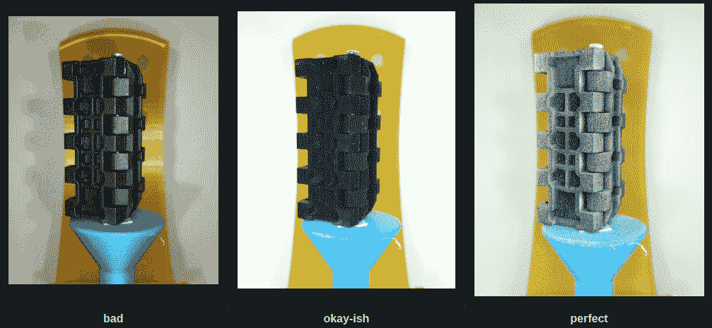

# 3D 扫描麻烦？这份指南涵盖了你

> 原文：<https://hackaday.com/2022/06/26/3d-scanning-trouble-this-guide-has-you-covered/>

当谈到 3D 扫描时，完美的表面看起来很像上面的图像:成千上万个不同的随机特征，高对比度，没有模糊的区域，也没有闪亮的斑点。虽然大多数物体*看起来没有*那么好，但无论如何都有可能获得可用的结果，这就是【Thomas】旨在帮助人们利用他的[技巧，如何利用摄影测量创建完美、精确的 3D 扫描](https://github.com/OpenScanEu/OpenScan2/blob/main/photogrammetry_basics.md)的目的。

一般来说，3D 扫描远不是“点盒子，按下按钮”那么简单，但是有一些工具可以让事情变得更简单。良好的照明是至关重要的，偏光镜可以有所帮助，像粉笔喷雾这样的产品可以暂时给原本麻烦、闪亮或无特色的物体添加哑光特征。[Thomas]提供了这些元素的视觉效果，因此人们可以确切了解这些元素会带来什么。甚至有一个方便的流程图表，以帮助排除故障和改善棘手的扫描情况。

[Thomas]在 3D 扫描方面很在行，因为他是 open scan 项目的负责人。[我们上一次展示 OpenScan 是在 2020 年](https://hackaday.com/2020/04/25/openscan-3d-scans-all-of-the-small-things/)，从那时起，事情已经随着新的设计 [OpenScan Mini](https://en.openscan.eu/openscan-mini) 而明显向前发展。对开源扫描解决方案感兴趣？一定要看一看。