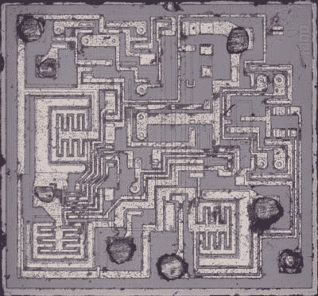

# 555 拆卸不仅仅是一个好时机，更是一个值得期待的时刻

> 原文：<https://hackaday.com/2022/01/25/555-teardown-isnt-just-a-good-time-its-to-die-for/>

在 Hackaday 的 555 定时器竞赛结束后不久，[Ken Shirriff]发布了一个黑客最喜欢的芯片 555 的早期版本的[硅芯片拆卸](https://www.righto.com/2022/01/silicon-die-teardown-look-inside-early.html)，这似乎是唯一合适的。

A Microscopic View Of the 555 Die

从 1973 年 1 月的一个神秘芯片开始，[Eric Schlaepfer]煞费苦心地打磨包装，露出芯片，他认为这是一个 555 定时器。为什么他们不知道这是一个 555 定时器开始？因为包裹上没有“555”的标记，而是其他一些标记，你可以在博客文章的[中看到。](https://www.righto.com/2022/01/silicon-die-teardown-look-inside-early.html)

除了很好地解释了 555 的一般工作原理之外，[Ken]还对 555 芯片本身进行了微观观察。a 555 的原理图很容易获得，而且[Ken]不仅能识别芯片的各个部分，还能识别各个元件。他还进一步解释了 PNP 和 NPN 电阻是如何用硅制造的。对 IC 中的电阻也有很好的见解，但我们不会在这里破坏它。

一定要向 555 竞赛的[获胜者表达你的爱，或者至少去看看那个停下来的项目:](https://hackaday.com/2022/01/20/congratulations-winners-of-the-2021-555-timer-contest/)[一个你不需要显微镜就能看到内部的巨型 555](https://hackaday.io/project/182863-giant-555-timer) 。