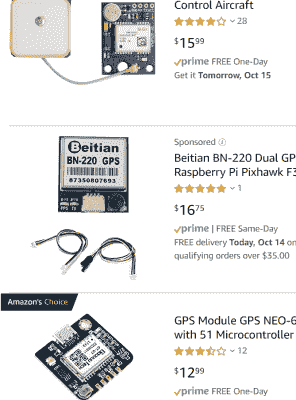

# 5G 是给机器人的

> 原文：<https://hackaday.com/2019/10/30/5g-is-for-robots/>

传道书 1:9 写道“已经发生的事将会再次发生，已经发生的事将会再次发生；日光之下并无新事。”或者换句话说，5G 大多是营销废话；就像 4G，3G，2G 在它之前。别忘了 LTE，4G LTE，Advance 4G，Edge。

Just a normal everyday antenna array in a Seattle parking garage.

从技术上来说，5G 意味着如果提供商愿意，他们可以安装一些 EHF 天线；和我们一直在城市里使用的点对点微波网络一样。这些频率太慢，无法穿透墙壁，所以我们必须在地平面的网格中安装这些天线。承诺的结果是，我们都将获得延迟稍低的分层互联网连接，不会辜负炒作。从客户的角度来看，它唯一能做的事情就是在我们的“无限”计划被扼杀之前，让我们以两倍的速度达到 8Gb 的上限。这在笔记本电脑上可能很好，但这将是一个历史性的荒谬假设，即威瑞森将允许我们将设备连接到他们闪亮的新网络，而不收取我们 100 万日元的特权。

那么，交易是什么？从实用的角度来看，我们已经最大限度地满足了手机的需求。例如，这里有一个电话世界的肮脏秘密:你无法在一个小小的屏幕上区分 1080p 和 720p 视频。我知道不止一家公司，他们应用程序上的 1080p 实际上意味着显示在设备上的 640 或 720，而 1080p 被记录在云上的某个地方供下载。没有一个用户注意到或抱怨过。哦，也许如果你仔细看，你会觉得一张照片比另一张更清晰，但除此之外，你在做什么？同样，60fps 的 8k 视频在手机上有什么意义？或者一台笔记本电脑？

我们真的要让一个手机网页达到极限吗？既然我们的设备呈现信息的能力超过了我们处理信息的能力，那么一个应用程序的大小是否存在理论上的最大值？即使我们让世界上的每一部手机都能接入千兆位互联网，从用户的角度来看，这充其量也只是一个微小的进步。除非你是一个专业的手机游戏玩家(那是一件事吗？)潜伏对你来说毫无意义。缓冲缓冲体验，直到它发光。

那么，我们为什么要关心亿万美元的公司竞相拥有最好的网络来发送低分辨率的广告 gif 到我们的 disctracto 立方体呢？因为 5G 是给机器人的。

## 暴力，但是有天线

GPS Antennas are very cheap now.

是的，5G 永远是机器人的，而不是人类和智能手机的混合体。更具体地说，一个巨大的微波天线网格为机器人提供了到城市和农场的低延迟千兆连接。现在，如果你想连接到一个 EHF 网络乐队，你需要派一队巫师到多个屋顶上对准天线，做各种各样的其他吟诵，跳舞，诅咒和符文工作，让该死的东西去。每次微风吹乱天线，或者一棵树长得太高，他们都需要回到那里再做一次。这并不是说 5G 上的 FR2 频段将独自震撼我们的世界，而是我们将有一个商定的硬件解决方案来处理所有困难的事情，例如在这个频段上交换天线。

我记得我在大学的机器人团队在一个又一个的目录中寻找 GPS 天线。我们最终发现，农业中可靠天线模块的不断增长的市场已将价格降至可笑的低价，如 1500 美元。在这个时候，iPhone 在一年前刚刚问世，摩托罗拉 Razer 仍然是酷小孩的手机。几年后，我放弃了诺基亚 3310，换了一台 HTC Thunderbolt。快进到今天，一个全球定位系统模块是 15 美元，主要航运。价格下降了 100 倍。我们可以预计这些微波调制解调器和天线也会类似地倒下。

## 今天的机器人把他们的记忆储存在别的地方

让我们看一个现代机器人。过去几年，我们迎来了机器学习热潮。这极大地改变了机器人的模式。

在此之前，你必须在机器人身上进行大量的计算。此外，机器人运行在人类生成的算法上，不一定需要大量的存储空间来提高其性能。性能与人类工程时间更直接相关。

现在你需要的是足够的计算机来运行一个相当确定的模型，只用于实时决策。其余的数据被发送到世界上某个地方的服务器农场，在那里输入学习算法，从而改善结果。一些更昂贵但耗时的决策也在那里进行。然而，这有时有一个翻转等式，你收集多少数据是你的机器人表现如何的主要驱动因素。

 我熟悉的一个例子是，物联网摄像头可能会在设备上运行运动检测，但它会在云上进行物体检测等操作。

一个更好的例子是，自动驾驶汽车内的硬盘驱动器有很大的市场。如果你有一个 Cruises、Zooxs、Waymos、Ubers 或 Teslas 车队，你怎么把数据从车上拿到云端进行处理呢？尤其是当这些数据可以从一次运行中累积到数 TB 时。目前的解决方案是一个非常昂贵的热插拔硬盘盒。当你把你的测试车开回车库时，他们会把用过的夹子拿出来，换上另一个。这是相当该死的网络朋克，但天生效率低下。

5G 网络是这类问题的完美解决方案。它不仅有足够的带宽在数据生成时直接从设备上获取所有这些数据，而且其极低的延迟还允许这些云处理的决策更快地返回给机器人。我敢打赌，在接下来的二十年里，我们将看到几十亿美元的公司涌现出来，做一些像建立互连层、硬件模块和为机器人建立大规模农业 5G 网络这样的事情。

总而言之，这项技术可能会成为像过去几年宇宙一直威胁我们的无人机送货这样的技术的砝码。这将使有用的增强现实变得更有可能，并将极大地提高生活在 5G 网格中的机器人的能力。它不会让我们的手机体验变得更好。