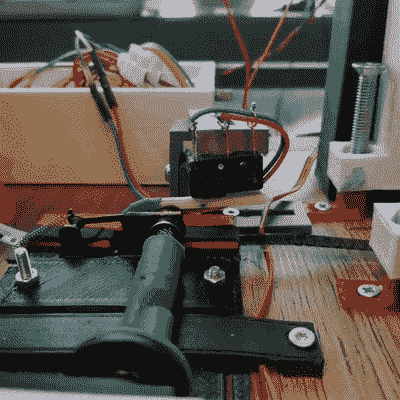

# 8 毫米胶片扫描仪成长为杰作

> 原文：<https://hackaday.com/2020/04/12/8mm-film-scanner-grows-into-a-masterpiece/>

数字化电影是一个乏味的过程，如果你花更多的时间来制作数字化仪，而不是花更少的时间来处理旧电影，这个过程会变得有趣得多。[Heikki Hietala]已经从事这项工作多年，他的 Kotokino Mark IV 胶片扫描仪是简单机械制造的杰作。

自从四年前[我们第一次看到胶片扫描仪](https://hackaday.com/2016/03/18/home-made-8mm-digitizer/)以来，它经历了许多出色的改进。最值得注意的是，傻瓜相机已经被 DSLR 取代。通过使用微距反转环，普通镜头可以翻转过来放大 8 毫米宽的胶片，以利用相机传感器上所有的百万像素。

 设置的关键是胶片推进装置，它负责推进胶片和触发相机。正如你所看到的，伺服电机转动一个轴提供了运动。这个机械装置插入胶片上的小孔，在下冲程时拉动胶片，在上冲程时关闭开关触发相机。在镜头正下方，对准夹具使用镜头清洁织物来避免刮伤胶片，同时将其完美地定位在光源上方。

以前的版本将相机放置在水平面上，但似乎系统中的一些振动导致了捕获帧之间的对齐问题。这个最新的版本将摄像机直接指向下方来解决这个问题，并将整个项目整合成一个美丽的成品。一路走来，已经聚集了无数的粉丝，[Heikki]提供了设计文件，这样你就可以建造你自己的版本。