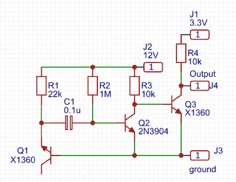

# 一个 4 位随机数发生器

> 原文：<https://hackaday.com/2020/05/23/a-4-bit-random-number-generator/>

随机性是一种追求，类似于计量学或时间和频率，因为在追求其最纯粹的形式时可以花费大量的努力。圣杯是完全不可预测的随机性的来源，对如此纯粹的熵的搜索已经将实验者带入了熔岩灯的采样、噪声源、计算机系统中用户行为的不可预测的定时，甚至进入了放射性衰变的采样。正如[Henk Mulder]用他的 4 位模拟随机数发生器向我们展示的那样，这是一个不需要昂贵或困难的领域。

产生随机模拟噪声的最简单电路之一是在齐纳击穿或雪崩击穿中使用反向偏置二极管，他使用的是这种电路的变体。晶体管的反向偏置发射极结产生噪声，该噪声被另一个晶体管放大，然后被第三个晶体管转换成 1 和 0 的数字开关流。他没有用移位寄存器来创建他的四位，而是用了四个相同的电路，没有时钟，它们的输出随意改变状态。

他的文章很大一部分是关于随机性和随机来源的研究。他发现这个源有缺陷，因为它的输出偏向逻辑 1，但我们想知道罪魁祸首是否是双晶体管电路及其偏置，而不是噪声本身。它还产生大约 100 kbps 的采样频率，这在他使用的 Teensy 进行采样时有点慢。

理解随机数的生成是一项迷人而重要的技能。这些年来，我们已经推出了这么多 RNG，这里的[一个由 memes](https://hackaday.com/2018/01/25/twitter-rng-is-powered-by-memes/) 驱动，另一个[由鱼缸](https://hackaday.com/2019/12/09/generating-random-numbers-with-a-fish-tank/)驱动。